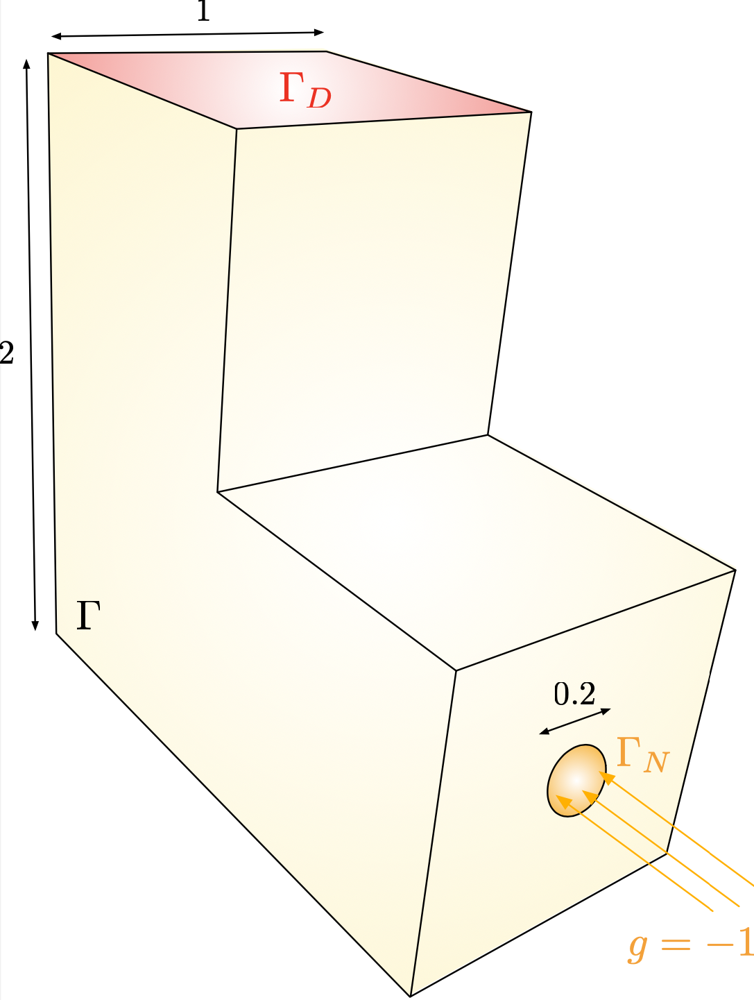
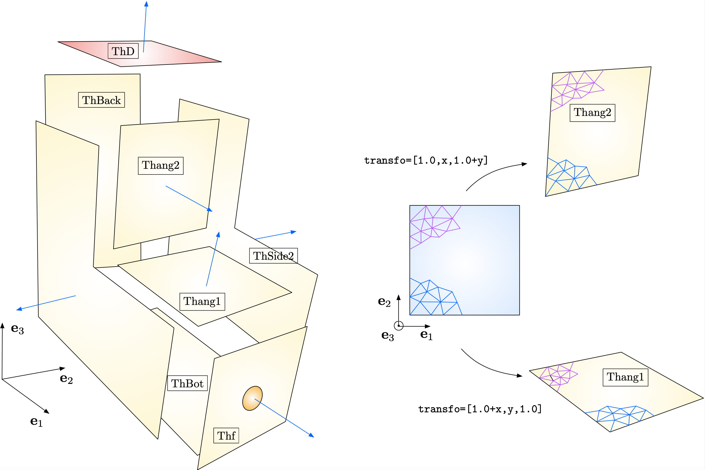
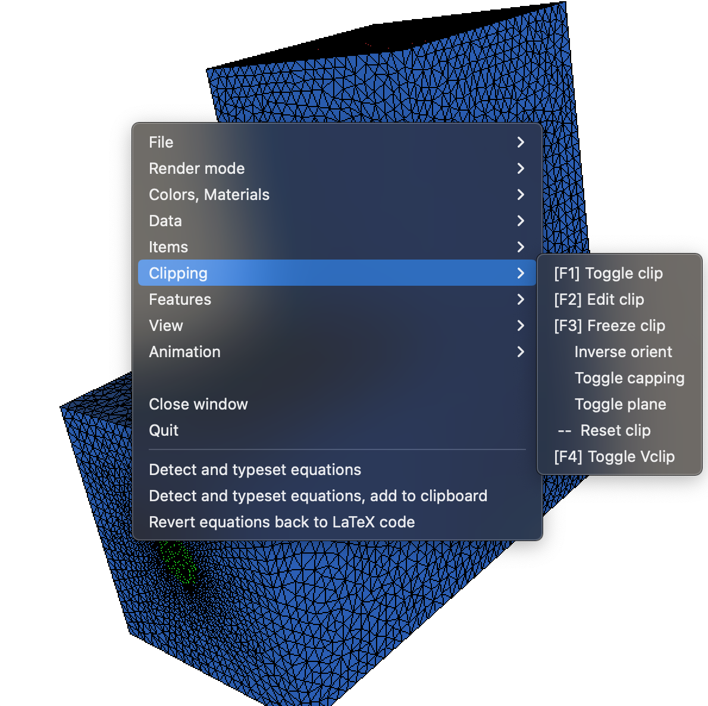
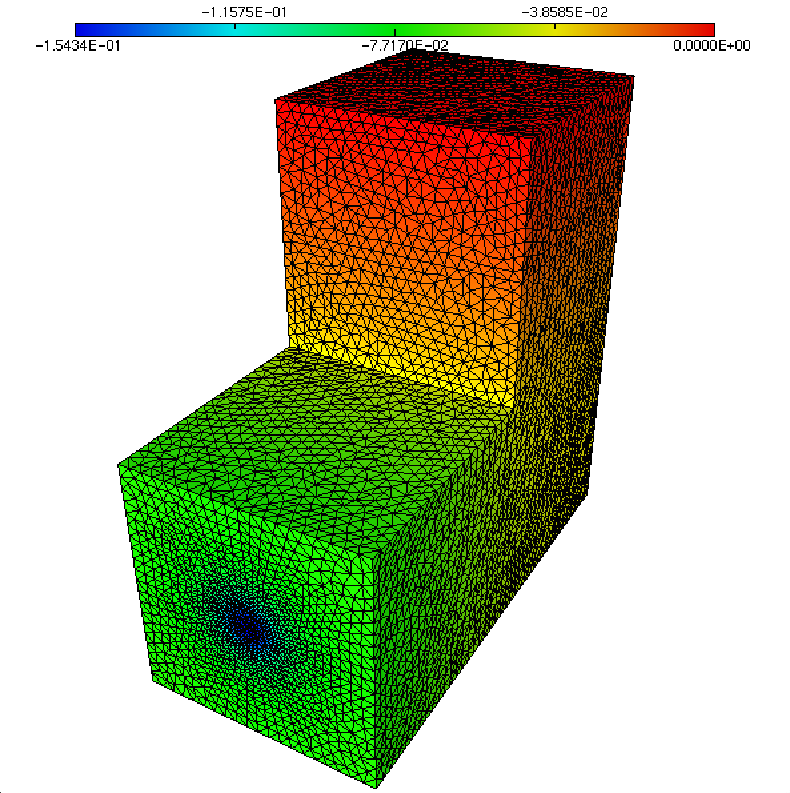

.. _sec.3dext:

Turning to 3d Finite Element problems
======================================

.. ########################################@
.. ########################################@

In this section, we describe how to adapt the material introduced in the previous sections to address 3d situations.

The theory about the solution of Finite Element problems in 2d, discussed in :numref:`sec.FE`, extends mutatis mutandis to the case of 3 space dimensions. This extensions is similarly straightforward in $\texttt{FreeFem}$, which conveniently conceals the underlying technical operations (assembly of the Finite Element matrices and vectors, inversion of large linear systems, etc.). However, a few other topics deserve comments, and notably that of mesh generation.

Our guiding example throughout this section takes places in the computational domain $\Omega$ depicted in :numref:`fig.Lshape3dLap`. Its boundary is composed of three regions $\Gamma_D$, $\Gamma$ and $\Gamma_N$, bearing homogeneous Dirichlet, homogeneous Neumann, and inhomogeneous Neumann boundary conditions, respectively. We aim to solve the following instance of the Laplace equation:

.. math:: 
  :label: eq.Laplace3d
  
  \left\{\begin{array}{cl}
  -\Delta u = 0 & \text{in } \Omega, \\
  u = 0 & \text{on } \Gamma_D, \\
  \frac{\partial u}{\partial n} = 0 & \text{on } \Gamma, \\
  \frac{\partial u}{\partial n} = g & \text{on } \Gamma_N,
  \end{array}
  \right.
  
for a given Neumann data $g: \Gamma_N \to \R$. The associated variational formulation reads:
$$\text{Search for } u \in H^1(\Omega) \text{ s.t. } \forall v \in H^1(\Omega), \quad \int_\Omega \nabla u \cdot \nabla v \:\d \x = \int_{\Gamma_N} gv \:\d s.$$

.. #################@

.. _fig.Lshape3dLap:

   Computational domain $\Omega$ considered in the 3d experiments.

.. #################@

The source code corresponding to this section is contained in the file :download:`3dex.edp <./codes/3d/3dex.edp>`.

.. #################@
.. #################@

Construction of a 3d mesh
-------------------------

.. #################@
.. #################@

The creation of a mesh of the 3d domain $\Omega$ is fairly more involved than in the 2d case in $\texttt{FreeFem}$, and a little care is in order. 

The process starts with the construction of a surface triangulation for the boundary $\partial \Omega$.
In turn, this task is realized by decomposing $\partial\Omega$ into several elementary panels, which are the 3d counterparts of the 2d $\texttt{border}$ elements used in :numref:`sec.LaplaceStart`. For instance, the L-shaped domain in :numref:`fig.Lshape3dLap` is created from the assembly plan depicted on :numref:`fig.LShape3dLayout`.

.. #################@

.. _fig.LShape3dLayout:

   Construction layout of the surface mesh for $\partial\Omega$. The normal vectors to $\partial \Omega$, pointing outward $\Omega$ are represented by blue arrows. The conformity of the surface mesh resulting from this construction plan requires that the discretizations of the bottom part of  $\texttt{Thang2}$ and the top part of $\texttt{Thang1}$ agree.
   
.. #################@

Each panel is created by first constructing a 2d mesh along the lines of the previous :numref:`sec.LaplaceStart`. The latter is the mapping to a surface mesh via a suitable transformation $\R^2 \to \R^3$, thanks to the command :code:`movemesh23`.
The listing below exemplifies the syntax used to create the panels $\texttt{Thang1}$ and $\texttt{Thang2}$. 

.. ############
.. code-block::
  
  load "msh3"

  /* Creation of the mesh of a 2d square */
  border a(t=0,1.0) {x=0; y=1.0-t; label=0;};
  border b(t=0,1.0) {x=t; y=0; label=0;};
  border c(t=0,1.0) {x=1.0; y=t; label=0;};
  border d(t=0,1.0) {x=1.0-t; y=1.0; label=0;};
  border circ(t=0,1.0) {x=0.5+0.1*cos(2*pi*t); y=0.5+0.1*sin(2*pi*t); label=0;};

  mesh Th2ds    = buildmesh(a(N) + b(N) + c(N) + d(N));
  
  /* Get surface mesh as the image of Th2ds via a suitable transformation $\R^2 \to \R^3$ */
  meshS Thang1  = movemesh23(Th2ds,transfo=[1.0+x,y,1.0]);
  meshS Thang2  = movemesh23(Th2ds,transfo=[1.0,x,1.0+y]);

.. ############

The constituent surface panels of $\partial \Omega$ are then glued into a single surface mesh via the following command:

.. ############
.. code-block::

  /* Total surface mesh */
  meshS Tht = ThD + ThSide1 + ThSide2 + ThBack + ThBot + Thang1 + Thang2 + Thf;

.. ############

.. ############
.. warning::

  Two important features have to be taken into account in this construction process, which are illustrated on :numref:`fig.LShape3dLayout`.
  
  - The total surface mesh must be conforming. One has thus to pay a close attention that the discretizations of a common border to two adjacent panels  be identical. This implies to choose the same number of discretization points for a common border in their declarations from different panels. 

  - The orientation of the different panels must be globally consistent: the unit normal vector to each panel, which is the image of the out-of-plane vector $\textbf{e}_3$ by the underlying transformation $\R^2 \to \R^3$ must be pointing outward $\Omega$. The optional argument :code:`orientation=-1` can be supplied to the :code:`movemesh23` command to change the orientation of a panel.

.. ############

Once a conforming, oriented surface mesh for $\partial \Omega$ is constructed, a tetrahedral mesh for the volume $\Omega$ is created thanks to the `tetgen <https://wias-berlin.de/software/index.jsp?id=TetGen&lang=1>`_ library, which is interfaced with $\texttt{FreeFem}$ via the following command:

.. ############
.. code-block::

  /* Load tetgen library */
  load "tetgen"
  
  /* Create 3d mesh */
  real[int] dominfo = [0.5,0.5,0.5,0,0.0001];
  mesh3 Th3 = tetg(Tht,switch="pqaAAYYQ",nbofregions=1,regionlist=dominfo);

.. ############

Here, $\texttt{dominfo}$ is an array with five real-valued entries:

  - The first three entries are the coordinates $(x_1,x_2,x_3)$ of a point $\x$ lying inside the domain $\Omega$; 
  
  - The fourth entry is the desired label for the tetrahedra of the mesh; 
  
  - The last entry is the maximum volume for a tetrahedron of the mesh. 
  
For an explanation of the other parameters of this command (such as the number $\texttt{nbofregions}$ of connected components of the $\Omega$), we refer to the `FreeFem documentation <https://doc.freefem.org/introduction/index.html>`_. 

The result of this procedure is presented in :numref:`fig.genmesh3d`. 

.. #################@

.. _fig.genmesh3d:
.. figure:: ../figures/genmesh3d.png
   :scale: 35 %

   (a,b,c) Various stages of the construction of the surface mesh for $\partial \Omega$; (d) Cut in the tetrahedral mesh for $\Omega$.
   
.. #################@

.. #################@
.. #################@

3d visualization with $\texttt{medit}$
--------------------------------------

.. #################@
.. #################@

Like in the 2d case discussed in :numref:`sec.visu`, the light and convenient tool $\texttt{medit}$ allows to visualize three-dimensional meshes and solutions attached to their vertices, to make snapshots, create animations, etc. It notably makes it straightforward to display various viewpoints on the mesh by simple manipulations using the mouse.

Calling $\texttt{medit}$ by command line is identical to the 2d situation considered hitherto:

.. ############
.. code-block:: console
  
  ffmedit domain.mesh
  
.. ############

Again, if a $\texttt{domain.sol}$ file is present in the same directory as the mesh $\texttt{domain.mesh}$, containing a solution defined at its vertices, it will be loaded automatically.

Let us emphasize one useful feature that is quite special to the visualization of 3d meshes:
cuts in the mesh can be realized by selecting $\texttt{toggle clip}$ from the right-click menu. The clipping plane can be adjusted manually with the mouse, see :numref:`fig.3dclip`.
  

.. #################@

.. _fig.3dclip:

   Enabling the clipping mode and edition of the clipping plane in $\texttt{medit}$.
   
.. #################@

.. #################@
.. #################@

Solution of the Finite Element problem
---------------------------------------

.. #################@
.. #################@

The resolution of the boundary-value problem :math:numref:`eq.Laplace3d` on $\Omega$ is now carried out by straightforward adaptations of the 2d syntax introduced in :numref:`sec.LaplaceStart`. 

.. ############
.. code-block::

  fespace Vh(Th3,P1);
  Vh u,v;

  func flux = -1.0;

  /* Variational formulation in 3d */
  problem Laplace(u,v,solver=CG) = int3d(Th3)(dx(u)*dx(v)+dy(u)*dy(v)+dz(u)*dz(v))
                                 - int2d(Th3,REFNEU)(flux*v)
                                 + on(REFDIR,u=0);
                                 
  Laplace;

  /* Save solution */
  savesol(SOL,Th3,u);

.. ############

The result is displayed in :numref:`fig.LShape3dsol`.

.. #################@

.. _fig.LShape3dsol:

   Solution to the Laplace equation :math:numref:`eq.Laplace3d` on the 3d geometry of :numref:`fig.Lshape3dLap`.
   
.. #################@
