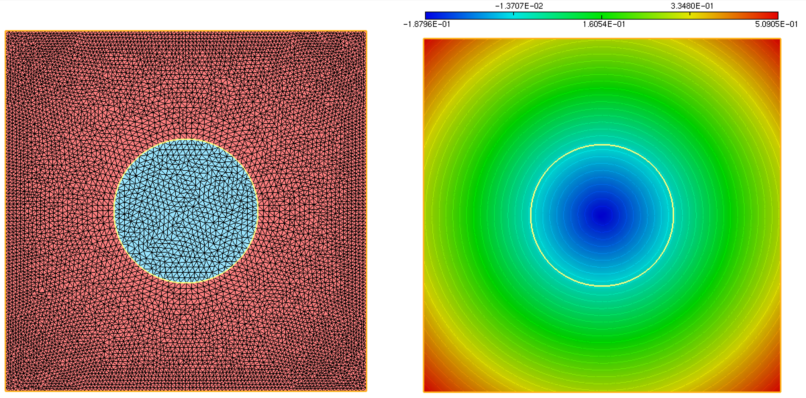
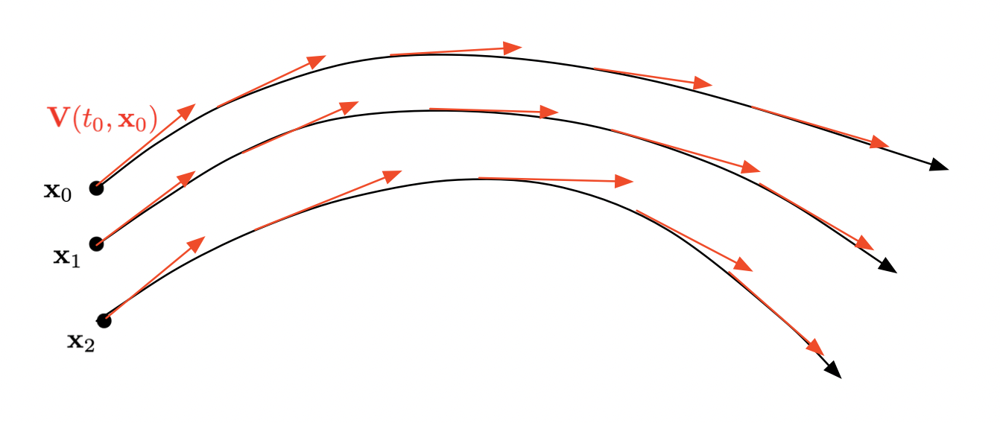
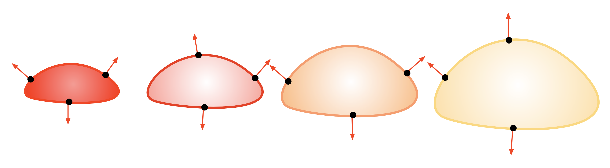
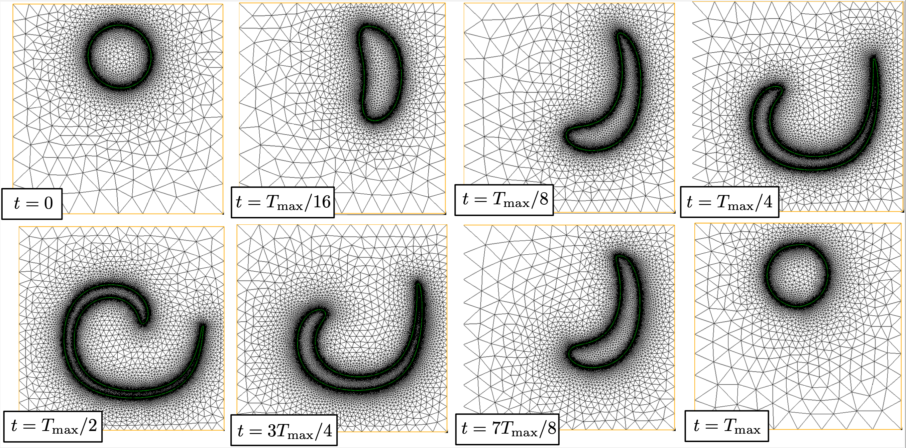

.. _sec.LSM2:

The Level Set method: Part II
=============================

This second part of our discussion about the Level Set Method deals with slightly more intricate issues, that are notably related to its ability to capture the time evolution of a domain $\Omega(t)$.

.. #################@
.. #################@

.. _sec.distLS:

Initialization of a Level Set representation by the signed distance function 
----------------------------------------------------------------------------

.. #################@
.. #################@

The signed distance function $d_\Omega$ is one among the many Level Set functions representing a given domain $\Omega \subset \R^d$, see :numref:`fig.2lsfunc`.
This section presents a few basic facts about this function, explaining its ubiquitous role in the Level Set framework, and its numerical calculation.

.. #################@

Definition
""""""""""""

.. #################@

Let us start with a definition.

.. #################@
.. prf:definition:: Signed distance function

   Let $\Omega$ be a bounded Lipschitz domain in $\R^d$. The signed distance function $d_\Omega : \R^d \to \R$ to $\Omega$ is defined by:
   
   $$\forall \x \in \R^d, \quad d_{\Omega}(\x) =
   \left\{\begin{array}{cl}
   - d(\x, \partial\Omega) & \text{if } \x \in \Omega,\\
   0 & \text{if } \x \in \partial\Omega,\\
   d(\x, \partial\Omega) & \text{if } \x \in \R^d\setminus\overline{\Omega},\\
   \end{array}
   \right.
   $$
   
   where $d(\x,\partial\Omega) = \min\limits_{\y \in \partial \Omega} \lvert \x - \y \lvert$ is the usual Euclidean distance from $\x$ to $\partial\Omega$.

.. #################@

.. #################@

.. _fig.2lsfunc:

.. figure:: ../figures/2lsfunc.png
   :scale: 50 %

   Two different Level Set functions for the interval $\Omega = (0,1)$ in $\R$. The signed distance function $d_\Omega$ (on the right) has unit derivative wherever it is defined.

.. #################@

The signed distance function $d_\Omega$ is often preferred over any other Level Set function for $\Omega$, owing to its unique features:

  - It appraises how far a point $\x\in D$ is from $\Omega$, and not only whether it belongs to $\Omega$ or $D \setminus \overline\Omega$.
  
  - It has uniform variations through space, which is a key ingredient in the stability of numerical frameworks based on the Level Set Method. It can indeed be proved that $d_\Omega$ is differentiable almost everywhere in $D$ and that its gradient has unit norm wherever this makes sense: 
    
    .. math:: 
      :label: eq.distgrad1
   
      \lvert\nabla d _\Omega(\x) \lvert = 1 \text{ for a.e. } \x \in D.
        
  - Its calculation can be realized by very efficient algorithms, such as the celebrated Fast Marching Method.

.. #################@

Numerical calculation of the signed distance function
""""""""""""""""""""""""""""""""""""""""""""""""""""""

.. #################@

The $\texttt{FreeFem}$ environment contains handful routines to calculate the signed distance function $d_\Omega$ to a domain $\Omega$, depending on the numerical representation of the latter. As often in this course, we focus on the 2d case. The implementation corresponding to the examples below is available :download:`here <./codes/LSM/dist.edp>`.

At first, it often happens that $\Omega$ is already described by a Level Set function $\phi$ which is not the signed distance function (see again :numref:`fig.2lsfunc`, left). The following listing shows how to use the built-in function :code:`distance` in $\texttt{FreeFem}$ to retrieve $d_\Omega$ from this datum.

.. ############
.. code-block::

  /* Include FreeFem distance function */
  load "distance"
  
  [...]

  /* Finite Element spaces */
  fespace Vh(Th,P1);
  Vh phi,phi0;
  
  /* phi0 = level set function (not signed distance) for the disk B((x0,y0),R) */
  real x0 = 0.5;
  real y0 = 0.5;
  real R  = 0.25;

  phi0 = (x-x0)^2 + (y-y0)^2 - R^2;
  
  /* phi = signed distance function to the domain defined by the LS function phi0 */
  distance(Th,phi0,phi[]);
  
.. ############

Let us now consider the situation where $\Omega$ arises as a submesh of a mesh $\calT$ of the computational domain $D$, i.e. it is identified as the set of triangles bearing a particular label $\texttt{REFINT}$, see :numref:`fig.distfrommesh` (left). The following commands can then be used, which make use of the built-in function :code:`distance` and of the module :download:`Level Set toolbox <./codes/LSM/LStools.idp>`, see :numref:`fig.distfrommesh` (right) for the result.

.. ############
.. code-block::

  /* Finite Element spaces */
  fespace Vh(Th,P1);
  Vh phi,phi0;

  /* Include Level Set toolbox */
  include "LStools.idp"

  /* Initialization of the signed distance function near the boundary with label REFBORDER 
     sign + in the domain REFINT, sign - in the domain REFEXT */
  phi0[] = inidist(REFBORDER,REFINT,REFEXT);
  
  /* Extension of this distance with built-in FreeFem function */
  distance(Th,phi0,phi[]);

.. ############

.. #################@

.. _fig.distfrommesh:

   Plot of the signed distance function $d_\Omega$ to a domain $\Omega$ represented as a submesh (in blue, on the left) of the computational domain $D$.

.. #################@

.. #################@
.. #################@

Evolution of a domain by the Level Set method
----------------------------------------------

.. #################@
.. #################@

The present section describes how the Level Set Method efficiently allows to track the motion of an evolving domain $\Omega(t)$ under the effect of a given velocity field $\bV(t,\x)$. The mathematical framework attached to evolving surfaces and domains is very intricate, and for simplicity, we keep the discussion at the formal level, referring the reader eager to delve into mathematical details to the monograph :cite:`giga2006surface`. Likewise, for simplicity, we temporarily ignore that the evolution of interest take place in a given bounded computational domain $D$, and the latter is replace by the whole ambient space $\R^d$.

Let us first make the notion of evolving domain a little more precise. 

.. #################@

Evolving domains
""""""""""""""""""

.. #################@

The description of the motion of a domain naturally builds on that of motion of an individual point. The underlying mathematical notion is that of characteristic curve. 

.. #################@

.. _def.characcurve: 

.. prf:definition:: Characteristic curve

  Let $\bV(t,\x)$ be a smooth vector field, defined over a time period $(0,T)$ and the physical space $\R^d$. The characteristic curve emerging from a point $\x_0 \in \R^d$ at time $t_0$ is the solution $t \to \bX(t,t_0,\x_0)$ to the following ordinary differential equation:
  
  .. math::
  
    \left\{\begin{array}{cl}
    \mathring{\bX}(t,t_0,\x_0) = \bV(t,\bX(t,t_0,\x_0)) & \text{for } t \in (0,T),\\
    \bX(t_0,t_0,\x_0) = \x_0. &
    \end{array}
    \right.
    
.. #################@

As depicted on :numref:`fig.characcurve`, the mapping $t \mapsto \bX(t,t_0,\x_0)$ describes the trajectory in time of a particle driven by the velocity field $\bV$ which is placed at the position $\x_0$ at time $t=t_0$. Characteristic curves play a ubiquitous role in fluid mechanics, for instance, where they account for the motion of fluid particles, as we shall see in :numref:`sec.FM`.

.. #################@

.. _fig.characcurve:

   Characteristic curves of the vector field $\bV(t,\x)$ emerging from 3 different points $\x_0$, $\x_1$, $\x_2$.

.. #################@

We can now define an evolving domain $\Omega(t)$ from an initial position $\Omega(t_0)$ as the set of positions at time $t$ of the particles lying in $\Omega(t_0)$ at $t_0$, see :numref:`fig.evolDomain`

.. #################@
.. prf:definition:: Intuitive definition of an evolving domain

  Let $\Omega_0$ be a domain in $\R^d$. The evolving domain $\Omega(t)$ starting from the position $\Omega_0$ at $t_0$ is defined by:
  
  $$\Omega(t) = \Big\{ \bX(t,t_0,\x), \:\: \x \in \Omega_0 \Big\}.$$
  
.. #################@

.. #################@

.. _fig.evolDomain:

.. figure:: ../figures/figdomevol.png
   :scale: 30 %

   Evolution of a domain $\Omega(t)$.

.. #################@

.. #################@

Description of the motion of a domain by the Level Set Method
""""""""""""""""""""""""""""""""""""""""""""""""""""""""""""""

.. #################@

Let us now explain how the time evolution of a domain is accounted for by a level set function.
To this end, let $\Omega(t)$ be a domain in $\R^d$, evolving according to a velocity field $\bV(t,\x)$ over a time period $(0,T)$. Let also $\phi(t,\cdot)$ be a Level Set function for $\Omega(t)$, i.e.

$$\forall t \in [0,T], \:\: \forall \x \in \R^d, \quad \left\{\begin{array}{cl}
\phi(t,\x) < 0 & \text{if } \x \in \Omega(t),\\[0.2em]
\phi(t,\x) = 0 & \text{if } \x \in \partial\Omega(t),\\
\phi(t,\x) > 0 & \text{if } \x \in \R^d \setminus \overline{\Omega(t)}.\\
\end{array}\right. $$

Since the boundary of $\Omega(0)$ is transported onto that of $\Omega(t)$ by the velocity field $\bV(t,\x)$, the above relation for $\phi(t,\x)$ implies that:

$$\forall t \in (0,T), \:\forall \x \in \partial \Omega(0), \quad \phi(t,\bX(t,0,\x)) = 0. $$

Hence, taking derivatives with respect to time in the above equality, we obtain:

$$\forall t \in (0,T), \:\forall \x \in \partial \Omega(0), \quad \frac{\partial \phi}{\partial t}(t,\bX(t,0,\x)) + \frac{\partial \bX}{\partial t}(t,0,\bX(t,0,\x)) \cdot \nabla \phi(t,\bX(t,0,\x)) = 0. $$

Since the instantaneous velocity $\frac{\partial \bX}{\partial t}$ of the particles is $\bV$, this rewrites:

.. math:: 
  :label: eq.LSadv1

  \forall t \in (0,T), \:\forall \x \in \partial\Omega(t), \quad \frac{\partial \phi}{\partial t}(t,\x) + \bV(t,\x) \cdot \nabla \phi(t,\x) = 0. $$

We now impose this relation at all points in space, to obtain the so-called Level Set advection equation:

.. math:: 
  :label: eq.LSadv2
  
  \forall t \in (0,T), \:\forall \x \in \R^d, \quad \frac{\partial \phi}{\partial t}(t,\x) + \bV(t,\x) \cdot \nabla \phi(t,\x) = 0.

This equation should be completed by a suitable initial condition, such as:
$$\forall \x \in \R^d, \quad \phi(0,\x) = \phi_0(\x), \text{ where } \phi_0 \text{ is one Level Set function for the initial domain }\Omega_0.$$

This simple, formal derivation reveals a key appealing feature of the Level Set framework: the (difficult) motion of the domain $\Omega(t)$ is encoded into an advection-like equation for an associated Level Set function, which can be solved on a fixed mesh of the computational domain $D$.

Let us consider two educative examples of evolving domains.

.. #################@

.. _ex.flamemodel: 

.. prf:example:: Flame propagation model

   In this example, the domain $\Omega(t) \subset \R^2$ represents a burnt region of the ground. In the absence of slope or wind, the flame front $\Omega(t)$ expands in the normal direction with a constant velocity $c >0$. The velocity field driving the motion of $\Omega(t)$ is: 
   $$\bV(t,\x) = c \n_{\Omega(t)}(\x), $$
   where $\n_{\Omega(t)}(\x) = \frac{\nabla\phi(t,\x)}{\lvert \nabla\phi(t,\x)\lvert}$ is the unit normal vector to $\partial \Omega(t)$, pointing outward $\Omega(t)$. The Level Set equation :math:numref:`eq.LSadv2` then becomes: 
   $$\frac{\partial \phi}{\partial t}(t,\x) + c\lvert \nabla \phi(t,\x)\lvert = 0.$$
   The dynamics of this evolution is sketched in :numref:`fig.flamprop`.
   
.. #################@

.. #################@

.. _fig.flamprop:

   Evolution of a domain $\Omega(t)$ in the flame propagation model.

.. #################@

.. #################@

.. _ex.mcf: 

.. prf:example:: Mean curvature flow

  The mean curvature flow features a deformation of the boundary of the domain $\Omega(t)$ which is opposite to its curvature, i.e.
  $$\bV(t,\x) = \kappa_{\Omega(t)}(\x) \n_{\Omega(t)}(\x), \text{ where } \kappa_{\Omega(t)}(\x) = \dv\left(\frac{ \nabla \phi(t,\x) }{\lvert  \nabla \phi(t,\x)   \lvert } \right) \text{ is the mean curvature of } \partial\Omega(t).$$
  Loosely speaking, this motion has the following behavior: 
    
    - The regions where $\Omega(t)$ is convex (i.e. $\kappa_{\Omega(t)}(\x) > 0$) get resorbed; 
    
    - The regions where $\Omega(t)$ is concave (i.e. $\kappa_{\Omega(t)}(\x) < 0$) are corked,
      
  see :numref:`fig.mcf` for an illustration. In this setting, the Level Set equation :math:numref:`eq.LSadv2` reads: 
  $$\frac{\partial \phi}{\partial t}(t,\x) + \dv\left(\frac{ \nabla \phi(t,\x) }{\lvert  \nabla \phi(t,\x)   \lvert }\right)\lvert \nabla \phi(t,\x)\lvert = 0.$$ 

.. #################@

.. #################@

.. _fig.mcf:

.. figure:: ../figures/mcf.png
   :scale: 30 %

   Evolution of a domain $\Omega(t)$ via the mean curvature flow.

.. #################@

.. #################@

.. _rem.velLS:

.. prf:remark:: 

    - The passage from the relation :math:numref:`eq.LSadv1`, which holds only on $\partial\Omega(t)$, to :math:numref:`eq.LSadv2`, which is imposed on the whole space $\R^d$, actually amounts to imposing that all the isolines of the Level Set function $\phi$ (and not only the $0$ isoline) are deformed according to the velocity field $\bV(t,\x)$.
  
    - In general, the Level Set equation :math:numref:`eq.LSadv2` is not a \"true\" advection equation, since the velocity field $\bV(t,\x)$ usually depends on the domain $\Omega(t)$ (and so, depends on $\phi(t,\x)$), for instance:
      
      - $\bV(t,\x)$ may depend on the normal vector or the mean curvature of $\partial \Omega(t)$, as in :numref:`ex.flamemodel` or :numref:`ex.mcf`; 
      
      - In even more intricate situations, it may be prescribed by the solution to physical boundary-value problems posed on $\Omega(t)$: the elasticity system when $\Omega(t)$ stands for a mechanical structure, the Stokes or Navier-Stokes equations when it represents a fluid domain, etc.
    
    - In the particularly simple situation where $\bV(t,\x)$ is externally given, i.e. independently of $\Omega(t)$, then :math:numref:`eq.LSadv2` boils down to a \"true\", linear advection equation. 
    
    - Another situation of interest is that where $\bV(t,\x)$ is consistently oriented in the direction of the normal vector $\n_{\Omega(t)}(\x)$, with a (scalar) normal velocity $v(t,\x)$ independent of $\Omega(t)$, that is:
      
      .. math:: 
        \bV(t,\x) = v(t,\x) n_{\Omega(t)} (\x).
        
      Then, the Level Set equation :math:numref:`eq.LSadv2` takes the form of a (non linear) Hamilton-Jacobi equation:
      $$\frac{\partial \phi}{\partial t}(t,\x) + v(t,\x) \lvert \nabla \phi(t,\x)\lvert = 0.$$

    
    - The above argument is only formal, as it is only valid when $\Omega(t)$, $\bV(t,\x)$ and $\phi(t,\x)$ are smooth enough over the considered time interval. Actually, the definition of an involving domain is different when singularities occur, and it relies on the intricate mathematical notion of viscosity solutions for Hamilton-Jacobi equations.
   
.. #################@

.. #################@

.. _sec.LSadv:

Numerical resolution of the advection equation in $\texttt{FreeFem}$
"""""""""""""""""""""""""""""""""""""""""""""""""""""""""""""""""""""

.. #################@

The $\texttt{FreeFem}$ environment provides useful commands to solve the Level Set evolution equation :math:numref:`eq.LSadv2`. 

Let us first consider the particular case where the velocity field does not depend on $\Omega(t)$, not even on time: $\bV \equiv \bV(\x)$. 
The equation :math:numref:`eq.LSadv2` is then a \"true\" advection equation:

.. math:: 
  :label: eq.trueAdv 
   
  \left\{
  \begin{array}{cl}
  \frac{\partial\phi}{\partial t}(t,\x) + \bV(\x) \cdot \nabla \phi(t,\x) =0 & \text{for } t \in (0,T), \: \x \in \R^d,\\
  \phi(0,\x) = \phi_0(\x) & \text{for } \x \in \R^d.
  \end{array}
  \right.

This special case is particularly handful, as the exact solution to :math:numref:`eq.trueAdv` is given by the (backward) method of characteristics:

.. math:: 
  :label: eq.soladvcharac 
  
  \forall t\in (0,T), \: \x \in \R^d, \quad \phi(t,\x) = \phi_0(\bX(0,t,\x)). 
  
In this expression $s \mapsto \bX(s,t,\x)$ is the characteristic curve emerging from $\x$ at time $t$, as defined in :numref:`def.characcurve`.
Despite its technical aspect, the above expression is very intuitive: the value of $\phi$ at time $t$ and point $\x$ is the value of the initial datum $\phi_0$ at the initial position $\bX(0,t,\x)$ of the particle lying at $\x$ at time $t$ (the \"foot\" of the characteristic curve); in other terms, $\phi_0$ is transported along the velocity field $\bV(\x)$. 

In practice, the formula :math:numref:`eq.soladvcharac` can be used to calculate $\phi(t,\x)$: this essentially demands to solve the ordinary differential equations for $\bX(s,t,\x)$, e.g. by a Runge-Kutta scheme. The  :code:`convect` command from $\texttt{FreeFem}$ conveniently allows to handle the operation :math:numref:`eq.soladvcharac`, as exemplified by the following listing:

.. ############
.. code-block::

   /* Finite Element spaces and functions */ 
   fespace Vh(Th,P1); 
   Vh Vx,Vy,phi0,phinew;
   
   /* Length of the advection period */
   real T = 0.1;
   
   /* Backward characteristic method along the vector field (Vx,Vy): phinew(x) = phi(\X(0,T,x)) */
   phinew = convect([Vx,Vy],-T,phi0);
  
.. ############

The general case where the velocity field $\bV(t,\x)$ depends on time $t$ (and on $\Omega(t)$) is usually reduced to a series of computations of the above type; 
the total time period $(0,T)$ is decomposed into a series of snapshots 
$$t^n = n \Delta t, \:\: t=0,\ldots,N := \frac{T}{\Delta t}, \text{ where }\Delta t > 0 \text{ is a small enough time step}.$$
The velocity field $\bV(t,\x)$ is then \"frozen\" on each interval $(t^n,t^{n+1})$:
$$\forall t \in (t^n,t^{n+1}), \quad \bV(t,\x) \approx \bV^n(\x) = \bV(t^n,\x).$$
Depending on the nature of $\bV(t,\x)$, this operation may involve the calculation of geometric quantities attached to $\Omega(t^n)$ (its normal vector, mean curvature, etc.), or it may require to solve physical boundary-value problems on this domain, see :numref:`rem.velLS`.

.. #################@
.. #################@

Miscellaneous operations on implicit domains
---------------------------------------------

.. #################@
.. #################@

In this section, we present two numerical operations based on the datum of a domain $\Omega \subset \R^d$ as a Level Set function $\phi : D \to \R$ that often come in handy. Again, for simplicity, the discussion stays at the formal level.

.. #################@

Evaluation of integrals on $\Omega$ or $\Gamma$
""""""""""""""""""""""""""""""""""""""""""""""""

.. #################@

Given a smooth function $f: \mathbb{R}^d \rightarrow \R$, we wish to calculate the volume integral

.. math:: 
  :label: eq.volintLS
  
  I := \int_\Omega f(\x)\:\d \x.
   
To achieve this, let us rewrite: 

.. math:: 
  :label: eq.characLS

  I = \int_{\R^d} f(\x) \chi_\Omega(\x) \:\d \x , \text{ where } \chi_\Omega \text{ is the characteristic function of } \Omega: \: \chi_\Omega(\x)= 
  \left\{\begin{array}{cl}
  1& \text{if } \x \in \Omega, \\
  0 & \text{otherwise}. \end{array}\right.

Let us now remark that $\chi_\Omega$ can be expressed in terms of the Level Set function $\phi$ as:

.. math:: 
  :label: eq.approxchiOm

  \chi_\Omega(\x) = H(\phi(\x)), \text{ where } H: \R \to \R \text{ is defined by } H(t) = \left\{
  \begin{array}{cl}
  1 & \text{if } t < 0, \\
  0 & \text{otherwise}.
  \end{array}
  \right. 

An approximation of $\chi_\Omega$ is thus given by:
$$\chi_\Omega(\x) \approx H_{\e}(\phi(\x)), \text{ where } H_{\e}(t):= \frac{1}{2}\left(1 - \frac{t}{\sqrt{t^2 + \e^2}} \right),$$
and $\e \ll 1$ is a \"small\" parameter, see :numref:`fig.Heps` for an illustration.

Hence, the volume integral $I$ can be approximated as:
$$I \approx \int_{\mathbb{R}^d}{f(\x) H_{\e}(\phi(\x))\:\d \x}.$$

.. #################@

.. _fig.Heps:

.. figure:: ../figures/Heps.png
   :scale: 25 %

   Approximation $H_{\e}$ (in red) of the characteristic function of $(-\infty,0)$ (in blue)

.. #################@

.. #################@

Calculation of an integral over $\partial\Omega$
"""""""""""""""""""""""""""""""""""""""""""""""""

.. #################@

Let $g: \R^d \rightarrow \R$ be a smooth function; we now wish to calculate the boundary integral 
$$J = \int_\Gamma{g(\x)\:\d s(\x)}.$$
This task is a little bit more intricate than the calculation of volume integrals, of the form :math:numref:`eq.volintLS`.
To achieve this, let us rewrite:
$$J = \langle \delta_{\partial \Omega}, g \rangle, \text{ where }\delta_{\partial \Omega} \text{ is the integration measure on }\partial \Omega.$$
We now invoke the following identity, which uses the language of the :ref:`theory of distributions <app.distrib>`:
$$\frac{\partial \chi_\Omega}{\partial n} = -\delta_{\partial \Omega}. $$
Intuitively, the above left-hand side features the characteristic function $\chi_\Omega$ of $\Omega$, see :math:numref:`eq.characLS`. This function is constant inside $\Omega$ and $\R^d \setminus \overline\Omega$ (and so its derivative vanishes on these sets), and its values jump from $1$ to $0$ across $\partial \Omega$, so that, formally, its normal derivative equals $-1$ on there. Hence, up to the sign, $\frac{\partial \Omega}{\partial n}$ coincides with $\delta_{\partial \Omega}$. 

We now use this identity to approximate the integration on $\partial \Omega$:
$$\delta_\Gamma   \approx -\frac{\partial}{\partial n}(H_{\e}(\phi)),$$
where $H_\e$ is the function introduced in :math:numref:`eq.characLS`.
The desired approximation of $J$ is now:
$$J \approx - \int_{\mathbb{R}^d}{\frac{\partial}{\partial n}(H_{\e}(\phi(\x)))\: g(\x) \:\d \x}.$$

.. #################@
.. #################@

Implementation of the Level Set Method
--------------------------------------

.. #################@
.. #################@

Building on the individual ingredients introduced previously, this section presents a generic numerical strategy for tracking the motion of a domain $\Omega(t)$, evolving from an initial configuration $\Omega_0$ according to a velocity field $\bV(t,\x)$. 

.. #################@

Algorithm sketch
"""""""""""""""""

.. #################@

Let $\calT$ be a fixed mesh of the computational domain $D$, and let
$$0 = t^0 < t^1 < \ldots < t^N = T, \quad t^n = n\Delta t, \text{ for a suitably small time step } \Delta t,$$
be a subdivision of the time interval $(0,T)$.

The following procedure calculates snapshots $\phi^n(\x) = \phi(t^n,\x)$ of a Level Set function $\phi(t,\x)$ for the evolving domain $\Omega(t)$.

- **Initialization:** $\phi^0(\x)$ is one Level Set function $\phi_0(\x)$ for the initial domain $\Omega_0$, see :numref:`sec.distLS` about the generation of such functions, depending on the input format for $\Omega_0$.

- **For $n=0,\ldots,N-1$**,
  
  - Freeze the velocity field over the time period $(t^n,t^{n+1})$: 
    $$\forall t \in (t^n,t^{n+1}), \quad \bV(t,\x) \approx \bV^n(\x) = \bV(t^n,\x);$$ 
    recall that this operation may involve geometric or Finite Element calculations on $\Omega(t^n)$. 
  
  - Solve the advection equation 
  
    .. math:: 
     
      \left\{
      \begin{array}{cl}
      \frac{\partial\phi}{\partial t}(t,\x) + \bV^n(\x) \cdot \nabla \phi(t,\x) =0 & \text{for } t \in (t^n,t^{n+1}), \: \x \in D,\\
      \phi(t^n,\x) = \phi^n(\x) & \text{for } \x \in D,
      \end{array}
      \right.
     
    thanks to the method introduced in :numref:`sec.LSadv`.

  - *(Optionally, once every 4, 5 iteration)* Replace the obtained Level Set function $\phi^{n+1}(\x)$ for $\Omega(t^{n+1})$ with the signed distance function $d_{\Omega(t^{n+1})}(\x)$ to $\Omega(t^{n+1})$, thanks to the method presented in :numref:`sec.distLS`.
  
.. #################@

.. prf:remark:: 
   
   As highlighted in :numref:`sec.distLS`, the numerical stability of the Level Set Method is significantly improved when the considered Level Set functions are \"close\" to being signed distance functions, whose variations are uniform over space, see :math:numref:`eq.distgrad1`. In the course of an iterative evolution process as in above, it is customary to periodically insert a so-called redistancing step, aimed to restore this property. 
   
   
.. #################@
    
.. #################@

An implementation example
""""""""""""""""""""""""""

.. #################@

In order to illustrate the previous material, let us simulate the evolution of a domain $\Omega(t)$ under the effect of an analytical vector field $\bV(t,\x)$. This example is admittedly artifical; we shall see more realistic usages of the Level Set Method in the context of evolving fluid interfaces, in :numref:`sec.dynfluid`, and in shape optimization, see :numref:`sec.soLS`.

Let $D$ be the unit square in $\R^2$, and let the initial domain $\Omega(0)$ be the disk with center $(x_0,x_1) = (0.5,0.75)$ and radius $0.15$. We aim to capture the evolution of $\Omega(t)$ under the effect of the vector field

$$\forall t \in (0,T_{\text{max}}), \: \x \in D, \quad \bV(t,\x) = \left(\begin{array}{c}
-\sin^2(\pi x_0)\sin(2\pi x_1) \cos(\pi t/T_{\text{max}})\\
\sin^2(\pi x_1) \sin(2\pi x_0) \cos(\pi t/T_{\text{max}})
\end{array}\right).$$

Loosely speaking, $\bV(t,\x)$ induces a vortex which stretches the domain from $0$ to $T_{\text{max}}/2$ and unstretches it back to its initial configuration at the final time $T_{\text{max}}$.

.. ##########
.. admonition:: Exercise
   :class: admonition-exo

   Implement the numerical simulation of the motion of $\Omega(t)$ for a final time $T_{\text{max}}=4$.
   
   *Hint: To carefully track the extreme deformation undergone by the domain, a mesh adaptation procedure is required, see* :numref:`sec.AMR` *about this issue.*

.. #################@

The code associated to this simulation is contained in the file :download:`evol.edp <./codes/LSM/evol.edp>`. It makes use of the functions contained in the :download:`Level Set toolbox <./codes/LSM/LStools.idp>`. The numerical result is depicted on :numref:`fig.vortres1` and :numref:`fig.vortres2`.

.. #################@

.. _fig.vortres1: 

   A few iterates in the simulation of the time-reversed vortex flow
   
.. #################@

.. #################@
.. _fig.vortres2: 

.. figure:: ../figures/vortex.gif
   :scale: 60 %

   Evolution of a disk under the time-reversed vortex flow
   
.. #################@

