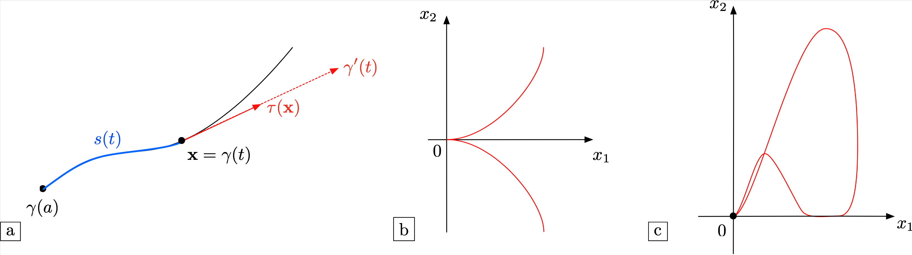
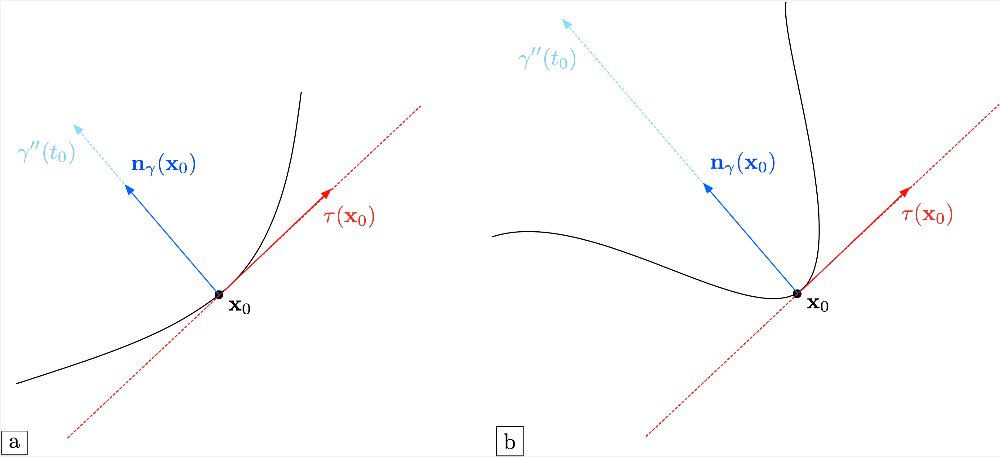
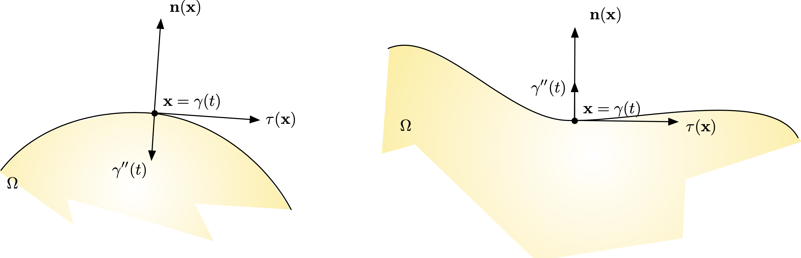
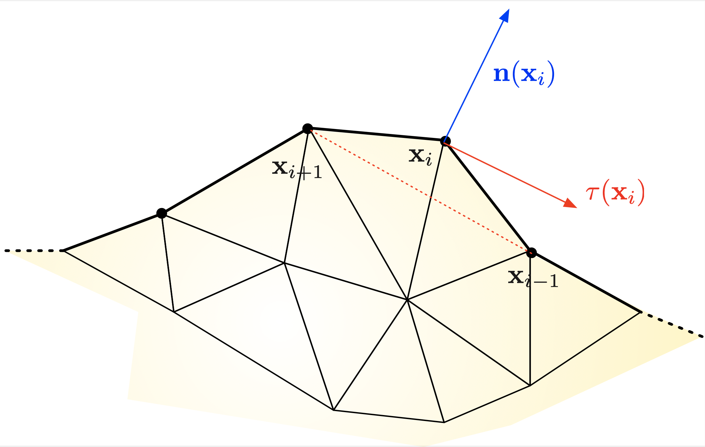
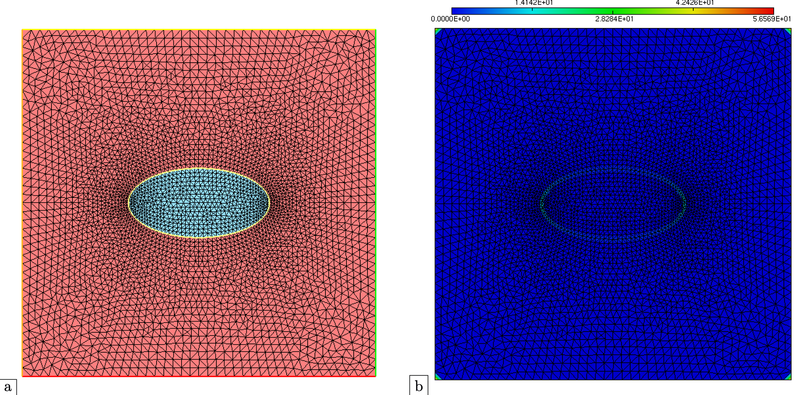

.. _sec.curvature:

Calculating curvature
=====================

This section is devoted to the quite subtle notion of curvature of a curve, appraising how fast a point travelling on the latter changes direction,
and its practical calculation. We first recall a few basic facts about curvature in :numref:`sec.defcurv`, before describing its practical calculation with $\texttt{FreeFem}$ in :numref:`sec.calccurv`. The notion of curvature being significantly more involved in higher space dimensions, we focus on the 2d case.

.. ##################################################
.. ##################################################

.. _sec.defcurv:

Definition of curvature
-----------------------

.. ##################################################
.. ##################################################

Throughout this section, we consider a 2d curve $\gamma$; with a small abuse of language, this terminology designates at the same time:
  
  - A mapping $\gamma: [a,b] \to \R^2$ between a parameter $t$ in some interval $[a,b]$ and a point $\gamma(t)$ in the 2d plane; 
  
  - The geometric locus of points formed by this mapping, i.e. the image $\gamma([0,T])$.

The curve $\gamma$ may be open (i.e. $\gamma(a) \neq \gamma(b)$) or closed (i.e. $\gamma(a) = \gamma(b)$).

Note that multiple parametrizations describe the same geometric object: for instance, if $\alpha: [\widetilde{a},\widetilde{b}] \to [a,b]$ is a smooth bijective mapping, $\widetilde{\gamma} = \gamma \circ \alpha: [\widetilde{a},\widetilde{b}] \to \R^2$ is another parametrization for $\gamma$.

Let us first define first-order quantities related to $\gamma$. 

.. #################@
.. prf:definition::

   Let $\gamma: [0,T] \to \R^2$ be a curve of class $\calC^1$. 
   
     - The velocity of $\gamma$ is the derivative $\gamma^\prime : [0,T] \to \R^2$.
     
     - The curve $\gamma$ is called simple when $\gamma^\prime$ does not vanish on $[0,T]$.
     
     - The unit tangent vector $\tau(\x)$ to $\gamma$ at a point $\x = \gamma(t)$ where $\gamma^\prime(t) \neq 0$ is:

       $$\forall \x = \gamma(t), \: t\in (0,T), \quad \tau(\x) = \frac{\gamma^\prime(t)}{\lvert\gamma^\prime(t) \lvert}.$$
     
     - The arc length of $\gamma$ is the function $s: [0,T] \to \R$ measuring the length from the initial value $t=0$:

       $$\forall t \in [0,T], \quad s(t) = \int_0^t \lvert \gamma^\prime(u)\lvert \:\d u.$$
       
       One can prove that a simple curve $\gamma$ may always be parametrized by its arc length, so that $\gamma$ has constant, unit velocity:

       $$\forall \x = \gamma(t), \: t\in (0,T), \quad \lvert \gamma^\prime(t) \lvert =1. $$
  
.. #################@

The velocity $\gamma^\prime(t)$ and the arc length $s(t)$ of $\gamma$ both depend on the chosen parametrization. On the contrary, the tangent vector $\tau(\x)$, giving the orientation of the tangent line to $\gamma$ passing through a point $\x$ on $\gamma$, only depends on the parametrization up to a sign, indicating the orientation of the curve, i.e. the sense of travel. 
These notions are illustrated on :numref:`fig.curvdef`.

.. #######

.. _fig.curvdef:

   $($a) Illustration of the first-order quantities attached to a curve $\gamma$; (b,c) Two different pathologies featured by non simple curves : (b) The curve $\gamma(t) = (t^2,t^3)$; (c) The curve $\gamma(t) = \left(\frac{\cos^2 t}{2+\sin(2t)},\frac{\sin^4 t}{2+\sin(2t)}\right)$.

.. #######

Let us now turn to the second-order features of a curve $\gamma: [a,b]\to \R^2$ of class $\calC^2$. The acceleration vector of $\gamma$ is the second-order derivative $\gamma^{\prime\prime} : [a,b] \to \R^2$ of the parametrization.

.. #################@
.. prf:definition::

  Let $\gamma: [0,T] \to \R^2$ be a simple curve of class $\calC^2$, parametrized by arc length. The curvature $\kappa(\x)$ at the point $\x = \gamma(t)$ is defined by
  
  $$k(\x) = \lvert \gamma^{\prime\prime}(t) \lvert. $$
  
.. #################@

To get an insight about curvature, let us assume that $\gamma$ is parametrized by arc length and let $\x_0 = \gamma(t_0)$ be a point on $\gamma$. A Taylor expansion of $\gamma$ around $t_0$ yields:
$$\gamma(t) \approx \gamma(t_0) + (t-t_0)\gamma^\prime(t_0) + \frac12 (t-t_0)^2 \gamma^{\prime\prime}(t_0). $$
Here,

  - The vector $\gamma^\prime(t_0) = \tau(\x_0)$ is the unit tangent vector to $\gamma$ at $\x_0$; 
  
  - The acceleration $\gamma^{\prime\prime}(t_0)$ is orthogonal to $\tau(\x_0)$, since
    $$\lvert \gamma^\prime(t)\lvert^2 = 1 \quad\Rightarrow \quad \gamma^\prime(t) \cdot \gamma^{\prime\prime}(t) = 0.$$
    We denote by $\n_\gamma(\x) = \frac{\gamma^{\prime\prime}(t_0)}{\lvert \gamma^{\prime\prime}(t_0) \lvert}$ the unit normal vector to $\gamma$ at $\x_0$.

With these notations, the above expansion rewrites:
$$\gamma(t) \approx \x_0 + (t-t_0)\tau(\x_0) + \frac12 (t-t_0)^2 k(x_0) \n_\gamma(\x_0). $$
This expansion reflects the local behavior of $\gamma$ near $\x_0 = \gamma(t_0)$: at first order, $\gamma$ follows the tangent direction $\tau(\x_0)$. Its normal deviation is encoded in the second-order term: the larger the curvature $k(\x_0)$, the faster it is; see :numref:`fig.curvdef2` for an illustration.

.. #######

.. _fig.curvdef2:

   Illustration of the second-order quantities attached to a curve $\gamma$; (a) A situation where the curvature $k(\x_0)$ is relatively small; (b) A situation where $k(\x_0)$ is large.

.. #######

The curvature $k(\x)$ is an unsigned quantity. It is customary to endow it with a sign in the particular situation where $\gamma$ is closed, and thus delimits an interior domain $\Omega \subset \R^2$. In this situation, let $\n$ be the unit normal vector to $\gamma$ pointing outward $\Omega$, whose orientation may differ from that of the normal vector $\n_\gamma$ defined above. We define the oriented curvature $\kappa(\x)$ of $\gamma$ at $\x$ by:
$$\kappa(\x) = -\gamma^{\prime\prime}(s) \cdot \n(\x);$$
in other terms, $\kappa(\x) = \pm k(\x)$, where the sign is that of the product $-\n(\x) \cdot \n_\gamma(\x)$.
Note that the oriented curvature is positive when $\gamma$ is locally convex near $\x$, positive otherwise, see :numref:`fig.curv2d`.

.. #################@

.. _fig.curv2d:

   (Left) The domain $\Omega$ is convex near $\x$: $\kappa(\x) > 0$; (right) $\Omega$ is concave near $\x$: $\kappa(\x) < 0$.

.. #################@

.. #################@

.. _ex.curvball: 

.. prf:example::

   Let $\Omega = B(\bz,R)$ be the disk centred at the origin $\bz$, with radius $R$. The curvature $\kappa(\x)$ at any point $\x \in \partial \Omega$ equals $\frac{1}{R}$, i.e. the larger the disk, the more \"flat\" its boundary appears.
   
.. #################@

.. ##################################################
.. ##################################################

.. _sec.calccurv:

Calculation of the mean curvature from a mesh
---------------------------------------------

.. ##################################################
.. ##################################################

Let $\Omega$ be a smooth bounded domain, equipped with a mesh $\calT_h$. We aim to calculate the mean curvature $\kappa$ at the points $\x$ of the boundary $\partial \Omega$.

The first step to achieve this goal is to approximate the unit normal vector $\n$ to $\partial\Omega$.
Let $\x_{i-1}$, $\x_i$ and $\x_{i+1}$ be three successive vertices on the discrete boundary $\partial \Omega$, enumerated in counterclockwise order.
The tangent vector $\t(\x_i)$ to $\partial \Omega$ at $\x_i$ is approximated as:

$$\tau(\x_i) \approx \frac{\x_{i-1}-\x_{i+1} }{\lvert \x_{i-1}-\x_{i+1} \lvert}.$$

The normal vector $\n(\x_i)$ is then obtained as the clockwise $90$ rotate of $\tau(\x_i)$; see :numref:`fig.curvapprox`.

In $\texttt{FreeFem}$, the normal vector $\n$ can be calculated in a simpler way, which uses the reserved keywords :code:`N.x` and :code:`N.y`.
These can only be used inside a one-dimensional integral :code:`int1d(Th)` call, and they represent the components of the normal vector field to the considered boundary. The following trick allows to calculate (an extension to $\Omega$ of) them as $\P_1$ Finite Element functions on $\calT_h$:

.. ################

.. code-block::

  /* Calculation of the normal vector to a meshed interface */
  /* Finite element spaces and functions */
  fespace Ph(Th,P1);
  Ph nx,ny,norm;

  /* Calculation of the normal vector to all borders of the mesh */
  real EPS = 1.e-5;
  varf normalx(u,v) = int1d(Th)(N.x*v);
  varf normaly(u,v) = int1d(Th)(N.y*v);

  nx[] = normalx(0,Ph);
  ny[] = normaly(0,Ph);
  norm = sqrt(nx^2+ny^2+EPS^2);
  nx = nx/norm;
  ny = ny/norm;

.. ################

Once $\n(\x_i)$ is available, the following approximation formula allows to calculate the mean curvature $\kappa(\x_i)$:

$$\frac{1}{\kappa(\x_i)} \approx - \frac{1}{4} \left( \frac{ (\x_{i-1}- \x_{i}) \cdot (\x_{i-1}- \x_{i}) }{\n(\x_i) \cdot  (\x_{i-1}- \x_{i}) } + \frac{ (\x_{i+1}- \x_{i}) \cdot (\x_{i+1}- \x_{i})}{\n(\x_i) \cdot  (\x_{i+1}- \x_{i}) }  \right).$$

.. #######

.. _fig.curvapprox:

   Approximation of the curvature of a domain $\Omega$ from a meshed discretization.

.. #######

This idea is implemented in the function $\texttt{curvatureFromMesh}$, contained in the independent module :download:`curvature.idp <./codes/curvature/curvature.idp>`, which is called as follows:
 
.. ################

.. code-block::

  /* Calculation of the mean curvature kappa from the datum of the normal vector (nx,ny) */
  curvatureFromMesh(Th,nx[],ny[],kappa[]);

.. ################

.. ##########

.. admonition:: Exercise
   :class: admonition-exo
   
   Use these $\texttt{FreeFem}$ recipes to:

     (1) Calculate the mean curvature of the unit ball; compare the result with the theoretical value $\kappa=1$, see :numref:`ex.curvball`.
     
     (2) Calculate the mean curvature of an ellipse with semi-axes $0.1$ and $0.2$.

.. ##########

A numerical result is presented in :numref:`fig.calccurv`, and the associated code can be downloaded :download:`here <./codes/curvature/test_curvature.edp>`.

.. #######

.. _fig.calccurv:

   $($a) Mesh of a box, containing a subdomain shaped as an ellipse; (b) Approximation of the curvature of all the boundaries of the mesh (including those of the bounding box).

.. #######

.. #####################

.. prf:remark::
 
  The curvature of the boundary $\partial\Omega$ of a domain $\Omega$ can be calculated in a different fashion when the latter is represented by a level set function, as we shall see in the next :numref:`sec.curvatureLS`.

.. #####################
