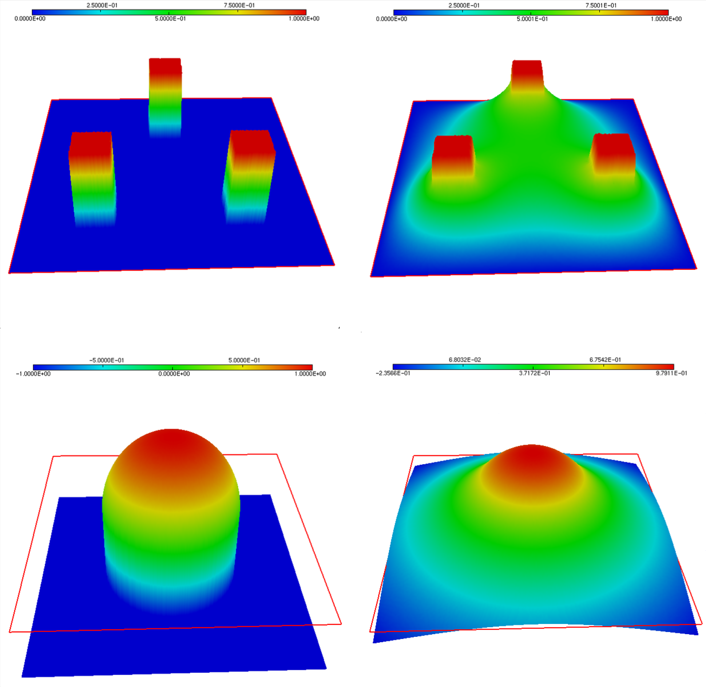

.. _sec.varineq:

A glimpse of variational inequalities
======================================

.. ##########
.. ##########

This section deals with variational inequalities. We consider a simple instance, featuring the following obstacle problem:

.. math:: 
  :label: eq.obstacle
  
  \left\{
  \begin{array}{cl}
  -\Delta u \geq f & \text{in } \Omega, \\
  u \geq m & \text{in } \Omega, \\
  -\Delta u = f & \text{on } \left\{ u > m\right\}, \\
  u = 0 & \text{on } \partial \Omega.
  \end{array}
  \right.
  
Here, $f: \Omega \to \R$ is a suitable source term, and we have chosen homogeneous Dirichlet boundary conditions on $\partial\Omega$ for the sake of simplicity -- although we shall use different boundary data in our examples.
  
As we shall see, this problem is often better understood from a variational viewpoint, i.e. it is seen as the minimization problem:

.. math:: 
  :label: eq.obstacleVar
  
  \min\limits_{u = \varphi \text{ on } \partial \Omega, \atop u \in K} J(u), \:\: \text{ where }\:\: \left\{\begin{array}{l}
   J(u) := \frac12 \displaystyle\int_\Omega \lvert\nabla u\lvert^2 \:\d\x - \displaystyle\int_\Omega fu \:\d\x, \\
   K = \Big\{u \in H^1(\Omega) \text{ s.t. } u \geq m \Big\}.
   \end{array}
   \right.
  
This problem serves as a prototype for more complex contact problems, in the setting of mechanical structures, as we shall see in the later :numref:`sec.contact`. We refer to the article :cite:`gustafsson2017finite` for an account of some of the existing numerical methods. 

.. #######

.. #######

.. ##########
.. ##########

A word about the modeling
--------------------------

.. ##########
.. ##########

The considered obstacle problem arises in multiple physical contexts, but its perhaps most intuitive interpretation arises in the context of membrane theory. 

Let us consider an elastic membrane, whose base is a two-dimensional domain $\Omega \subset \R^2$. We denote by $u:\Omega \to \R$ the vertical displacement of the membrane. The latter is supposed to be attached on $\partial \Omega$, i.e. $u(\x) = 0$ for $\x \in \partial \Omega$.
The membrane is loaded by a normal force with amplitude $f : \Omega \to \R$. 

We thus arrive at the following problem: 

$$\min\limits_{u \in H^1_0(\Omega)} \int_\Omega \lvert \nabla u \lvert^2 \:\d \x - \int_\Omega q u \:\d \x. $$

Now assuming that an obstacle $m : \Omega \to \R$ is present, the following constraint is added:

$$u(\x) \geq m(\x) \text{ for a.e. } \x \in \Omega.$$

.. ##########
.. ##########

A glimpse of the theory
------------------------

.. ##########
.. ##########

Convex minimization problem.

  
  .. math::
    :label: eq.varineqgen
     
       \text{Search for } u \in K \text{ s.t. for all } v\in K, \quad \langle Au, v-u \rangle \geq \ell(v-u).

The mathematical analysis of such variational inequalities often relies on the Lions-Stampacchia theorem, which is a generalization of the Lax-Milgram :numref:`th.LaxMilgram` encountered in the treatment of variational equalities. 

.. ##########

.. _th.LionsStampacchia:

.. prf:theorem:: Lions-Stampacchia
  
  Let $V$ be a real Hilbert space, and let $K \subset V$ be a closed, convex and non empty subset of $V$. Let $A: K \to V^*$ be a (possibly non linear) mapping such that
  
    -  $A$ is Lipschitz continuous: there exists $M \geq 0$ such that
    
       $$\forall u,v \in K, \quad \lvert\lvert A u - A v \lvert\lvert_{V^*}  \leq M \lvert\lvert u - v \lvert\lvert.$$
            
    -  $A$ is coercive: there exists $\alpha >0$ such that:
    
       $$\forall u,v \in K, \quad \alpha \lvert\lvert u\lvert\lvert^2 \leq \langle A u - Av, u-v \rangle.$$

  Then, for every linear form $\ell \in V^*$, there exists a unique function $u$ satisfying :math:numref:`eq.varineqgen`. Moreover, the dependence of $u$ on $\ell$ is Lipschitz continuous, i.e. if $u_1$, $u_2$ are the unique solutions to :math:numref:`eq.varineqgen` associated to the forms $\ell_1$, $\ell_2 \in V^*$, it holds:
  
  $$\lvert\lvert u_1- u_2 \lvert\lvert \leq \left(1 -\frac{\alpha^2}{M^2}\right)^{1/2} \lvert \lvert \ell_1 - \ell_2 \lvert\lvert_{V^*} .$$

.. ##########

.. ##########
.. admonition:: Proof
    :class: dropdown
    
    The proof consists in rewriting the search for $u$ as that of a fixed point of a suitable mapping, by using the variational characterization of the projection onto the closed convex set $K$ offered by :numref:`th.projconv`. 
    
    To achieve this, let us first remark that an element $u \in K$ satisfies :math:numref:`eq.varineqgen` if and only $u$ is an element in $V$ satisfying: 
    
    $$\forall v \in K, \quad \langle u - (u - \rho A u), v - u \rangle  \geq \ell(v-u),$$
    
    where $\rho > 0$ is for the moment arbitrary. Denoting by $I: V^* \to V$ the Riesz representation mapping, this is in turn equivalent to: 
    
    $$u\in K \text{ is s.t. } \forall v \in K, \quad \langle u - T _\rho u ,v - u \rangle \geq 0, \text{ where } T _\rho : V \to V \text{ is defined by } T _\rho v= v - \rho I A v + I\ell . $$
    
    Now invoking the projection operator $p_K$ over the closed convex set $K \subset V$, this is equivalent to the fact that $u = p_K T _\rho u$. Hence, since the projection mapping $p_K$ is $1$ Lipschitz, the result will follow provided we can prove that the mapping $p_K T _\rho : V \to V$ is a contraction, for a suitable value of $\rho$. To see this, let us calculate: 
    
    $$\begin{array}{ccl}
    \lvert\lvert T _\rho u - T _\rho v \lvert\lvert^2 &=& \lvert\lvert u - v - \rho (IA u - IA v) \lvert\lvert^2 \\
    &=& \lvert\lvert u - v \lvert\lvert^2 - 2\rho \langle A u - Av, u-v \rangle + \rho^2 \lvert\lvert Au- A v \lvert\lvert^2 \\
    &\leq & (1-2\rho \alpha + M^2) \lvert\lvert u - v \lvert\lvert^2,
    \end{array}$$
    
    where we have used the coerciveness assumption to estimate the second term in the right-hand side of the second line, and the Lipschitz assumption to deal with its third term. 
    
    Now choosing $\rho$ such that $0 < \rho < \frac{2M^2}{\alpha}$ (for instance $\rho = \frac{\alpha}{M^2}$ works), the desired result follows. 
    
.. ##########

The following result is an immediate consequence of the Lions-Stampacchia theorem, but it is useful in a wide variety of situations.

.. ##########

.. prf:corollary::
  
  Let $V$ be a real Hilbert space, and let $K \subset V$ be a closed, convex and non empty subset of $V$. Let $a: V \times V \to \R$ be a continuous and coercive bilinear form, and let $\ell : V \to \R$ be a continuous linear form. Then the variational inequality: 
  
  $$\text{Search for } u \in K \text{ s.t. } \forall v \in K, \quad a(u,v-u) \geq \ell(v-u) $$
  
  has a unique solution that depends continuously on $\ell$.
  
.. ##########

.. ##########
.. ##########

A simple penalty method
------------------------

.. ##########
.. ##########

This section deals with a penalization method for the obstacle problem :math:numref:`eq.obstacle`; in other terms, the inequality constraint $u \geq m$ is imposed in a \"soft\", approximate way, via a suitable penalization of the energy functional. 
More precisely, we consider the following minimization problem:

$$\min\limits_{u \in H^1_0(\Omega)} J _\e(u), \text{ where } J _\e(u) = \frac{1}{2}\int_\Omega \lvert \nabla u \lvert^2 \:\d \x - \int_\Omega fu \:\d\x + \frac{1}{2\e}\int_\Omega [ u-m ]_-^2 \:\d\x.$$

Here, we have denoted by $[t]_- := \min(0,t)$ the negative part of a real number $t\in\R$.
Intuitively, as $\e$ tends to $\infty$, the minimization of this energy gives priority to the final term: $[u-m]_-$ is driven to $0$, so that the constraint is satisfied in this limit.

The variational formulation for this problem reads: 

$$\text{Search for }  u \in H^1_0(\Omega) \text{ s.t. } \forall v \in H^1_0(\Omega), \quad \int_\Omega \nabla u \cdot \nabla v \:\d\x + \frac{1}{\e} \int_\Omega [ u-m ]_- v \:\d \x = \int_\Omega fv \:\d\x,$$

see notably the exercise in :numref:`app.nemitski` for the treatment of the last integral in the left-hand side.
This is a non linear variational problem, to which we apply Newton's method. 

This yields the following scheme: 

  - $u^0$ is the initial datum. 
  
  - For $n=0, \ldots$ until convergence, do:
  
    - Define the set $A^n = \left\{ \x \in \Omega, \:\: u(\x) \leq m(\x) \right\}$; 
    
    - Solve the variational problem: 
    
      .. math::
        :label: eq.Newtonvarineq
     
        \text{Search for } u^{n+1} \in H^1_0(\Omega) \text{ s.t. } \forall v \in H^1_0(\Omega), \quad \int_\Omega \nabla u^{n+1} \cdot \nabla v \:\d \x + \frac{1}{\e} \int_{A^n} u^{n+1} v \:\d \x = \int_\Omega fv \:\d \x + \frac{1}{\e}\int_{A^n} m v \:\d \x.
      
That this scheme is exactly that provided by Newton's method is the purpose of the next exercise.

.. ##########
.. admonition:: Exercise
   :class: admonition-exo

   Prove that the above algorithm exactly corresponds to the application of Newton's method to the non linear mapping:
   
   $$H^1_0(\Omega) \to H^{-1}(\Omega), \quad F(u) : v \mapsto \int_\Omega \nabla u \cdot \nabla v \:\d\x + \frac{1}{\e} \int_\Omega [ u-m ]_- v \:\d \x - \int_\Omega fv \:\d\x.$$

.. ##########

.. ##########
.. admonition:: Correction
    :class: dropdown

    Let us calculate the derivative of the function $F$ at some iterate $u^n$: 
    
    $$F^\prime(u^n)(h) = \int_\Omega \nabla h \cdot \nabla v \:\d x + \frac{1}{\e} \int_\Omega \chi_{A^n} h v \:\d \x,  $$
    
    where $\chi_{A^n}$ is the characteristic function of $A^n$. Now, the $n^{\text{th}}$ iteration of Newton's method reads: 
    
    $$u^{n+1} = u^n + h^n, \text{ where } h^n \text{ is the solution to } F^\prime(u^n)(h^n) = -F(u^n).$$

    
.. ##########

The implementation of this strategy can be downloaded :download:`here <./codes/varineq/varineq_penalty.edp>`. 
Let us consider its application to a suitably tailored situation where the analytical situation is known. $\Omega$ is the 2d square $\Omega = (-2,2) \times (-2,2)$, and the obstacle $m$ is defined by:

$$m(\x) = \left\{
\begin{array}{cl}
\sqrt{1-x_1^2 - x_2^2} & \text{if } \lvert \x \lvert \leq 1, \\
-1 & \text{otherwise}.
\end{array}
\right.$$

We also set the boundary condition $u_d$ so that the analytical solution to this problem is given by:
$$u_{\text{ex}}(\x) = \left\{
\begin{array}{cl}
\sqrt{1-\lvert \x \lvert^2} & \text{if } \lvert \x \lvert < r^*, \\
- \frac{{r^*}^2}{(1-{r^*}^2)^{1/2}} \log\left(\frac12\lvert\x\lvert\right) & \text{otherwise},
\end{array}
\right.$$
where $r^*$ is defined so that $(r^*)^2\left(1-\log\left(\frac{r^*}{2}\right)\right)=1$, that is: $r^* \approx 0.697965$.

The result is depicted on :numref:`fig.obstacle`, as well as the solution to a similar instance, associated to another situation.

.. #######

.. _fig.obstacle:

   (Upper row) Obstacle and solution of the obstacle problem :math:numref:`eq.obstacle` for the analytical example; (Lower row) Obstacle and solution in another particular instance.
    
.. #######

.. ##########
.. ##########

Use of a constrained optimization algorithm: $\texttt{ipopt}$
-------------------------------------------------------------

.. ##########
.. ##########

An alternative idea is to use a constrained optimization algorithm.
Let us consider the following discretization of the obstacle problem.

Then, it is natural to try and use an on-the-shelf constrained optimization algorithm, such as $\texttt{ipopt}$, which is interfaced in $\texttt{FreeFem}$. The syntax for calling $\texttt{ipopt}$ in $\texttt{FreeFem}$ is the following.

Note that $\texttt{FreeFem}$ also interfaces $\texttt{nlopt}$.

Note that this method is likely to be very costly, since the number of constraints is huge -- being equal to the number of vertices in the mesh. 

.. ##########
.. ##########

An active set algorithm
------------------------

.. ##########
.. ##########

This section deals with an alternative solution technique of the obstacle problem :math:numref:`eq.obstacle`, proposed in the article :cite:`hintermuller2002primal`. In a nutshell, this method amount to solving the first-order necessary conditions for optimality of the constrained optimization problem :math:numref:`eq.obstacleVar`.
Since constrained optimization theory is significantly more technical in infinite-dimensional spaces, we describe the method in the finite-dimensional setting.

Let us then consider the following discretization of :math:numref:`eq.obstacleVar`, with a Finite Element method counting $N$ degrees of freedom, see :numref:`sec.discvarpb`. 

$$\min\limits_{\u \in \R^N} \:\left(\frac{1}{2} A\u \cdot \u - \f \cdot \u \right) \:\: \text{ s.t. } \:\: m_i - u_i \leq 0 \text{ for } i =1,\ldots,N. $$

Here, 
  
  - $A \in \R^{N\times N}$ is the stiffness matrix of the problem: 
     
    $$A_{ij} = \int_\Omega \nabla \phi_j\cdot\nabla\phi_i \:\d\x, \quad i,j=1,\ldots,N.$$
  
  - $\f \in \R^N$ is the force vector:
  
    $$f_i = \int_\Omega f(\x) \phi_i(\x) \:\d \x, \quad i=1,\ldots,N.$$ 
  
  - The unknown $\u = \left\{u_i\right\}_{i=1,\ldots,N} \in \R^N$ is the collection of degrees of freedom of the sought function $u$ in the chosen basis:
    
    $$u(\x) = \sum\limits_{i=1}^N u_i \phi_i(\x), \quad \x \in \Omega.$$
  
Let us now write down the first-order conditions characterizing the optimality of a vector $\u \in \R^N$, see :numref:`app.recalloptim`;
note that their fulfillment is equivalent to that of the problem :math:numref:`eq.obstacleVar` itself, since the latter is a convex optimization program. A vector $\u \in \R^N$ is solution to :math:numref:`eq.obstacleVar` if and only if there exists a Lagrange multiplier $\lambda \in \R^N$ such that:  

$$\left\{
\begin{array}{l}
A \u + \lambda = \f \\
u_i \geq m_i, \: \lambda_i \geq 0, \text{ and } \lambda_i (u_i-m_i)=0 \text{ for all } i=1,\ldots,N.
\end{array}
\right.$$

In order to endow this problem with an equivalent expression which is amenable to computations, we rely on the following elementary reformulation of the complementarity constraints, featured on the second line. 

.. ##########
.. admonition:: Exercise
   :class: admonition-exo

   Let $\u$, $\m$  and  $\lambda$ be three vectors in $\R^N$, and let $c >0$ be a fixed, arbitrary real number. Prove that the following two assertions are equivalent:
   
   (i) For all $i=1,\ldots,N$, $\:$ $u_i \geq m_i$, $\:$ $\lambda_i \geq 0$ $\:$ and $\lambda_i(u_i-m_i) = 0$.
   
   (ii) For all $i=1,\ldots,N$, $\:$ $\lambda_i = \max(0,\lambda_i - c(u_i-m_i))$.

.. ##########

.. ##########
.. admonition:: Correction
    :class: dropdown
    
    Let us first assume that $(i)$ holds true. Then, on the one hand, $\lambda_i \geq 0$, and since $u_i - m_i \geq 0$, we also have $\lambda_i \geq \lambda_i - c(u_i-m_i)$. Thus, $\lambda_i \geq \max(0,\lambda_i - c(u_i-m_i))$. In order to prove the converse inequality, let us distinguish two cases:
    
      - If $\lambda_i = 0$, then obviously, $\lambda_i \leq \max(0,\lambda_i - c(u_i-m_i))$;
      
      - If $\lambda_i > 0$, then by the last relation, $u_i - m_i =0$, and so $\lambda_i =\lambda_i - c(u_i-m_i)$. In particular, $\lambda_i \leq \max(0,\lambda_i - c(u_i-m_i))$.
      
    Hence, in both cases, we have that $\lambda_i \leq \max(0,\lambda_i - c(u_i-m_i))$, and we have thus proved that $(i)$ implies $(ii)$.

    Let us now assume that $(ii)$ holds true. Then, obviously, we have that $\lambda_i \geq 0$. Let us now distinguish two cases: 
    
    - If $\lambda_i = 0$, then necessarily, $\lambda_i - c(u_i-m_i) \leq 0$, which proves that $u_i-m_i \geq 0$. We also obviously have that $\lambda_i(u_i-m_i) = 0$ in this case. 
    
    - If $\lambda_i > 0$ then $\lambda_i = \lambda_i - c(u_i-m_i)$, and thus $u_i-m_i=0$. Also in this case, we have that $\lambda_i(u_i-m_i)=0$. 
    
    This proves that $(ii)$ implies $(i)$.
    
.. ##########

Let us now introduce the function $\bC: \R^N \times \R^N \to \R^N$ defined by:

$$\forall (\u,\lambda) \in \R^N \times \R^N, \quad C(\u,\lambda)_i = \max(0,\lambda_i - c(u_i-m_i)).$$

It follows that our problem is now equivalent to:

$$\text{Search for } (\u,\lambda) \in \R^N \times \R^N \:\: \text{ s.t. } \bF(\u,\lambda) = \bz, \text{ where } \bF(\u,\lambda) = \left(
\begin{array}{c}
A \u + \lambda - \f \\
\lambda - \bC(\u,\lambda)
\end{array}
\right).$$

We now treat this problem with a so-called semi-smooth Newton's method. Loosely speaking, we use Newton's method to search for a zero of $\bF : \R^N \times \R^N \to \R^N \times \R^N$ by proceeding as if $\bC$ were differentiable everywhere, relying on the following formulas:

$$\frac{\partial C_i}{\partial u_i} (\u,\lambda) = \left\{
\begin{array}{cl}
-c & \text{if } \lambda_i - c(u_i-m_i) > 0, \\
0 & \text{if } \lambda_i - c(u_i-m_i) < 0, \\
\end{array}
\right. \:\: \text{ and } \:\: \frac{\partial C_i}{\partial \lambda_i} (\u,\lambda) = \left\{
\begin{array}{cl}
1 & \text{if } \lambda_i - c(u_i-m_i) > 0, \\
0 & \text{if } \lambda_i - c(u_i-m_i) < 0. \\
\end{array}
\right. $$

The following exercise provides the iteration formulas associated to this strategy.

.. ##########
.. admonition:: Exercise
   :class: admonition-exo

   Show that the Newton iteration formula
   
   $$(\u^{n+1},\lambda^{n+1}) = (\u^{n},\lambda^{n})  +(\delta \u^{n},\delta\lambda^{n}), \:\: \text{ where } \:\:(\delta \u^{n},\delta\lambda^{n}) \text{ solves } \bF^\prime(\u^n,\lambda^n)(\delta \u^n, \delta\lambda^n) = -\bF(\u^n,\lambda^n),$$
   
   is equivalent to 
   
   $$\left\{
   \begin{array}{cl}
   A\u^{n+1} + \lambda^{n+1} = \f & \\ 
   \lambda_i^{n+1}  = 0 & \text{if } \lambda_i^n - c(u_i^n-m_i) < 0, \\
   u_i^{n+1}  = m_i& \text{if } \lambda_i^n - c(u_i^n-m_i) > 0, \\
   \end{array}
   \right.$$

.. ##########

.. ##########
.. admonition:: Correction
    :class: dropdown
    
    The Newton iteration formula reads: 
    
    $$\left\{
    \begin{array}{cl}
    A\delta \u^n + \delta \lambda^n = \f - A \u^n - \lambda^n &  \\ 
    \delta\lambda_i^{n}  = - \lambda_i^n + C_i(\u^n,\lambda^n) & \text{if } \lambda_i - c(u_i-m_i) < 0, \\
    -c \delta u_i^{n}  = -\lambda_i^n + C_i(\u^n,\lambda^n)& \text{if } \lambda_i - c(u_i-m_i) > 0.
    \end{array}
    \right.$$
    
    Using now the very definition of $C(\u^n,\lambda^n)$, this rewrites:
    
    $$\left\{
    \begin{array}{cl}
    A\delta \u^n + \delta \lambda^n = \f - A \u^n - \lambda^n &  \\ 
    \delta\lambda_i^{n}  = - \lambda_i^n & \text{if } \lambda_i^n - c(u_i^n-m_i) < 0, \\
    -c \delta u_i^{n}  = - c(u_i^n-m_i)& \text{if } \lambda_i^n - c(u_i^n-m_i) > 0.
    \end{array}
    \right.$$
    
    A simple rearrangement of this system yields the desired expression.
    
.. ##########

According to this result, let us introduce the sets $\calA^n$ and $\calI^n$ of indices of the active and inactive degrees of freedom as: 

$$\calA^n := \Big\{ i=1,\ldots,N \: \text{ s.t. }\: \lambda_i^n - c (u_i^n - m_i)  > 0 \Big\}, \text{ and } \calI^n := \Big\{1,\ldots,n \Big\} \setminus \calA^n.$$

For simplicity of the presentation, and without loss of generality, we assume that $\calA^n = \left\{1,\ldots,K\right\}$ and $\calI^n = \left\{K+1,\ldots,N\right\}$. Accordingly, we write the matrix $A$ block-wise:

These features can be conveniently imposed in $\texttt{FreeFem}$ via a similar penalization trick as for Dirichlet conditions, see :numref:`sec.dirtgv`.

This yields the following numerical procedure: 

  - Initialization: Take $\u^0 \in \R^N$ and $\lambda^0 \in \R^N$.
  
  - For $n=0,\ldots,$ until convergence: 
  
    -  Identify the sets $\calA^n$ and $\calI^n$. 
       
    - Solve the system:
    
    - Update the Lagrange multiplier.

As we have seen, $\calA^k$ coincides with the indices $i$ where $u_i^k = m_i$ -- i.e. the obstacle constraint is active.
 
The implementation of this procedure can be downloaded :download:`here <./codes/varineq/varineq_primaldual.edp>`. 

.. ##########

.. prf:remark::
  
     - From the theoretical viewpoint, $c >0$ could be chosen arbitrarily. However, in numerical practice, choosing a large value of $c$ will tend to yield a \"small\" number of active nodes (especially at the first iterations), i.e. of those nodes where $u_i$ should be constrained to equal $m_i$, while a small value of $c$ will yield a large number of active nodes.
     
     - From the practical side, be very careful with the manipulation of both finite element functions and arrays of real numbers in $\texttt{FreeFem}$.
  
.. ##########
