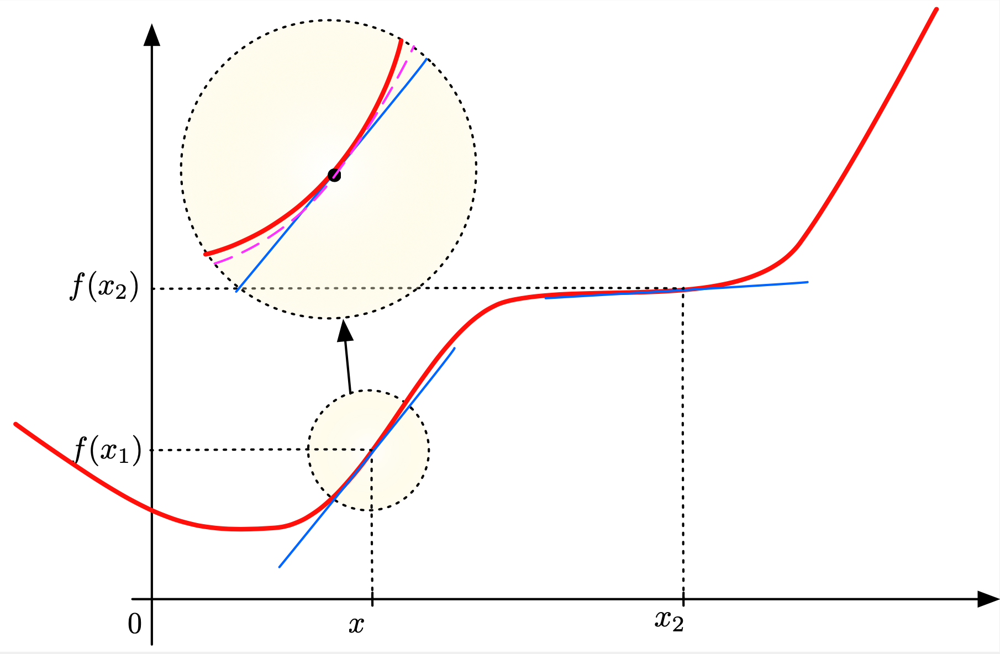
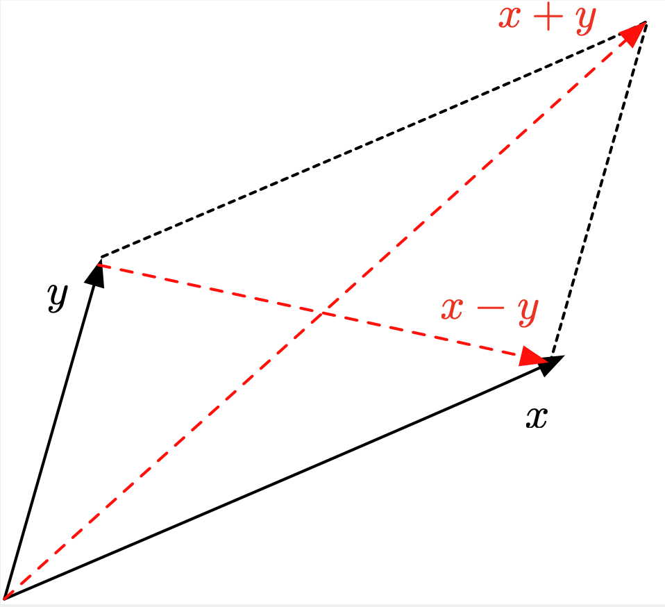
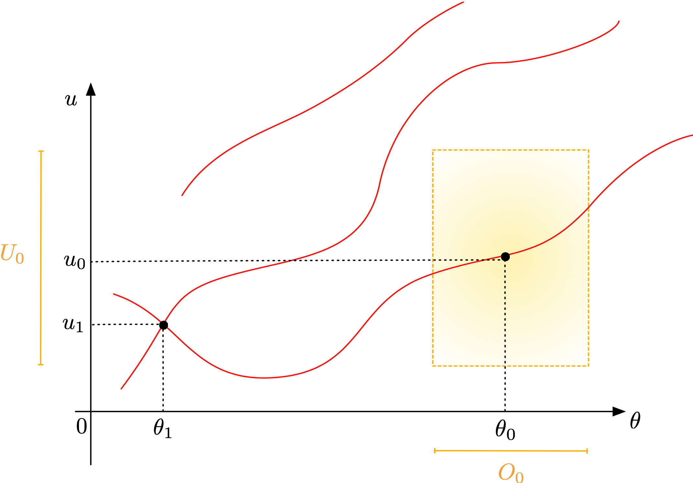
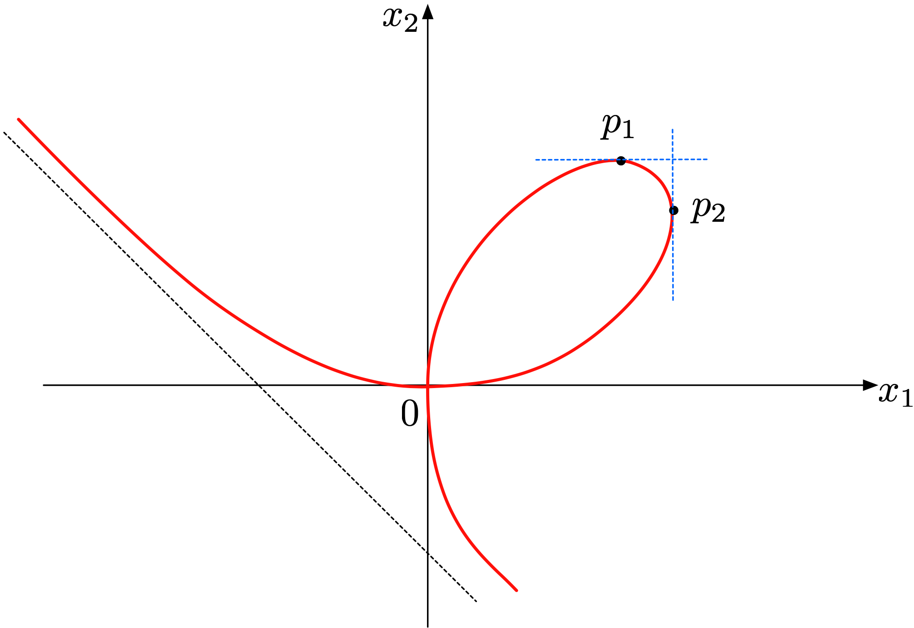

A reminder of differential calculus
====================================

Here, we recall a few mathematical facts from differential calculus. Let us remind the reader that, as all these appendices, this section is not meant to be read from top to down, but rather to be referred to when needed in reading the main sections of the book.

.. ##################################################
.. ##################################################

Basic definitions and notations
--------------------------------

.. ##################################################
.. ##################################################

Let $(E, \lvert\lvert \cdot \lvert\lvert_E)$ and $(F, \lvert\lvert \cdot \lvert\lvert_F)$ be two normed vector spaces. 

  - We denote by $\calL(E;F)$ the vector space of continuous linear mappings from $E$ into $F$. 
  
  - When $F = \R$ is the real line, we set $\calL(E) \equiv \calL(E;\R)$.   

.. ##################################################
.. ##################################################

Derivatives in normed vector spaces
------------------------------------

.. ##################################################
.. ##################################################

The Fréchet derivative is the generalization to arbitrary normed vector spaces of the familiar derivative of a function $f: \R \to \R$. For a given point $x \in \R$, the derivative $f^\prime(x)$ is defined as the following limit, when it exists:

$$f^\prime(x) = \lim\limits_{h \to 0} \frac{f(x+h) - f(x)}{h};$$

visually, $f^\prime(x)$ is the slope of the tangent line to the graph of $f$ at $x$. This expression can be re-arranged into an approximation formula for $f$ near $x$:
$$f(x+h) = f(x) + f^\prime(x) h + \text{o}(h),$$

where the notation $\text{o}(h)$ stands for an unspecified function of $h$ which tends to $0$ faster than $h$ as $h \to 0$: $\lim_{h\to 0} \frac{\text{o}(h)}{h} = 0$.
Roughly speaking, when \"small\" perturbations $(x+h)$, $h \ll 1$, are considered around $x$, a coarse approximation of the corresponding values $f(x+h)$ is the ($h$-independent) value $f(x)$.
A more accurate \"first-order\" approximation of $h \mapsto f(x+h)$ (up to a remainder of the order $\text{o}(h)$)
is the affine function $h \mapsto f(x) + f^\prime(x) h$, see :numref:`fig.derivativeR`.

.. ############
.. _fig.derivativeR:

   Interpretation of the derivative of a function $f : \R \to \R$: when \"zooming\" on a point $x \in \R$, the function $h \mapsto f(x+h)$ resembles the constant value $f(x)$; a more precise approximation is given by the affine function $h \mapsto f(x) + f^\prime(x)(h)$ (whose graph is the blue line), and an even more precise approximation is given by the second-order expansion $h \mapsto f(x) + f^\prime(x) h +\frac12 f^{\prime\prime}(x) h^2$ (in purple)
   
.. ############

.. ################
.. prf:definition::

  Let $(E,||\cdot ||_E)$ and $(F, ||\cdot ||_F)$ be two normed vector spaces, and let $U$ be an open subset of $E$. One function $f : U \to F$ is called differentiable in the sense of Fréchet at some point $x \in U$ if there exists a linear, continuous mapping $L : E \to F$ such that
  $$\forall \e >0, \:\: \exists \delta >0, \forall h \in E, \quad ||h ||_E \leq \delta \:\: \Rightarrow \:\:\frac{|| f(x+h) - f(x) - L(h) ||_F}{|| h||_E} \leq \e.$$

  In such case, the linear mapping $L$ is unique; it is denoted by $f^\prime(x): E \to F$ and it is called the Fréchet derivative of $f$ at $x$.

.. ################

The following result is fundamental.

.. ##################################################
.. ##################################################

.. _sec.dual:

Dual spaces
------------

.. ##################################################
.. ##################################################

Let us start with a definition.

.. ################
.. prf:definition::

   Let $(E,\lvert\lvert \cdot \lvert\lvert_E)$ be a normed vector space. The dual space $(E^*,\lvert\lvert \cdot \lvert\lvert_{E^*})$ of $E$ is the vector space of continuous linear forms on $E$, that is:
   
   $$E^* = \left\{ \ell : E \to \R , \:\: \ell \text{ is linear and continuous}\right\}. $$
     
   The norm $\lvert\lvert \ell \lvert\lvert_{E^*}$ of a linear and continuous form $\ell \in E^*$ is the best constant (i.e. the smallest, most accurate) in the relation defining its continuity.
   
   $$\lvert\lvert \ell \lvert\lvert_{E^*} = \sup\limits_{x \in E, \atop x \neq 0} \frac{\lvert \ell(x)\lvert}{\lvert\lvert x \lvert\lvert_E}.$$
   
   $E$ is a Banach space (even if $E$ is not).
   
.. ################

It is often interesting to try and compare the dual space $E^*$ with $E$ itself. To emphasize the symmetry between both spaces, it is cutsomary to denote:

$$\forall x \in E, \:\: \ell \in E^*, \quad \langle \ell, x \rangle_{E^*,E} = \ell(x). $$ 

The notation $\langle,\cdot,\cdot \langle_{E^*,E}$ is referred to as the duality bracket.

.. ##################################################
.. ##################################################

.. _sec.Banach:

Banach spaces
--------------

.. ##################################################
.. ##################################################

.. ##########
.. admonition:: Exercise (Neumann series)
   :class: admonition-exo

   Let $(E,||\cdot ||)$ be a Banach space.

     (1) Let $T : E \to E$ be a linear operator with norm $|| T ||_{\calL(E)} < 1$. Show that the series

         $$U = \sum\limits_{n=0}^\infty T^n$$

         converges in $\calL(E)$. 
         
     (2) Prove that $(\Id - T)$ is invertible, with inverse $(\Id - T)^{-1} = U$. 

     (3) Show that the subset $\text{Inv}(E)$ of $\calL(E)$ made of invertible operators is open in $\calL(E)$. 

     (4) Prove that the (non linear) mapping 
         
         $$\text{Inv}(E) \ni T \longmapsto T^{-1} \in \text{Inv}(E)$$

         is continuous.

     (5) Let $(F,||\cdot ||_F)$ be another normed vector space. Show that the subset $\text{Inv}(E;F)$ of $\calL(E;F)$ made of invertible mappings is open in $\calL(E;F)$.

.. ##########

.. ##########
.. admonition:: Correction
    :class: dropdown
    
    To Do
    
.. ##########

.. ##################################################
.. ##################################################

.. _sec.Hilbert:

Hilbert spaces
--------------

.. ##################################################
.. ##################################################

For simplicity, we focus on the case of real Hilbert spaces, but most of this material extends to complex vector spaces.

.. ################
.. prf:definition::

   Let $V$ be a vector space. An inner product $a$ on $V$ is a mapping $a : V \times V \to \R$ which is
   
     - Bilinear, i.e. it is linear with respect to the first variable:
       $$\forall u,v,w \in V,  \lambda, \mu \in \R, \quad a(\lambda u + \mu v,w) = \lambda a(u,w) + \mu a(v,w), $$
       and also with respect to the second variable:
       $$\forall u,v,w \in V,  \lambda, \mu \in \R, \quad a(w,\lambda u + \mu v) = \lambda a(w,u) + \mu a(w,v). $$
       
     - Symmetric: for all $u,v \in V$, it holds $a(u,v) = a(v,u)$.
     
     - Positive: for all $u \in V$, it holds $a(u,u) \geq 0$.
     
     - Positive definition: forall $u \in V$, $a(u,u) =0 \Rightarrow u=0$.
     
.. ################

A fundamental fact about inner products is that they induce a norm.

.. ################
.. prf:lemma:: Cauchy-Schwarz inequality

   Let $V$ be a vector space, equipped with an inner product $a$. Then, the following inequality holds true:
   $$\forall u,v \in V, \quad a(u,v) \leq a(u,u)^{\frac12} a(v,v)^{\frac12}. $$
   Moreover, equality holds true if and only if $u=0$ or there exists a real value $\lambda > 0$ such that $v = \lambda u$.
   
.. ################

.. ################
.. prf:definition::

   A pre-Hilbert space $(H,(\cdot,\cdot)_H)$ which is complete for the norm $\lvert\lvert \cdot \lvert\lvert_H$ is called a Hilbert space.
   
.. ################

.. admonition:: Exercise
  :class: admonition-exo

  Let $(H,(\cdot , \cdot))$ be a pre-Hilbert space. Show that the associated norm $\lvert\lvert x\lvert\lvert = (x,x)^{1/2}$ satisfies the parallelogram identity, see :numref:`fig.parallelogramidentity`:
  
  $$\forall x, y \in H, \quad \lvert\lvert x + y \lvert\lvert ^2 + \lvert\lvert  x - y \lvert\lvert ^2 = 2 \lvert\lvert x \lvert\lvert ^2 + 2\lvert\lvert y \lvert\lvert ^2.$$

.. ##########

.. #######

.. _fig.parallelogramidentity:

   Illustration of the parallelogram identity.

.. #######

In Hilbert spaces, Riesz representation theorem + this makes duality especially convenient. 

The gradient is the direction of steepest variation.

.. ##################################################
.. ##################################################

.. _sec.impfuncthm: 

The implicit function theorem
------------------------------

.. ##################################################
.. ##################################################

This section is devoted to the implicit function theorem -- a key result in the setting of Banach spaces which has countless applications in fields so diverse as differential geometry, ordinary and partial differential equations, etc. 

.. ####################

Intuitive presentation
"""""""""""""""""""""""

.. ####################

In a nutshell, the implicit function theorem is a key tool for proving the existence, uniqueness and regularity of solutions to non linear equations depending on parameters. The typical application context is as follows: we consider an equation of the form 

.. math:: 
  :label: eq.Fthetau0
  
   \text{Search for } u \: \text{ s.t. } \calF(\theta,u) = 0,

where 
  
  - The sought variable $u$ belongs to a subset $U$ of a Banach space $E$; 
 
  - The parameter $\theta$ belongs to a subset $O$ of another Banach space $\Theta$; 

  - The mapping $\calF: O \times U \to F$ is non linear and takes values in a Banach space $F$.  

Let us glean some intuition about what we should expect regarding the solvability of the equation :math:numref:`eq.Fthetau0` by considering the particular case where all spaces are finite-dimensional, and the mapping $\calF \equiv \bF$ is linear. The parameter $\theta$ belongs to $\R^m$ and the variable $\u$ is sought in $\R^n$: for each value $\theta \in \R^m$, we search for the solution $\u = \u(\theta) \in \R^n$ to the equation
$$\bF(\theta,\u) = \bz.$$
Since $\bF : \R^m \times \R^n \to \R^n$ is assumed to be linear, it can be written under the form

$$\bF(\theta,\u) = A \theta + B \u,\:\: \text{ where } A \in \R^{n \times m} \text{ and } B \in \R^{n\times n} \text{ are two matrices.}$$

In this setting, the resolution of :math:numref:`eq.Fthetau0` is quite simple: assuming that $B$ is an invertible matrix, there is a unique solution 
$$\u(\theta) = -B^{-1} A \theta.$$

The implicit function theorem generalizes this pattern to the general context where $\theta$ and $\u$ belong to infinite-dimensional Banach spaces, and $\bF$ is replaced by a smooth, possibly non linear mapping $\calF$. Similar results to those of our model situation hold true, up to the following adaptations:

- The result applies locally, around one particular solution $(\theta_0,u_0)$ to the equation :math:numref:`eq.Fthetau0`: for $\theta$ \"close enough\" to the reference value $\theta_0$, :math:numref:`eq.Fthetau0` has a unique solution $u$ which is \"close enough\" to $u_0$; 

- The linearized version of $\calF$ with respect to the variable $u$ at the point $(\theta_0,u_0)$ has to be a linear isomorphism (this generalizes the above requirement that the block $B$ be invertible).

.. ####################

Statement of the implicit function theorem
"""""""""""""""""""""""""""""""""""""""""""

.. ####################

Let us now provide a rigorous statement of the implicit function theorem.

.. ################
.. prf:theorem:: Implicit function theorem

   Let $(\Theta,||\cdot ||_\Theta)$, $(E,|| \cdot ||_E)$ and $(F,||\cdot ||_F)$ be three Banach spaces, and  let $O \subset \Theta $ and $U \subset E$ be open subsets. Let 
   
   $$\calF : O \times U \to F $$

   be a mapping of class $\calC^k$ for some $k \geq 1$. Let $(\theta_0, u_0) \in O \times U$ satisfy $\calF(\theta_0,u_0) = 0$; we assume that the partial Fr\'echet derivative 

   $$\frac{\partial \calF}{\partial u}(\theta_0, u_0) : E \to F $$

   is a linear isomorphism. Then, there exist open neighborhhods $O_0 \subset O$ and $U_0 \subset U$ of $\theta_0$ and $u_0$ respectively, as well as a mapping $g: O_0 \to U_0$ of class $\calC^k$ such that $u_0 = g(\theta_0)$ and

   $$\forall \theta \in O_0, \: \: u \in U_0, \quad \calF(\theta , u) = 0 \text{ if and only if } u = g(\theta).$$
   
.. ################

This result is illustrated on :numref:`fig.impfunc`.

.. ############
.. _fig.impfunc:

   The implicit function theorem: the set of solutions $(\theta,u)$ to :math:numref:`eq.Fthetau0` consists of the red curves in the $(\theta,u)$ plane; at $(\theta_0, u_0)$, the partial derivative $\frac{\partial \calF}{\partial u}(\theta_0,u_0)$ is invertible and for $\theta$ close to $\theta_0$, the equation $\calF(\theta,u)= 0$ has a unique solution $u$ close enough to $u_0$; at $(\theta_1,u_1)$,  $\frac{\partial \calF}{\partial u}(\theta_0,u_0)$ is not invertible, and several branches of solutions may meet. 
   
.. ############

.. ################
.. prf:remark:: 

   The derivative of the mapping $g : O_0 \to U_0$ supplied by the implicit function theorem can be calculated owing to the following observation. 
   
   We know that both mappings $\calF : O \times U \to F$ and $g: O_0 \to U_0$ are of class $\calC^k$, and that the following relation holds: 
   
   $$\forall \theta \in O_0, \quad \calF(\theta, g(\theta)) = 0.$$

   Taking derivatives in this equation and using the chain rule, we obtain
   
   $$\forall h \in \Theta, \quad \frac{\partial \calF}{\partial \theta}(\theta,g(\theta))(h) + \frac{\partial \calF}{\partial u}(\theta,g(\theta)) \d_\theta g(h) = 0.$$

   By the assumption of the implicit function theorem, the partial derivative $\frac{\partial \calF}{\partial u}(\theta_0,g(\theta_0)) : E \to F$ is invertible. Since the subset of $\calL(E;F)$ consisting of invertible mappings is open (a fact which follows from the consideration of Neumann series, see the exercise about Neumann series in :numref:`sec.Banach`), it follows that, up to decreasing the open set $O_0$, the mapping $\frac{\partial \calF}{\partial u}(\theta,g(\theta)) \in \calL(E;F)$ is actually invertible for all $\theta \in O_0$. We thus obtain: 

   $$\forall h \in \Theta, \quad \d_{\theta} g(h) = - \left[ \frac{\partial \calF}{\partial u }(\theta,g(\theta)) \right]^{-1}\left( \frac{\partial \calF}{\partial \theta}(\theta ,g(\theta))(h) \right). $$ 
   
.. ################

.. ####################

A few application examples 
"""""""""""""""""""""""""""

.. ####################

.. ##################################################

Differentiability of the roots of a polynomial around a simple root
^^^^^^^^^^^^^^^^^^^^^^^^^^^^^^^^^^^^^^^^^^^^^^^^^^^^^^^^^^^^^^^^^^^^

.. #################################################

This example aims to show that the roots of a polynomial depend in a smooth way on its coefficients, as long as these roots are simple. 
More precisely, let $n \geq 1$; we consider the polynomial of degree $n$:

$$P(x) = a_0 + a_1 x + \ldots + a_n x^n,$$

which we assume to have simple roots $z_1,\ldots, z_n$. 
Let us introduce the function $\calF : \R^{n+1} \times \R $ defined by

$$\forall (b_0,\ldots,b_n) \in \R^{n+1}, \: x \in \R, \quad  \calF((b_0,\ldots,b_n),x) = b_0 + b_1 x + \ldots b_n x^n.$$

By assumption, the non linear equation

$$\text{Search for } x \in \R \text{ s.t. } \calF((a_0,\ldots,a_n),x) = 0$$

has exactly $n$ distinct solutions $z_1,\ldots, z_n$. For any of these roots $z_i$, the partial derivative of $\calF$ with respect to the last variable at $((a_0,\ldots,a_n),z_i)$ reads:

$$\frac{\partial \calF}{\partial x}((a_0,\ldots,a_n),z_i) = a_1 + 2a_2 z_i +  \ldots + n a_n z_i^{n-1},$$

which is a non zero real number as $z_i$ is a simple root of $P$.
 
By the implicit function theorem, there exists a neighborhood $U$ of $(a_0,\ldots,a_n)$ in $\R^{n+1}$, a neighborhood $V$ of $z_i$ in $\R$ and a function $g : U \to V$ of class $\calC^\infty$ such that for all $(b_0, \ldots,b_n) \in U$, the polynomial $q(x) = b_0 + b_1 x + \ldots + b_n x^n$ has a unique root $g(b_0,\ldots,b_n)$ in $V$ (which thus depends in a smooth way on $(b_0, \ldots, b_n)$).  

.. ##################################################

Regularity of a curve in 2d
^^^^^^^^^^^^^^^^^^^^^^^^^^^

.. #################################################

In this example, we aim to study the set $S \subset \R^2$ defined by 

$$S = \left\{ x = (x_1, x_2) \in \R^2, \:\: \calF(x_1,x_2) = 0 \right\}, \text{ where } \calF(x_1,x_2 ) = x_1^3 + x_2^3 - 3x_1x_2.$$

This set, called the Descartes folium, is depicted on :numref:`fig.folium`.  

.. ############
.. _fig.folium:

   The Descartes folium. 
   
.. ############

The function $\calF$ is differentiable on $\R^2$ (actually, it is of class $\calC^\infty$), and its partial derivatives read:

$$\forall x = (x_1,x_2) \in \R^2, \quad  \frac{\partial \calF}{\partial x_1}(x_1,x_2) = 3(x_1^2 -x_2), \text{ and } \frac{\partial \calF}{\partial x_2}(x_1,x_2) = 3(x_2^2 -x_1).$$

A simple calculation shows that the only points $x = (x_1,x_2) \in S$ where the partial derivative $\frac{\partial \calF}{\partial x_1}(x_1,x_2)$ vanishes are:

$$0 = (0,0) \text{ and } p^1 = (2^{\frac13},2^{\frac23}).$$

Hence, for any point $x = (x_1,x_2) \in S \setminus \left\{0,p^1 \right\}$, the partial Fréchet derivative

$$\R \ni h \mapsto \frac{\partial \calF}{\partial x_1}(x_1,x_2) h \in \R$$

is invertible; the implicit function theorem guarantees that there exist open neighborhoods $U$ of $x_1$ and $V$ of $x_2$ and a function $f: V \to U$ of class $\calC^\infty$ such that

$$\forall z_1 \in U, \: z_2 \in V, \:\: (z_1,z_2) \in S \:\: \Leftrightarrow z_1 = f(z_2).$$

Likewise, the only points in $S$ where $\frac{\partial \calF}{\partial x_2}(x_1,x_2)$ vanishes are:

$$0 = (0,0) \text{ and } p^2 = (2^{\frac23},2^{\frac13}).$$

A similar argument as above shows that for any point $x = (x_1,x_2) \in S \setminus \left\{0,p^2 \right\}$, there exist open neighborhoods $U$ of $x_1$ and $V$ of $x_2$ and a function $g: U \to V$ of class $\calC^\infty$ such that

$$\forall z_1 \in U, \: z_2 \in V, \:\: (z_1,z_2) \in S \:\: \Leftrightarrow z_2 = g(z_1). $$

The set $S$ has a horizontal tangent line at $p_1$, which is why the partial derivative $\frac{\partial \calF}{\partial x_1}$ vanishes at $p^1$, but $\frac{\partial \calF}{\partial x_2}$ does not: roughly speaking, near $p^1$, the $x_2$ coordinate can be expressed in terms of the $x_1$ coordinate in a smooth way, but not the other way around. Likewise, $S$ has a vertical tangent line at $p^2$. The point $0$ is more particular: both partial derivatives $\frac{\partial \calF}{\partial x_1}$ and $\frac{\partial \calF}{\partial x_2}$ vanish at that point, which reveals the singular character of $S$ at this point.
