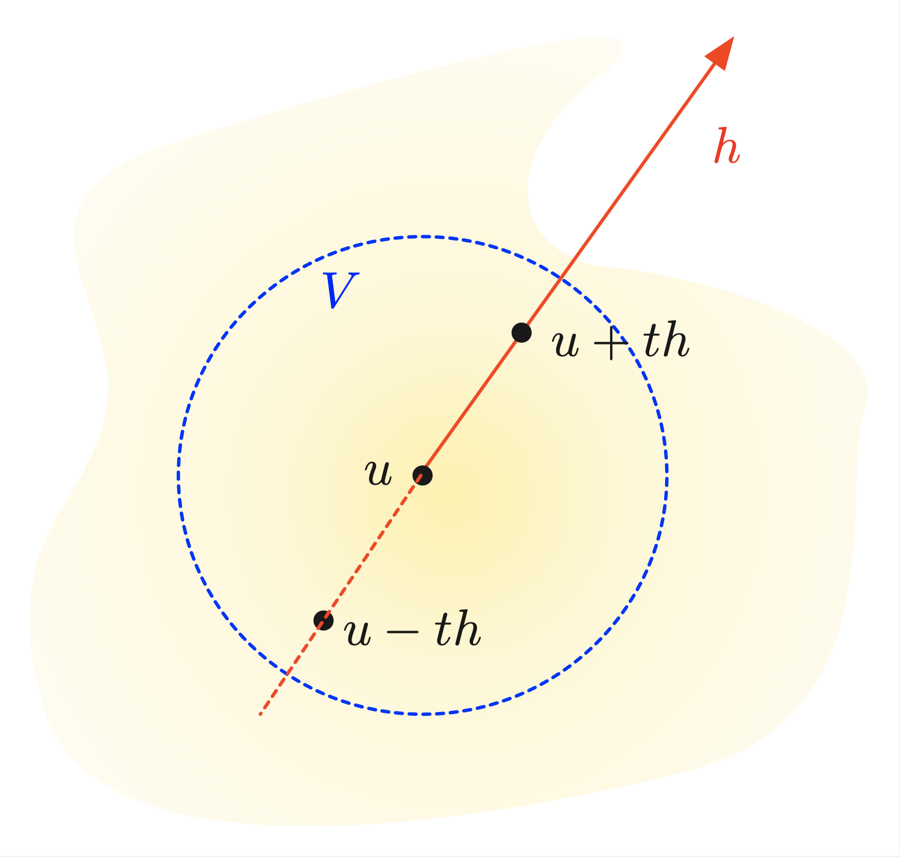

.. _app.recalloptim:

A reminder about optimization theory
=====================================

.. ##################################################
.. ##################################################

We place ourselves in the setting of a Hilbert space $H$, but the reader who is not familiar with this framework may assume that $H$ is a finite-dimensional space.

Let us warn the reader that manifold expressions of the results below are available in the literature, with slightly different settings, assumptions, and conclusions. The statements presented below are not by far the most general ones in terms of assumptions.

Throughout this section, we consider optimization problems of the form:

$$\min\limits_{u} J(u) \:\: \text{ s.t. } \:\: u \in K,$$

where:

  - The objective function $J : H \to \R$ is assumed to be continuously differentiable, 
  
  - $K$ is a subset of $H$ (for the moment arbitrary) called constraint set.

.. ##################################################
.. ##################################################

.. _sec.app1stordercond:

Necessary first-order optimality conditions
-------------------------------------------

.. ##################################################
.. ##################################################

.. ####################

.. _sec.optuc: 

Unconstrained problems
"""""""""""""""""""""""

.. ####################

Let $H$ be a Hilbert space, and let $J : H \to \R$ be a differentiable function; we consider the unconstrained minimization problem: 

.. math:: 
  :label: eq.ucpb 
  
  \min\limits_{u \in H}{J(u)}. 
  
.. ##########

.. prf:definition::

   A point $u \in H$ is a local minimizer for :math:numref:`eq.ucpb` if there exists an open neighborhood $V \subset H$ containing $u$ such that: 
   
   $$\forall v \in V, \:\: J(u) \leq J(v).$$

.. ##########

.. ##########

.. prf:theorem::

   Let $u$ be a local minimizer for :math:numref:`eq.ucpb`; then:

   $$\nabla J(u) = 0.$$

.. ##########

   
.. ##########
.. admonition:: Proof
    :class: dropdown

    Let $h \in H$ be given; by the definition of $u$, it holds for $t>0$ small enough:
    
    $$J(u + t h) \geq J(u), \text{ and so } \frac{J(u+t h) - J(u)}{t} \geq 0.$$
     
    Letting $t \to 0$, the differentiability of $J$ yields: 
    
    $$J^\prime(u)(h) = \langle \nabla J(u) , h \rangle \geq 0.$$
    
    Replacing $h$ by $-h$ in the previous argument yields the converse inequality 

    $$\langle \nabla J(u) , h \rangle \leq 0,$$
 
    which completes the proof. Note that this argument uses in a critical way that the point $u$ in :math:numref:`eq.ucpb` minimizes $J(v)$ (locally) in any direction $h \in H$.
 
.. ##########
   

   Expression of the necessary optimality condition at a point which is interior.

.. ####################

.. _sec.opteqc: 

Equality-constrained problems
"""""""""""""""""""""""""""""

.. ####################

The situation when the problem at hand features equality constraints is more intricate. Let $J : H \to \R$ and $C: H \to \R^p$ be differentiable functions; we consider the equality-constrained minimization problem: 

.. math:: 
  :label: eq.eqcpb 
  
  \min\limits_{h \in H}{J(h)} \:\: \text{ s.t. } \:\: C(h) = 0.
  
.. ##########

.. prf:definition::

   A point $u \in H$ is a local minimizer for :math:numref:`eq.eqcpb` if there exists an open neighborhood $V \subset H$ containing $u$ such that: 
   
   $$\forall v \in V \text{ s.t. } C(v) = 0, \:\: J(u) \leq J(v).$$

.. ##########

.. ##########

.. prf:theorem::

   Let $u$ be a local minimizer for :math:numref:`eq.eqcpb`, and assume that the gradients $\nabla C_1(u), \ldots,$ $\nabla C_p(u)$ are linearly independent. Then there exist Lagrange multipliers $\lambda_1,\ldots,\lambda_p \in \R$ such that:

   $$\nabla J (u)  + \sum\limits_{i=1}^p{ \lambda_i \nabla C_i(u)} = 0.$$

.. ##########

.. ##########
.. admonition:: Hint of proof
    :class: dropdown

    The local optimality of $u$ no longer implies that, for arbitrary $h \in H$ and $t$ small enough, 
    
    $$J(u+th) \geq J(u).$$
    
    Such an inequality can only be written with directions $h$ in the admissible space:

    $$K(u) := \left\{ h \in H, \:\: \text{there exists } \varepsilon >0 \text{ and a curve }\gamma: [-\varepsilon,\varepsilon] \to H \text{ s.t. } \gamma(0) = u, \: \gamma^\prime(0) = h \text{ and } C(\gamma(t) ) = 0 \text{ for } t >0 \right\}.$$

    $K(u)$ is a vector space, which rewrites, using the implicit function theorem (see :numref:`sec.impfuncthm`): 
   
    $$K(u) = \bigcap \limits_{i=1}^p{\left\{\nabla C_i(u) \right\}^\perp}.$$
    
    .. ############
    
    .. _fig.tangconst:
    .. figure:: ../figures/figtangconst.png
      :scale: 25 %

      Tangent space to the constraint set. 
   
    .. ############
    
    For any $h \in K(u)$, introducing a curve $\gamma(t)$ with the above properties, we obtain: 
    
    $$J(\gamma(t)) \geq J(u), \text{ and so } \frac{J(\gamma(t)) - J(u)}{t} \geq 0.$$

    Taking limits, it follows:
    
    $$\langle \nabla J(u) , h \rangle \geq 0.$$

    Since $K(u)$ is a vector space, the same argument applies to $-h$, and so: 

    $$\langle \nabla J(u) , h \rangle = 0.$$

    Hence, we have proved that 
    
    $$\forall h \in K(u)\:\: \langle \nabla J(u), h \rangle = 0, \text{ that is } \nabla J(u) \in  \left( \bigcap \limits_{i=1}^p{\left\{\nabla C_i(u) \right\}^\perp} \right)^\perp.$$
    
    Finally, using the general fact that, for arbitrary subsets $A_1,\ldots, A_p \subset H$, 
    
    $$\left(\text{span} \left\{A_i, \:\: i=1,\ldots,p\right\} \right)^\perp = \bigcap_{i=1}^p{A_i^\perp},$$
    
    the desired result follows.
 
.. ##########

It is instructive to appraise the meaning of this result in a simple case. Let us assume that the considered problem :math:numref:`eq.eqcpb` features only $p=1$ equality constraint. The above theorem applies, and then two cases arise:
   
  - *Case 1:* $\lambda=0$, and then $\nabla J(u) = 0$. This equality is the necessary first-order optimality condition for $u$ to be an unconstrained minimizer of $J(v)$. 
     
  - *Case 2:* $\lambda \neq 0$, and so we may write:
       
    $$\nabla C(u) = -\frac{1}{\lambda} \nabla J(u).$$
       
    Then, \"at first order\"", a direction $h \in H$ such that $J(u+th) < J(u)$ for small $t >0$, has a non zero coordinate along $\nabla J(u)$: 

    $$h = \alpha \nabla J(u) + v, \text{ where } v \perp \nabla J(u), \:\: \alpha < 0.$$
      
    Alternatively, $h$ rewrites:.

    $$h = \beta \nabla C(u) + w, \text{ where } w \perp \nabla C(u), \:\: \beta \neq 0.$$
       
    Hence, $C(u+th) \neq 0$, so that $u+th$ is not an admissible point for the constrained optimization problem.
       
    .. ############
    
    .. _fig.illuskkt:
    .. figure:: ../figures/illuskkt.png
      :scale: 25 %

      Illustration when $H= \R^2$, $p=1$ and $J$ is an affine function, whose isolines are depicted. At a local optimum $u$, $\nabla J(u)$ and $\nabla C(u)$ are aligned
   
    .. ############
    

.. ####################

.. _sec.optineqc: 

Equality and inequality constrained problems
"""""""""""""""""""""""""""""""""""""""""""""

.. ####################

We now arrive at the most difficult setting. We consider a problem featuring equality and inequality constraints, of the form:

.. math:: 
  :label: eq.ineqcpb 
  
  \min\limits_{h \in H}{J(h)} \:\: \text{ s.t. } \:\: \left\{\begin{array}{l}
   C(h) = 0,\\
   H(h) \leq 0.
   \end{array}
   \right. 

.. ##########

.. prf:theorem::

   Let $u$ be a local minimizer for :math:numref:`eq.eqcpb`, and assume that the gradients $\nabla C_1(u), \ldots,$ $\nabla C_p(u), \nabla H_1(u), \ldots,\nabla H_q(u)$ are linearly independent. Then there exist Lagrange multipliers $\lambda_1,\ldots,\lambda_p \in \R$ and $\mu_1 \geq 0$, ..., $\mu_q \geq 0$ such that:

   $$\nabla J (u)  + \sum\limits_{i=1}^p{ \lambda_i \nabla C_i(u)} +  \sum\limits_{j=1}^q{ \mu_i \nabla H_i(u)} = 0,$$
   
   and 
   
   $$H(u) \leq 0, \:\: \mu \geq 0, \text{ and } \mu \cdot H(u) = 0.$$

.. ##########

Again, it is instructive to observe the meaning of this statement in a simple case, where $p=0$ and $q=1$, i.e. the problem features only one inequality constraint.

.. ##################################################
.. ##################################################

.. _sec.app1stordercondconvex:

The convex case
---------------

.. ##################################################
.. ##################################################

In the previous sections, we have only provided first-order necessary conditions: assuming that a local minimizer exists, we have derived series of relations that should be satisfied. 
These relations can be investigated to try and glean information about the structure of minimizer(s). However, in themselves, they are generally not sufficient, i.e. they may very well be satisfied at other points than local minimizers. 

However, under additional convexity assumptions, this does not happen: they characterize global solutions of the problem.