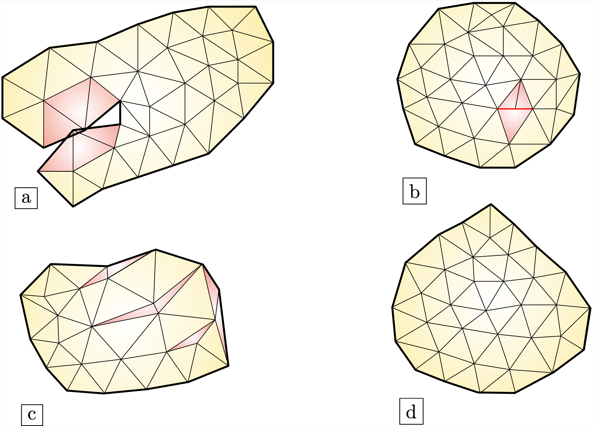
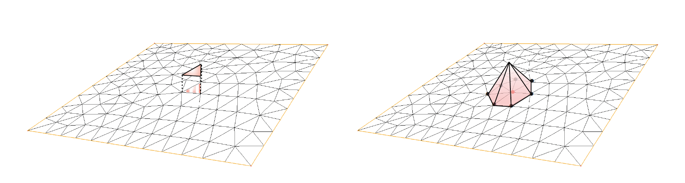

.. _sec.FE:

An introduction to the Finite Element method
=============================================

We now discuss the numerical resolution of a boundary value problem by means of the Finite Element method. 
As we have mentioned, this method builds on the variational form of this problem, a notion which was introduced in the previous :numref:`sec.LM`. To better see the big picture, we consider the following generic variational problem:

.. math::
  :label: eq.varpbFE
  
  \text{Search for } u \in V \text{ s.t. for all } v \in V, \quad a(u,v) = \ell(v),
  
where:

  - $V$ is a Hilbert space of functions $u : \Omega \to \R$ defined on a spatial domain $\Omega \subset \R^d$;
  
  - $a: V \times V \to \R$ is a bilinear, continuous and coercive form on $V$; 
  
  - $\ell: V \to \R$ is a continuous linear form on $V$.
  
We have seen in :numref:`sec.LM` that under these assumptions, :math:numref:`eq.varpbFE` is well-posed, i.e. it has a unique solution $u \in V$ which depends continuously on the data $\ell$. 

The Finite Element Method consists in searching for a solution $u$ to this variational problem by restricting it to a finite-dimensional subspace $V_h$ of $V$:

.. math::
  :label: eq.varpbFEdisc
  
  \text{Search for } u_h \in V_h \text{ s.t. for all } v_h \in V_h, \quad a(u_h,v_h) = \ell(v_h).
  
Here, the subscript $_h$ refers to the accuracy of the method. As we shall see below, the discrete space $V_h$ is constructed from a mesh of the physical domain $\Omega$ and $h$ typically refers to the \"size\" of this mesh. It is expected that, as $h$ decreases, $u_h$ is a more and more accurate approximation of $u$.

.. ##################################################
.. ##################################################

.. _sec.meshintroFE:

A short digression about meshes
--------------------------------

.. ##################################################
.. ##################################################

The Finite Element Method builds on a mesh of the spatial domain $\Omega$.
Here, we provide a few ingredients about this notion, referring to the later :numref:`sec.mesh` for practical details. 
The readers eager to discover more about meshes may fruitfully consult the very comprehensive book :cite:`frey2007mesh`.
For simplicity, we focus this presentation on the 2d case, but all the material below extends to the 3d case. 

Let us start with a definition, which is illustrated on :numref:`fig.meshdefs`.

.. ####################

.. _def.mesh:

.. prf:definition::

   A mesh $\calT$ of $\Omega$ is a subdivision of this domain into a number $N_{\calT}$ of closed simplices (i.e. triangles in 2d, tetrahedra in 3d) $T_i$, $i=1,...,N_{\mathcal T}$ with disjoint interiors $\mathring{T_i}$, $\mathring{T_j}$:

   .. math::
     
     \overline{\Omega} = \bigcup\limits_{i=1}^{N_{\mathcal T}}{T_i}, \text{ where } \mathring{T_i} \cap \mathring{T_j} = \emptyset \text{ if } i \neq j.
   
   Such a mesh is often required to be conforming: the intersection $T_i \cap T_j$ between any two elements is either a vertex, or an edge, or a face of $T_i$ and $T_j$.

.. ####################

.. #######

.. _fig.meshdefs:

   Various types of meshes: (a) An invalid mesh, with overlapping triangles (in red); (b) A non conforming mesh: the closures of the red triangles do not intersect along a whole common edge; (c) A valid and conforming, yet ill-shaped mesh (low-quality elements are represented in red); (d) A conforming mesh. In all cases, the external boundary of $\Omega$ is represented in bold.

.. #######

.. #################@

Size of a mesh 
"""""""""""""""

.. #################@

The size of a mesh is a crucial feature; we indeed expect the mesh ${\mathcal T}$ to be sufficiently fine, for at least two reasons:

- Geometric approximation: Often, the domain $\Omega$ is not a polygon: it is a smooth domain which is approximated by the polygonal mesh $\calT$. It is thus natural to require that $\calT$ be a fine geometric approximation of $\Omega$.

- Computational approximation: As we shall see below, the accuracy of the numerical solution supplied by the finite element method is related to the size of the elements of $\calT$. Intuitively, if the continuous solution $u$ has large variations in a region of the domain $\Omega$, the mesh $\calT$ has to be fine enough (at least in this region) to authorize the capture of this phenomenon.

For this reason, a common practice is to label the mesh $\calT$ as ${\mathcal T}_h$, where $h$ is a measure of its \"size\". For instance, $h$ may represent the largest diameter of a triangle in the mesh: 

$$h = \sup\limits_{T \in \calT} \text{diam}(T), \text{ where } \text{diam}(T) = \sup\limits_{\x,\y\in T} \lvert \x - \y\lvert. $$

.. #################@

Quality of a mesh
"""""""""""""""""""

.. #################@

One second notion of utter importance is the quality of the mesh $\calT$: multiple numerical operations conducted on $\calT$ require that it be \"well-shaped\", i.e. that each element $T \in \calT$ be close to equilateral, and not degenerate. One possible \"quality factor\" to account for this feature is the following ratio:

$$\frac{\text{diam}(T)}{\rho(T)}, $$

where the inradius $\rho(T)$ of $T$ is the radius of the largest ball contained in $T$, see :numref:`fig.aspecttria`. 

.. #######

.. _fig.aspecttria:
.. figure:: ../figures/aspecttria.png
   :scale: 30 %

   Diameter $\text{diam}(T)$ and inradius $\rho(T)$ of a triangle.

.. #######

In practice, slightly different error measures may be used, such as:

$${\mathcal Q}(T) = \alpha \frac{\text{Vol}(T)}{\sum\limits_{i=1}^3 \lvert \be_i \lvert^2},$$

where $\text{Vol}(T)$ is the volume of $T$, and $\be_1,\be_2,\be_3$ are its edges. $\alpha$ is a suitable normalization constant.

In any event, a quality close to $0$ should indicate a nearly degenerate triangle, while a quality near $1$ should indicate a triangle close to equilateral. We refer to :numref:`fig.meshcal` for an illustration and :numref:`sec.FEcv` about the importance of this feature to guarantee the accuracy of the Finite Element Method. 

.. prf:remark::
  
  This notion of \"Finite Element quality\" for a mesh $\calT$ is often complemented with a notion of \"geometric quality\", appraising how well the discrete polygon $\calT$ approximates the continuous domain $\Omega$ under scrutiny. 

.. #################@

.. _fig.meshcal:

.. figure:: ../figures/meshcal.png
   :scale: 30 %

   (Left) Valid and conforming mesh, containing low-quality elements (in red), and representing a poor geometric approximation (in blue) (right) High-quality mesh of the same domain.

.. #################@

.. ##################################################
.. ##################################################

Finite Element spaces
---------------------

.. ##################################################
.. ##################################################

Let us return to our purpose of constructing a suitable Finite Element space $V_h \subset V$ to formulate the discrete counterpart :math:numref:`eq.varpbFEdisc` of the variational problem :math:numref:`eq.varpbFE`. The datum of a mesh $\calT_h$ of $\Omega$ paves the way to several ways of achieving this purpose:

  - The space $V(\calT_h,\P_0)$ of $\P_0$ Lagrange Finite Element functions is composed of the functions $u:\Omega \to \R$ which are constant inside each simplex $T \in \calT_h$:
  
    $$V(\calT_h,\P_0) = \left\{u \in L^2(\Omega), \:\: \ \forall T \in \calT_h, \:\: u\lvert_T \in \P_0 \right\},$$
    
    where $\P_0$ is the vector space of $0^{\text{th}}$-order polynomial functions (i.e. constants) in $d$ variables.

  - The space $V(\calT_h,\P_1)$ of $\P_1$ Lagrange Finite Element functions consists of the functions which are continuous on $\Omega$, and whose restriction to each triangle $T \in \calT_h$ belongs to the space $\P_1$ of first-order polynomial functions (i.e. affine functions) in $d$ variables:
  
  $$V(\calT_h,\P_1) = \left\{u \in \calC(\overline\Omega), \:\: \ \forall T \in \calT_h, \:\: u\lvert_T \in \P_1 \right\}.$$
  
  - More generally, for $k \geq 1$, the space $V(\calT_h,\P_k)$ of $\P_k$ Lagrange Finite Element functions consists of the functions which are continuous on $\Omega$, and whose restriction to each triangle $T \in \calT_h$ belongs to the space $\P_k$ of polynomial functions in $d$ variables, whose order is less or equals to $k$:
  
  $$V(\calT_h,\P_k) = \left\{u \in \calC(\overline\Omega), \:\: \ \forall T \in \calT_h, \:\: u\lvert_T \in \P_k \right\}.$$
  
  - Other, slightly more exotic Finite Element spaces can be considered, such as:
    
    - The Taylor-Hood Finite Element space for discretizing the (vector-valued) velocity and pressure of a fluid; 
    - The Nédélec and Raviart-Thomas Finite Element spaces which are commonly used in electromagnetism owing to their good behavior with respect to the divergence and curl operators. 

In practice, the discrete space $V_h$ is equipped with a basis $\left\{ \phi_i\right\}_{i=1,...,N_{V_h}}$; for instance:

  - The space $V(\calT_h,\P_0)$ has a dimension $N_{V_h} = N_{\calT_h}$ equal to the number $N_{V_h}$ of elements (i.e. triangles in 2d, tetrahedra in 3d) in the mesh. For every $i=1,...,N_{V_h}$, the basis function $\phi_i$ associated to the simplex $T_i$ reads:
  
  $$\phi_i(\x) = \left\{
  \begin{array}{cl}
  1 & \text{if } \x \in T_i ,\\
  0 & \text{otherwise,}
  \end{array}
  \right. $$
  
    see :numref:`FEfuncs` (left).
  
  - The dimension $N_{V_h}$ of the space $V(\calT_h,\P_1)$ equals the number of vertices $\p_1,\ldots,\p_{N_{V_h}}$ in the mesh $\calT_h$. For every $i=1,...,N_{V_h}$, the basis function $\phi_i$ associated to the vertex $\p_i$ of the mesh is the \"hat function\" characterized by:
  
  $$\left\{
  \begin{array}{l}
  \phi_i(\p_i) = 1\\
  \phi_i(\p_j) = 0 \text{ if } j \neq i, \\
  \phi_i \text{ is affine inside each element } T \in \calT_h,
  \end{array}
  \right.$$
    
    see :numref:`FEfuncs` (right).
  
Any Finite Element function $u_h \in V_h$ may be decomposed on this basis:

.. math::
  :label: eq.decompFEbasis

  u_h = \sum\limits_{i=1}^{N_{V_h}}{u_i \phi_i},
  
where the coefficients $u_i$ are referred to as the degrees of freedom of the Finite Element Method.

.. ######

.. _FEfuncs:

   (Left) Graph of the $\P_0$ basis function which equals $1$ on the dashed triangle and $0$ elsewhere; (right) Graph of the $\P_1$ basis function which equals $1$ at the red vertex and $0$ on the others.

.. ######

Note that, as the size $h$ of the mesh $\calT_h$ tends to $0$ -- i.e. $\calT_h$ is refined -- it is expected that the subspace $V_h$ becomes a closer approximation of the continuous space $V$.

.. ##################################################
.. ##################################################

The discrete variational problem
---------------------------------

.. ##################################################
.. ##################################################

The Finite Element discretization of the continuous variational problem :math:numref:`eq.varpbFE` is simply obtained by casting its variational formulation over the finite-dimensional space $V_h$: $u_h$ is sought within $V_h$ and the test functions $v_h$ are taken in the same space, which yields:

.. math::
  :label: eq.discFV
  
  \text{Search for } u_h \in V_h \text{ such that: } \forall v_h \in V_h, \:\: a(u_h,v_h) = \ell(v_h).

Let us decompose the sought function $u_h$ on the selected basis $\left\{ \phi_i \right\}_{i=1,...,N_{V_h}}$ of $V_h$, as in :math:numref:`eq.decompFEbasis`. The discrete variational problem :math:numref:`eq.discFV` is equivalent to

$$\text{ Search for } (u_1,..., u_{N_{V_h}}) \in \mathbb{R}^{N_{V_h}} \text{ s.t. }\quad \forall v_h \in V_h, \:\: \:\: \sum\limits_{j=1}^{N_{V_h}}{u_j a(\phi_j,v_h)} = \ell(v_h).$$
  
Since $\left\{ \phi_i \right\}_{i=1,...,N_{V_h}}$ is a basis of $V_h$ and since the mappings $a(\phi_j,\cdot)$ and $\ell(\cdot)$ are linear, it is equivalent to require that the above statement hold true for $v_h= \phi_1,\ldots,\phi_{N_{V_h}}$: 

$$\text{ Search for } (u_1,..., u_{N_{V_h}}) \in \mathbb{R}^{N_{V_h}} \text{ s.t. }\quad \forall i=1,...,N_{V_h}, \:\:\:\: \sum\limits_{j=1}^{N_{V_h}}{u_j a(\phi_j,\phi_i)} = \ell(\phi_i).$$

This is a linear system for the $N_{V_h}$ unknown coefficients $u_1,\ldots,u_{N_{V_h}}$, which features $N_{V_h}$ equations. In order to write it under matrix form, let $\bU_h = (u_1,...,u_{N_{V_h}}) \in \mathbb{R}^{N_{V_h}}$ be the vector of the components of $u_h$ in the basis $\left\{ \phi_i \right\}_{i=1,\ldots,N_{V_h}}$; we obtain:

.. math::
  :label: eq.Ku=F
  
   \text{Search for } \bU_h \in \mathbb{R}^{N_{V_h}} \:\: \text{ s.t. } \:\: K_h \bU_h = \bF_h,

where $K_h$ is the $N_{V_h} \times N_{V_h}$ stiffness matrix, and $\bF_h \in\mathbb{R}^{N_{V_h}}$ is defined by:

.. math::
  :label: eq.defKF

  (K_h)_{ij} = a(\phi_j,\phi_i), \:\: (F_h)_i = \ell(\phi_i), \:\: i,j=1,...,N_{V_h}.
  
.. prf:remark::
  
  The linear system :math:numref:`eq.Ku=F` is usually very large: the matrix $K_h$ has size $N_{V_h} \times N_{V_h}$, where the number $N_{V_h}$ of degrees of freedom of the Finite Element method may be very large (especially in 3d). However, this system is fortunately very sparse: for a given index $i \in \left\{1,\ldots,N_{V_h}\right\}$, only very few of the coefficients $(K_h)_{ij}$ differ from $0$. This important property is due to the very \"local\" nature of the chosen basis $\left\{ \phi_i \right\}_{i=1,...,N_{V_h}}$ for the Finite Element space at stake.
  
Let us now wonder about the invertibility of this system. The above reasoning has shown that :math:numref:`eq.defKF` is equivalent to the discrete variational problem :math:numref:`eq.discFV`. However, the latter is well-posed, as it satisfies all the assumptions of the :ref:`Lax-Milgram theorem <th.LaxMilgram>`:

  - $V_h$ is certainly a Hilbert space, as it is finite-dimensional; 
  
  - $a$ and $\ell$ are identical to the ingredients of the continuous variational problem :math:numref:`eq.varpbFE`, and so they are still respectively bilinear and linear, continuous, and $a$ is coercive.
  
As a result, :math:numref:`eq.discFV` is well-posed, and so the linear system :math:numref:`eq.defKF` is invertible.

.. prf:remark::
  
  Loosely speaking, when the well-posedness of a continuous variational problem is guaranteed by the Lax-Milgram theorem, the well-posedness of the discretized one follows immediately, since the validity of the assumptions of this theorem in the continuous case automatically imply that they are also verified in the discretized setting. This is in sharp contrast with the more general setting of saddle-point problems involved in the treatment of the Stokes equations.

.. ##################################################
.. ##################################################

.. _sec.FEcv:

Convergence of the finite element method
----------------------------------------

.. ##################################################
.. ##################################################

So far, the Finite Element Method has been an intuitive, but formal means to approximate the variational problem :math:numref:`eq.varpbFE`. It is a crucial question to elucidate under which conditions
the numerical solution $u_h$ converges to the continuous one, $u$, when the size $h$ of the mesh $\calT_h$ tends to $0$.

The key result in this perspective is the following lemma.

.. ##########################

.. prf:theorem:: Céa's lemma

  There exists a constant $C>0$ which does not depend on $h$ such that the respective solutions $u$, $u_h$ to :math:numref:`eq.varpbFE` and :math:numref:`eq.discFV` satisfy:
  
  .. math::
     :label: eq.Cea 
    
      \lvert\lvert u - u_h \lvert\lvert_V \: \leq \: C \inf\limits_{v_h \in V_h}{\lvert\lvert u-v_h \lvert\lvert}.

.. ##########
.. admonition:: Proof
    :class: dropdown

    The variational problem satisfied by $u$ implies in particular that:

    $$\forall v_h \in V_h, \:\: a(u,v_h) = \ell(v_h).$$
  
    On the other hand, the discrete variational problem for $u_h$ reads:
    
    $$\forall v_h \in V_h, \:\: a(u_h,v_h)  = \ell(v_h).$$
  
    Subtracting one of these relations from the other, we obtain:

    $$\forall v_h \in V_h, \:\: a(u-u_h, v_h) = 0.$$
  
    It follows that, for an arbitrary element $v_h \in V_h$, we have

    .. math::
      \begin{array}{ccl}
      \alpha || u-u_h || ^2 &\leq & a(u-u_h,u-u_h)\\ 
      &=& a(u-u_h,u-v_h) \\
      &\leq& M || u-u_h ||_V || u - v_h ||_V.
     \end{array}
   
    Since this holds true for arbitrary $v_h \in V_h$, we may take the infimum in the above right-hand side, which yields:

    $$\lvert\lvert u-u_h \lvert\lvert_V \leq \frac{M}{\alpha} \inf\limits_{v_h \in V_h} \lvert\lvert u-v_h \lvert\lvert_V,$$
  
    which is the desired result with $C = M/\alpha$.

.. ##########
.. ##########################

Intuitively, Céa's lemma states that the Finite Element approximation $u_h$ of the solution $u$ to :math:numref:`eq.varpbFE` is \"almost\" the best approximation of $u$ by a function in $V_h$. Hence, the convergence of $u_h$ to $u$ as the mesh is refined is controlled by the "approximation capabilities\" of the functional space $V$ by the discrete counterpart $V_h$. 

Without entering into mathematical details, let us state an archetypal convergence result of the Finite Element Method allowed by this lemma.

.. ##########################

.. prf:proposition:: 
   
   Assume that $\Omega$ is a polygonal domain in $\R^d$ ($d=2$ or $3$), and let ${\mathcal T}_h$ be a sequence of meshes of $\Omega$, indexed by the maximum size $h = \max_{T \in \calT_h} \text{diam}(T)$ of a simplex in the mesh. We assume that: 
   
     - The size $h$ of $\calT_h$ converges to $0$. 
     
     - The quality of the mesh $\calT_h$ does not degenerate, i.e. 
     
       $$\text{There exists a constant } C >0 \text{ independent of } h \text{ s.t }\quad 1 \leq \frac{\text{diam}(T)}{\rho(T)} \leq C.$$  
   
   Then, the Lagrange Finite Element Method $\mathbb{P}_k$ converges for $k \geq 1$, i.e. 
   
   $$\lim\limits_{h \to 0} \lvert\lvert u- u_h \lvert\lvert_{H^1(\Omega)} \xrightarrow{h \to 0} 0.$$
   
   Moreover, assuming that $u$ belongs to $H^{k+1}(\Omega)$, there exists a constant $C >0$ such that: 
   
   $$\lvert\lvert u- u_h \lvert\lvert_{H^1(\Omega)} \leq C h^k \lvert\lvert u \lvert\lvert_{H^{k+1}(\Omega)}.  $$

.. ##########################

.. ##################################################
.. ##################################################

Towards implementation of the method
---------------------------------------

.. ##################################################
.. ##################################################

Once an appropriate Finite Element space $V_h$ is chosen, the solution of the variational problem :math:numref:`eq.Ku=F` by the Finite Element Method proceeds in two main steps:

  - One first needs to assemble the system, i.e. to calculate the entries $K_{ij}$ of the stiffness matrix and those $b_i$ of the right-hand side, see the formulas :math:numref:`eq.defKF`;
  
  - One then needs to solve the large (but sparse) linear system :math:numref:`eq.Ku=F`.
