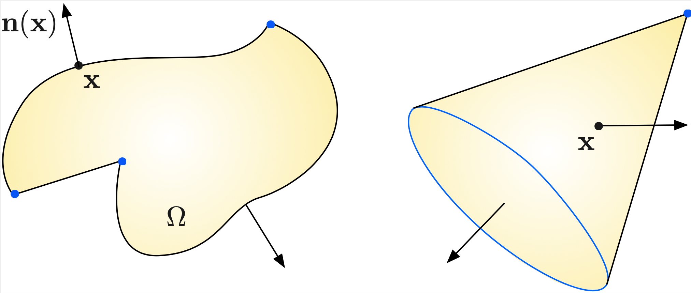
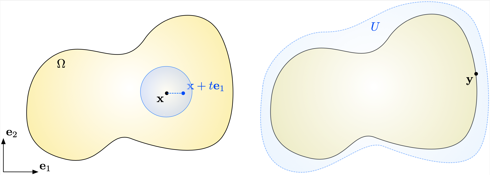

.. _sec.anafunc:

A vade mecum of functional analysis
===================================

This section introduces the necessary mathematical background underlying the developments of this book,and it sets the main notation used throughout.

.. list-table::
   :widths: 15 80
   :class: borderless

   * - .. image:: ../figures/warning.png
          :scale: 40%
         
     - The topics of this section are very abstract, and they are certainly difficult for the unfamiliar reader with functional analysis. This dry presentation is not meant to be thoroughly perused prior the (more applied) subsequent chapters. It is rather advised to refer to it when needed: these concepts hopefully get clearer when illustrated by concrete situations. On the other hand, the reader with a firm mathematical background will perhaps feel a bit frustrated about the lack of exhaustivity (and sometimes of precision) of this account. More exhaustive details about differential calculus and functional analysis are provided in the :ref:`appendix <sec.app>`. We also refer to classical presentations such as Chapter 4 in :cite:`allaire2007numerical` and the textbook :cite:`brezis2010functional` about these subjects.
     
.. ##################################################
.. ##################################################

Setting
--------

.. ##################################################
.. ##################################################

The scene unfolds in the physical space $\R^d$, where $d=2$ or $3$ in practice.
We denote by $\be_1,\ldots,\be_d$ the usual coordinate vectors, i.e.
$$\be_1 = (1,0,\ldots,0) , \:\: \be_2 = (0,1,0\ldots,0), \ldots,\:\: \be_d = (0,\ldots,0,1).$$
The coordinates of a point (or a vector) $\x \in \R^d$ in this basis are denoted by $\x = (x_1,\ldots,x_d)$. 

Throughout this section, $\Omega$ is a bounded Lipschitz (open) domain of $\R^d$:

  - The boundary $\partial\Omega$ of $\Omega$ is smooth, except perhaps at a finite number of corners in 2d, or corners and ridges in 3d, see :numref:`LipDomain`. For instance, polyhedra are Lipschitz domains. 

  - We denote by $\n = (n_1,\ldots,n_d) : \partial \Omega \to \R^d$ the unit normal vector field to $\partial \Omega$, pointing outward $\Omega$. The vector $\n(\x)$ is defined at almost every point $\x \in \partial \Omega$, except at corners or ridges.

  - The integration of a function $u$ on the boundary of $\Omega$ is denoted by:
    $$\int_{\partial\Omega} u \:\d s, $$
    where the symbol $\d s$ refers to the surface measure on $\partial\Omega$.

.. _LipDomain:

   (Left) The boundary of a 2d Lipschitz domain is a smooth curve, except at some vertices (in blue); (right) The boundary of a 3d Lipschitz domain is a smooth hypersurface, except at corners (blue points) and ridges (blue lines)

.. ##################################################
.. ##################################################

.. _sec.Green:

Differentiable functions, notations, and the Green's formula
-------------------------------------------------------------

.. ##################################################
.. ##################################################

We presently recall a few classical notions about multivariable calculus (notably, derivatives), and set the related notions used throughout these tutorials. 

.. ####################

Classical spaces of continuous and differentiable functions
""""""""""""""""""""""""""""""""""""""""""""""""""""""""""""

.. ####################

Let $u$ be a function from $\Omega \subset \R^d$ into $\R$.

 - For $j=1,\ldots,d$, the partial derivative of $u$ in the $j^{\text{th}}$ direction at a given point $\x \in \Omega$, if it exists, is defined by the following limit:

    .. math::
      :label: eq.dudxi 
  
      \frac{\partial u}{\partial x_j}(\x) = \lim\limits_{t\to 0} \frac{u(\x + t \be_j) - u(\x)}{t},

   see :numref:`fig.CCbar` (left).

 - When all the partial derivatives $\frac{\partial u}{\partial x_1}(\x),\ldots,\frac{\partial u}{\partial x_d}(\x)$ exist, $u$ is called differentiable at $\x$, and its gradient at $\x$ is the vector
 
$$\nabla u(\x) := \left(\frac{\partial u}{\partial x_1}(\x),\ldots,\frac{\partial u}{\partial x_d}(\x)\right) \in \R^d.$$

 - The function $u$ is said to be continuously differentiable on $\Omega$, or of class $\calC^1$ on $\Omega$, if it is differentiable at every point $\x \in \Omega$, and if all the functions $\x \mapsto \frac{\partial u}{\partial x_j}(\x)$ are continuous on $\Omega$.
 
 - The function $u$ is said to be twice continuously differentiable on $\Omega$, or of class $\calC^2$ on $\Omega$, if $u$ and the functions $\x \mapsto \frac{\partial u}{\partial x_j}(\x)$ are continuously differentiable on $\Omega$. 
 
 - The notion of $k$ times continuously differentiable functions (or functions of class $\calC^k$) on $\Omega$ is defined likewise, for $k \geq 3$. The partial derivative of such a function $u$ of order $\alpha_1$ with respect to the first variable, ...,  and of order $\alpha_d$ with respect to the $d^{\text{th}}$ variable is denoted by:
 
   $$\frac{\partial^\alpha u}{\partial x^{\alpha}} (\x), \quad \x \in \Omega, \:\: \alpha = (\alpha_1,\ldots,\alpha_d) \in \mathbb{N}^d.$$
 
 
Let now $\u : \Omega \to \R^d$ be a vector field on $\Omega$. The wording \"vector field\" means that $\u$ is made of $d$ real-valued coordinate functions $\u = (u_1,\ldots,u_d)$. Then,

  - $u$ is called differentiable at some point $\x \in \Omega$ if for every $i=1,\ldots,d$, the real-valued function $u_i : \Omega \to \R$ is differentiable at $\x$. 
  
  - When this is the case, the derivative of $\u$ at $\x$ is the $d \times d$ matrix $\nabla \u(\x) \in \R^{d\times d}$ given by:

$$\nabla \u(\x) = \left(\frac{\partial u_i}{\partial x_j}(\x)\right)_{i,j=1,\ldots,d}= \left(
\begin{array}{cccc}
\frac{\partial u_1}{\partial x_1}(\x) & \frac{\partial u_1}{\partial x_2}(\x) & \ldots & \frac{\partial u_1}{\partial x_d}(\x)  \\
\vdots & & &\vdots \\
\frac{\partial u_d}{\partial x_1}(\x) & \frac{\partial u_d}{\partial x_2}(\x) & \ldots & \frac{\partial u_d}{\partial x_d}(\x)  
\end{array}
\right), $$

    i.e. the $i^{\text{th}}$ line of $\nabla \u(\x)$ is the gradient of the real-valued function $u_i$ at $\x$.

  - For $k \geq 1$, $\u$ is said to be $k$ times continuously differentiable (or of class $\calC^k$) if all its coordinate functions $u_1,\ldots,u_d$ are themselves $k$ times continuously differentiable. 
  
Let us now recall the main differential operators, i.e. operators acting on functions or vector fields via some of their partial derivatives. These are consistently involved in the applications of the next sections.

  - The divergence of a vector field $\u: \Omega \to \R^d$ is real-valued function $\dv(\u) : \Omega \to \R$ defined as the trace of the matrix $\nabla \u$, that is:
  
$$\dv(\u)(\x) = \sum\limits_{i=1}^d \frac{\partial u_i}{\partial x_i}(\x), \quad \x \in \Omega.$$

  - The Laplacian $\Delta u$ of a real-valued function $u:\Omega \to \R$ of class $\calC^1$ is the real-valued function defined by:
  
$$\Delta u(\x) = \sum\limits_{i=1}^d \frac{\partial^2 u}{\partial x_i^2}(\x), \quad \x \in \Omega.$$ 

Throughout this book, we adopt the following notations:
  
  - For any integer $k \geq 0$, $\calC^k(\Omega)$ is the space of $k$ times continuously differentiable functions $u: \Omega \to \R$ on $\Omega$.
  
  - For any $k \geq 0$, $\calC^k_c(\Omega)$ is the space of $k$ times continuously differentiable functions with compact support inside $\Omega$: $u\in \calC^k(\Omega)$ if $u$ is of class $\calC^k$ on $\Omega$ and there exists a compact subset $K \subset \Omega$ such that $u(\x) = 0$ for $x \in \Omega \setminus K$.

Before ending this section, let us stress a quite subtle point. The derivative of a function $u:\Omega \to \R$, as defined above, only makes sense at points $\x \in \Omega$ lying inside the domain $\Omega$, not on its boundary. Note indeed that the definition :math:numref:`eq.dudxi` of $\frac{\partial u}{\partial x_j}(\x)$ involves the values of $u$ at points that are \" close\" to $\x$ in every direction. It is convenient to give a meaning for functions $u:\Omega \to \R$ to be differentiable up to the boundary $\partial \Omega$, see :numref:`fig.CCbar` (right) for an illustration.
  
.. ####################

.. _def.Ckbdy:

.. prf:definition::

   Let $k \geq 0$ be an integer. A function $u : \Omega \to \R$ is called $k$ times continuously differentiable up to the boundary $\partial \Omega$ if there exists an open neighborhood $U$ of $\overline\Omega$ in $\R^d$ and a function $\widetilde u : U \to \R$ of class $\calC^k$ on $U$ such that the restriction $\widetilde{u} \lvert_\Omega$ coincides with $u$. We denote the space of such functions by $\calC^k(\overline{\Omega})$.

.. ####################

.. _fig.CCbar:

   (Left) The definition of the partial derivatives of $u$ at $\x$ require that $u$ be defined on a small neighborhood around $\x$; (right) The derivative of $u$ at a boundary point $y \in \partial \Omega$ involves an extension of $u$ to a slightly larger open set $U$.

.. ####################

The Green's formula
"""""""""""""""""""""

.. ####################

The Green's formula is the generalization to multivariable calculus of the ubiquitous integration by parts formula on the real line. 
Among other things, it is the main tool which will allow us to pass from the \"classical\", strong form of a boundary value problem to its weak, variational form, see :numref:`sec.LM`.

.. _th.Green:

.. prf:theorem:: Green's formula

  Let $u$ be a function in $\mathcal{C}^1(\overline{\Omega})$. Then, for every index $i=1,\ldots,d$, one has:
  
  $$\int_\Omega{\frac{\partial u}{\partial x_i}\:\d \x}  = \int_{\partial \Omega}{u n_i \:\d s}.$$

The Green's formula is accompanied with numerous avatars, and we next state the most useful ones.

.. _cor.Green:

.. prf:corollary:: 

    - Let $u,v$ be two functions in $\mathcal{C}^1(\overline{\Omega})$. Then the following formula holds true for each $i=1,\ldots,d$:
  
      $$\int_\Omega{\frac{\partial u}{\partial x_i} v \:\d\x}  = \int_{\partial \Omega}{v n_i \:\d s} - \int_\Omega{u \frac{\partial v}{\partial x_i} \:\d\x}.$$

    - The Laplace operator $\Delta$ satisfies the following identity: for all functions $u,v$ in $\mathcal{C}^2(\overline{\Omega})$,
    
      $$\int_{\Omega}{\Delta u \: v \:\d\x} = \int_{\partial\Omega}{\frac{\partial u}{\partial n }v \:\d s} - \int_\Omega{\nabla u \cdot \nabla v \:\d\x}.$$
      
.. ##########
.. admonition:: Sketch of proof
    :class: dropdown

    The first formula is obtained by applying the Green's formula of :numref:`th.Green` to the function $uv$ instead of $u$, and then rearranging terms.
    
    To obtain the second formula, one takes $\frac{\partial u}{\partial x_i}$ in place of $u$ in the Green's formula, and sums over $i=1,\ldots,d$. 
.. ##########

.. ##########
.. prf:remark::

    The first formula in :numref:`cor.Green` is exactly the multi-dimensional generalization of the familiar integration by parts formula, involving two functions $u,v : [a,b] \to \R$ on an interval $[a,b] \subset \R$:
    
    $$\int_a^b u^\prime(x) v(x) \d x = (u(b)v(b) - u(a)v(a)) - \int_a^b u(x) v^\prime(x)\: \d x.$$

    Indeed, in this case, $\frac{\partial u}{\partial x_1}$ and $\frac{\partial v}{\partial x_1}$ are the familiar derivatives $u^\prime$ and $v^\prime$, and the unit normal \"vector\" $n$ to $[a,b]$ is the scalar $n(a) = -1$, $n(b)=1$.
    
.. ##########

.. ##################################################
.. ##################################################

Functional spaces
-----------------

.. ##################################################
.. ##################################################

As we shall discuss from :numref:`sec.LM`, the mathematical formulation and the analysis of the Finite Element Method make extensive use of various spaces of functions, and notably Lebesgue and Sobolev spaces, that we briefly present in this section.

.. ####################

Lebesgue spaces
""""""""""""""""

.. ####################

The Lebesgue spaces are made of functions whose integrals are well-defined and convenient to handle.

.. prf:definition::

  - Let $1 \leq p < \infty$; the Lebesgue space $L^p(\Omega)$ is the Banach space of functions whose $p^{\text{th}}$ power is integrable over $\Omega$:

    $$L^p(\Omega) := \left\{u: \Omega \to \R, \:\: \lvert\lvert u \lvert\lvert_{L^p(\Omega)} < \infty \right\}, \text{ with the norm } \lvert\lvert u\lvert\lvert_{L^p(\Omega)} := \left( \int_\Omega \lvert u \lvert^p \:\d \x\right)^{\frac{1}{p}}.$$
  
  - The Lebesgue space $L^\infty(\Omega)$ is the Banach space of measurable functions on $\Omega$ which are essentially bounded, i.e.
    
    $$L^\infty(\Omega) := \left\{u: \Omega \to \R, \:\: \lvert\lvert u \lvert\lvert_{L^\infty(\Omega)} < \infty \right\}, \text{ with the norm }  \lvert\lvert u \lvert\lvert_{L^\infty(\Omega)} := \inf\left\{ m >0 \text{ s.t. } \lvert u(\x) \lvert < m \text{ for a.e. } \x \in \Omega \right\}.$$

.. ####################

A few remarks are in order:

  - The case $p=2$ is particularly useful in applications. In most physical contexts indeed, squared quantities account for energy: one may for instance think of the kinetic energy of a particle, which is essentially equal to the square of its velocity. From the mathematical viewpoint, $L^2(\Omega)$ enjoys the rich structure of a :ref:`Hilbert space <sec.Hilbert>` structure, when it is equipped with the inner product:

    $$\forall u,v \in L^2(\Omega),\quad (u,v)_{L^2(\Omega)} := \int_\Omega{uv \:\d\x},$$

    so that, obviously, $\lvert\lvert u \lvert\lvert_{L^2(\Omega)} = (u,u)_{L^2(\Omega)}^{1/2}$.
    
  - The space $L^\infty(\Omega)$ is that of bounded functions on $\Omega$. The above technical definition makes this intuition rigorous in the general context of functions defined almost everywhere, that could take arbitrarily large values on subsets of measure $0$. Functions in the space $L^\infty(\Omega)$ are called essentially bounded, i.e. they are bounded except on a subset of $\Omega$ with measure $0$.
  
The next statement shows that functions in the space $L^p(\Omega)$ can be approximated by infinitely smooth functions, except in the critical case where $p=\infty$.

.. ####################

.. _prop.densLp:

.. prf:proposition::

   Let $1 \leq p < \infty$. Then the space $\calC^\infty_c(\Omega)$ of smooth functions with compact support inside $\Omega$ is dense is $L^p(\Omega)$, i.e. 
   
   $$\forall u \in L^p(\Omega), \text{ there exists a sequence } u_n \in \calC^\infty_c(\Omega) \:\text{ s.t. }\: \lvert\lvert u_n - u\lvert\lvert_{L^p(\Omega)} \xrightarrow{n\to\infty} 0. $$  

.. ####################

We eventually recall an important inequality, which somehow reflects the \"duality\" between Lebesgue spaces:

.. ####################

.. prf:proposition:: Hölder's inequality

   Let $p,q$ be two real indices in $[1,\infty]$, such that $\frac{1}{p} + \frac{1}{q} = 1$. Then for all functions $u \in L^p(\Omega)$ and $v \in L^q(\Omega)$, the product $uv$ belongs to $L^1(\Omega)$ and:
   
   $$\underbrace{\int_\Omega \lvert u(\x) v(\x) \lvert \:\d \x}_{\lvert\lvert uv\lvert\lvert_{L^1(\Omega)}} \leq \underbrace{\left( \int_\Omega \lvert u(\x)\lvert^p \:\d \x\right)^{\frac{1}{p}}}_{=\lvert\lvert u \lvert\lvert_{L^p(\Omega)}} \underbrace{\left( \int_\Omega \lvert v(\x)\lvert^q \:\d \x\right)^{\frac{1}{q}}}_{\lvert\lvert v\lvert\lvert_{L^q(\Omega)}}. $$ 

.. ####################

A few remarks are in order about Hölder's inequality: 

  - if $p=q=2$, it is exactly the familiar Cauchy-Schwarz inequality for functions $u,v \in L^2(\Omega)$: 
  
    $$\forall u,v \in L^2(\Omega), \quad \int_\Omega u(\x) v (\x)\:\d\x \leq \left( \int_\Omega \lvert u(\x)\lvert^2 \:\d\x\right)^{\frac{1}{2}} \left(\int_\Omega \lvert v(\x)\lvert^2 \d\x\right)^{\frac{1}{2}}.$$ 
    
  - The case where $p=1$ and $q=\infty$ is no less interesting. Hölder's inequality thus writes:
  
  $$\forall u\in L^1(\Omega), \: v \in L^\infty(\Omega), \quad \int_\Omega u(\x) v(\x) \:\d x  \leq \lvert\lvert v \lvert\lvert_{L^\infty(\Omega)} \int_\Omega \lvert u (\x) \lvert\:\d\x, $$
  
   a quite intuitive result, at least in the situation where $v$ is continuous (and bounded).
  
The following exercise deals with the important fact that, because of the boundedness of the domain $\Omega$, the Lebesgue space $L^p(\Omega)$ is embedded in all the spaces with weaker exponents. 

.. ##########
.. admonition:: Exercise
   :class: admonition-exo

   Recall that the domain $\Omega$ is bounded, and let $a, b$ be two real values such that $1 \leq a \leq b \leq \infty$. Prove that the space $L^b(\Omega)$ is continuously embedded in $L^a(\Omega)$, i.e. 
  
   $$\text{There exists a constant }C_{a,b} \text{ s.t. for all } u \in L^b(\Omega), \: u \in L^a(\Omega) \text{ and }\:\: \lvert\lvert u \lvert\lvert_{L^a(\Omega)} \leq C_{a,b} \lvert\lvert u \lvert\lvert_{L^b(\Omega)}. $$

.. ##########

.. ##########
.. admonition:: Correction
    :class: dropdown
    
    Let $u$ be a function in $L^b(\Omega)$. Then, one can write
    
    $$\lvert u(\x) \lvert^a = \lvert u(\x) \lvert^a \cdot 1, \text{ where } \left\{
    \begin{array}{cl}
    \lvert u(\x) \lvert^a \in L^{\frac{b}{a}}(\Omega),& \text{ since } \lvert\lvert \lvert u \lvert ^a \lvert\lvert_{L^{b/a}(\Omega)}  = \left(\displaystyle\int_\Omega \lvert u(\x)\lvert^b \:\d \x \right)^{\frac{a}{b}} < \infty,\\
    1 \in L^{\frac{b}{b-a}}(\Omega) & \text{with } \lvert\lvert 1 \lvert\lvert_{L^{\frac{b}{b-a}}(\Omega)} = \lvert \Omega \lvert^{\frac{b-a}{b}}, \\
    \frac{1}{b/a} + \frac{1}{b/(b-a)} = \frac{a}{b} + \frac{b-a}{b}= 1. &
    \end{array}
    \right. $$
    
    Hence, Hölder's inequality yields:
    
    $$\left(\int_\Omega \lvert u(\x) \lvert^a \:\d \x \right)^{\frac{1}{a}} \leq C_{a,b} \left(\int_\Omega \lvert u(\x) \lvert^b \:\d \x \right)^{\frac{1}{b}} \text{ with } C_{a,b} := \lvert \Omega \lvert^{\frac{b-a}{ab}},$$
    
    which is the expected result.
    
.. ##########

.. ####################

.. _sec.Sobolev:

Sobolev spaces on domains
"""""""""""""""""""""""""

.. ####################

Sobolev spaces spring from the key idea of duality, which underlies the mathematical theory of distributions. In loose terms, this modern viewpoint drops the \"classical\" understanding of a function $u:\Omega \to \R$, associating a value $u(\x)$ at (almost all) points $\x \in \Omega$. Instead, $u$ is seen through the collection of its averages
$$\varphi \mapsto \int_\Omega u \varphi \:\d \x,$$
weighted by \"sufficiently many\" test functions $\varphi$. 
Operations on a function $u$, such as differentiation or multiplication by a smooth function, are defined in terms of the effect induced (by transposition) on the test functions $\varphi$. 

In this book, we shall avoid to resort to the fascinating, but difficult theory of distributions; the curious reader can consult the :ref:`dedicated appendix <app.distrib>` and the references provided therein. For the present purpose, let us extract from this theory the notion of weak derivative for a function $u$ which solely belongs to $L^p(\Omega)$, and may in particular be discontinuous. 

If $u$ were to be a function of class $\calC^1$ on $\Omega$, then the :ref:`Green's formula <th.Green>` would yield:

$$\text{For all test functions } \varphi \in \calC^\infty_c(\Omega), \quad \int_\Omega \frac{\partial u}{\partial x_i} \varphi \:\d \x = -\int_\Omega u \frac{\partial \varphi}{\partial x_i} \:\d \x.$$

The key observation is that the right-hand side of the above identity makes sense under very weak assumptions about $u$, contrary to its left-hand side: this right-hand side makes sense as soon as $u$ belongs to $L^1(\Omega)$. Hence, this relation can actually be thought of as a definition for the existence of a derivative for $u$. 

.. ####################

.. prf:definition::

  Let $1 \leq p \leq \infty$; then:
  
    - A function $u \in L^p(\Omega)$ is said to have a $i^{\text{th}}$ partial derivative in $L^p(\Omega)$ if there exists a function $v_i \in L^p(\Omega)$ such that:

      $$\forall \varphi \in {\mathcal C}_c^\infty(\Omega),\:\: \int_{\Omega}{u \frac{\partial \varphi}{\partial x_i} \:\d\x} = -\int_{\Omega}{v_i \varphi \: \d\x}.$$

      We denote this function by $\frac{\partial u}{\partial x_i}:= v_i$. With a slight abuse of notation, the fact that $u\in L^p(\Omega)$ have a $i^{\text{th}}$ partial derivative in $L^p(\Omega)$ is denoted by $\frac{\partial u}{\partial x_i} \in L^p(\Omega)$.
      
    - The Sobolev space $W^{1,p}(\Omega)$ is the space of functions in $L^p(\Omega)$ whose first-order partial derivatives $\frac{\partial u}{\partial x_1},\ldots,\frac{\partial u}{\partial x_d}$ belong to $L^p(\Omega)$, that is:
    
      $$W^{1,p}(\Omega) = \left\{u \in L^p(\Omega), \:\: \frac{\partial u}{\partial x_i} \in L^p(\Omega), \quad i=1,\ldots,d  \right\}.$$
      
      The space $W^{1,p}(\Omega)$ is a Banach space when it is equipped with the norm:
      
      $$\lvert\lvert u \lvert\lvert_{W^{1,p}(\Omega)} := \left\{\begin{array}{cl}
      \left( \displaystyle\int_{\Omega}{ \lvert u \lvert^p \:\d\x} + \sum\limits_{i=1}^d{\displaystyle\int_{\Omega}{ \left \lvert \frac{\partial u}{\partial x_i} \right\lvert^p \:\d\x}}\right)^{\frac{1}{p}} & \text{if } 1\leq p<\infty, \\
      \lvert\lvert u \lvert\lvert_{L^\infty(\Omega)} + \sup\limits_{i=1,\ldots,d} \left\lvert\left\lvert \frac{\partial u}{\partial x_i} \right\lvert\right\lvert_{L^\infty(\Omega)}& \text{if } p=\infty\end{array}\right.$$

.. ####################

The following facts are worth mentioning:

  - According to the previous discussion, if $u$ is continuously differentiable up to $\partial \Omega$ in the classical sense of :numref:`def.Ckbdy`, i.e. $u\in\calC^1(\overline\Omega)$, then $u$ belongs to $W^{1,p}(\Omega)$ for all $1 \leq p \leq \infty$.

  - Again, the particular case where $p=2$ is especially interesting. The norm $\lvert\lvert \cdot \lvert\lvert_{W^{1,2}(\Omega)}$ is induced by the following inner product:

$$\lvert\lvert u \lvert\lvert^2_{W^{1,2}(\Omega)} = ( u,u )_{W^{1,2}(\Omega)}, \text{ where } (u,v)_{W^{1,2}(\Omega)} := \int_{\Omega}{(uv + \nabla u \cdot \nabla v) \:\d\x}.$$

    The Sobolev space $W^{1,2}(\Omega)$ is then a Hilbert space, which is often denoted by $H^1(\Omega)$.
 
  - Higher-order differentiability spaces $W^{m,p}(\Omega)$ (which are also denoted by $H^m(\Omega)$ when $p=2$) are defined in a similar way: we denote by $W^{m,p}(\Omega)$ (resp. $H^m(\Omega)$) the Banach space of functions whose derivatives up to order $m$ are in $L^p(\Omega)$ (resp. in $L^2(\Omega)$):
  
  $$W^{m,p}(\Omega) = \left\{ u \in L^p(\Omega) \text{ s.t. } \frac{\partial^\alpha u}{\partial x^\alpha} \in L^p(\Omega) \text{ for all } \lvert \alpha \lvert \leq m\right\}.$$

Let us finally mention the following important density result, whereby $W^{m,p}(\Omega)$ functions can be approximated by \"classical\" smooth functions.

.. ####################
.. _th.densWmp:

.. prf:theorem::

  For all $m\geq 1$ and $1\leq p<\infty$, the space $\calC^\infty(\overline{\Omega})$ is dense in $W^{m,p}(\Omega)$, i.e.:
  
  $$\forall u \in W^{m,p}(\Omega), \text{ there exists a sequence } u_n \in \calC^\infty(\overline{\Omega}) \: \text{ s.t } \:\lvert\lvert u - u_n \lvert\lvert_{W^{m,p}(\Omega)} \: \xrightarrow{n\to \infty} \: 0.$$

.. ####################
  
Note the difference with the corresponding result for the Lebesgue spaces $L^p$ (:numref:`prop.densLp`): functions in $W^{m,p}(\Omega)$ can only be approximated by functions which are smooth up to the boundary, and not be the more particular class of functions with compact support inside $\Omega$. Only particular functions in $W^{m,p}(\Omega)$ could be approximated by such functions, as we shall see in :numref:`sec.H10`.

.. ####################

.. _sec.traces: 

Sobolev spaces on the boundary of a domain and traces
""""""""""""""""""""""""""""""""""""""""""""""""""""""

.. ####################

In general, functions $u \in H^1(\Omega)$ (more generally, functions in $W^{1,p}(\Omega)$)
may fail to be continuous, and even take infinitely large values, as exemplified by the following exercise:

.. ##########
.. admonition:: Exercise
   :class: admonition-exo

   Let $\Omega$ be the unit ball in $\R^2$, and consider the fonction
   
   $$\forall \x \in \Omega \setminus \left\{0\right\}, \quad u(\x) = \left\{ \begin{array}{cl}
   \log\lvert \log\lvert \x\lvert\lvert & \text{if } \lvert \x \lvert <\frac12, \\
   \log\log 2 & \text{otherwise.}
   \end{array}\right.$$

   (1) Calculate the gradient of $u$.
   
   (2) Show that $u$ is unbounded.
   
   (3) Show that $u$ belongs to $L^2(\Omega)$.
   
   (4) Show that $u$ belongs to $H^1(\Omega)$.
   
   (5) Let now $\Omega$ be the unit ball of $\R^d$, $d\geq 3$. Give an example of a function $u:\Omega \to \R$ which is unbounded but belongs to $H^1(\Omega)$.

.. ##########

.. ##########
.. admonition:: Correction
    :class: dropdown

    (1) An elementary calculation shows that:
        
        $$\nabla u(\x) = \left\{ \begin{array}{cl}
        \frac{\x}{\lvert \x\lvert^2 \log\lvert \x\lvert} & \text{if } \lvert \x \lvert <\frac12, \\
        \bz & \text{otherwise.}
        \end{array}\right.$$
        
    (2) The classical limits of the $\log$ function imply that:
        $$\lim\limits_{\x\to\bz} u(\x) = +\infty.$$
        
    (3) The function $u$ is continuous, thus bounded, on any compact set of the form $\overline\Omega \setminus B(\bz,\e)$ for $0<\e<1$, and so it is bounded on these. Hence, it is enough to prove that the integral of $u^2$ is bounded on a sufficiently small ball $B(\bz,\e)$. To achieve this, classical results about the behavior of the $\log$ function in the neighborhood of $\x=0$ show that:
        $$\forall \x \in B(\bz,\e), \quad \lvert \log\lvert \x \lvert \lvert \leq \frac{1}{\lvert \x \lvert}, $$
        and so:
        $$\forall \x \in B(\bz,\e), \quad (\log\lvert \log\lvert \x \lvert)^2 \leq (\log\lvert \x \lvert)^2. $$
        It follows that
        $$\int_{B(\bz,\e)} \lvert u(\x) \lvert^2 \:\d x \leq \int_{B(\bz,\e)} (\log\lvert \x \lvert)^2\:\d x < \infty,$$
        where we have used, again, the classical properties of the logarithm.
        
    (4) A calculation in polar coordinates yields:
        $$\begin{array}{ccl}
        \displaystyle\int_\Omega \lvert \nabla u(\x) \lvert^2 \:\d \x &=& \displaystyle\int_{B(0,\frac12)} \frac{1}{\lvert \x\lvert^2 (\log\lvert \x\lvert)^2} \:\d x\\
        &=& 2\pi\displaystyle\int_0^{\frac12} \frac{1}{r(\log\lvert r\lvert)^2} \:\d r\\
        &=& 2\pi \left[ - \frac{1}{\log r}\right]_0^{\frac12}\\
        &=& \frac{2\pi}{\log 2}.
        \end{array} $$
        
    (5) The same argument as above works with the function $u$ defined by:
        $$\forall \x \in \Omega \setminus \left\{0\right\}, \quad u(\x) = \left\{ \begin{array}{cl}
        \log\lvert \x\lvert & \text{if } \lvert \x \lvert <\frac12, \\
        -\log 2 & \text{otherwise.}
        \end{array}\right.$$
   
.. ##########

On the other hand, the set where functions in $H^1(\Omega)$ are discontinuous cannot be \"too large\". In particular, it is possible to consider their values on codimension $1$ objects (that is, curves in 2d, or surfaces in 3d), in the particular sense of traces:

.. ##########

.. prf:proposition::

  There exists a unique linear and continuous mapping $\gamma: H^1(\Omega) \to L^2(\partial \Omega)$ such that, for any differentiable function $u \in {\mathcal C}^1(\overline{\Omega})$ up to the boundary $\partial\Omega$, it holds:
  
  .. math::
     \gamma(u) = u|_{\partial \Omega}.
     
  This mapping is called the trace operator on $H^1(\Omega)$. We denote by $H^{1/2}(\partial \Omega)$ its range:
  
  .. math::
    H^{\frac{1}{2}}(\partial \Omega) = \left\{ \varphi \in L^2(\partial\Omega), \:\: \exists u \in H^1(\Omega) \text{ s.t. } \gamma(u) = \varphi \right\}.
  
  It is a Hilbert space when equipped with the quotient norm:
  
    .. math::
      \lvert\lvert \varphi \lvert\lvert_{H^{\frac{1}{2}}(\partial \Omega)} := \inf_{u \in H^1(\Omega) \atop \gamma(u) = \varphi}{|| u ||_{H^1(\Omega)}}.

.. ##########

Most often, we shall simply denote by $u|_{\partial\Omega}$, or simply $u$ the trace of a function $u \in H^1(\Omega)$ on $\partial \Omega$.

We also denote by $H^{-\frac{1}{2}}(\partial \Omega)$ the dual space of $H^{\frac{1}{2}}(\partial \Omega)$: 

$$H^{-\frac{1}{2}}(\partial \Omega) = \left\{\ell : H^{\frac{1}{2}}(\partial \Omega) \to \R \text{ is linear and continuous}\right\}, $$

equipped with the norm:

$$\lvert\lvert \ell \lvert\lvert_{H^{-\frac{1}{2}}(\partial \Omega)} = \sup\limits_{v \in H^{\frac{1}{2}}(\partial \Omega) \atop \ell \neq 0} \frac{\lvert \ell(v) \lvert}{\lvert\lvert v \lvert\lvert_{H^{\frac{1}{2}}(\partial \Omega)}}. $$
  
.. ##################################################
.. ##################################################

Two additional Sobolev spaces
""""""""""""""""""""""""""""""

.. ##################################################
.. ##################################################

In this section, we describe two other Sobolev spaces, which are frequently encountered in applications.

.. ##################################################

.. _sec.H10:

The space $H^1_0(\Omega)$ of $H^1$ functions with vanishing trace
^^^^^^^^^^^^^^^^^^^^^^^^^^^^^^^^^^^^^^^^^^^^^^^^^^^^^^^^^^^^^^^^^

.. #################################################

.. ####################

.. prf:proposition::

   The Sobolev space $H^1_0(\Omega)$ is the subspace of $H^1(\Omega)$ composed of functions with vanishing trace on $\partial \Omega$:

   $$H^1_0(\Omega) = \left\{ u \in H^1(\Omega), \:\: u \lvert_{\partial\Omega} = 0 \right\}.$$

.. ####################

An alternative and no less important viewpoint about $H^1_0(\Omega)$ consists in seeing this space as the closure of smooth functions with compact support in $H^1(\Omega)$. 

.. ####################

.. prf:proposition::

   The space $\mathcal{C}^\infty_c(\Omega)$ is dense in $H^1_0(\Omega)$, i.e. for any function $u \in H^1_0(\Omega)$, there exists a sequence $u_n$ of functions in $\calC^\infty_c(\Omega)$ such that:
   
   $$\lvert\lvert u_n - u \lvert\lvert_{H^1(\Omega)} \xrightarrow{n \to 0} 0.$$

.. ####################

It is important to appraise the difference between this result and the general density :numref:`th.densWmp`. According to the latter, a function $u$ in $H^1(\Omega)$ can be closely approximated by a function $u_n \in \calC^\infty(\overline\Omega)$, which is smooth up to the boundary $\partial \Omega$. If $u$ belongs to the more precise space $H^1_0(\Omega)$, this function $u_n$ can be assumed to vanish outside a compact subset of $\Omega$, and in particular to vanish \"close\" to the boundary $\partial\Omega$.

We denote by $H^{-1}(\Omega)$ the dual space of $H^1_0(\Omega)$, that is, the vector space of continuous and linear forms on $H^1_0(\Omega)$. Note that $H^{-1}(\Omega)$ is not the dual space of $H^1(\Omega)$. The following exercise deals with a nice characterization of $H^{-1}(\Omega)$ as the space of derivatives of $L^2$ functions:

.. ##########
.. admonition:: Exercise
   :class: admonition-exo

     (1) Let $u$ be a function in $L^2(\Omega)$; show that the following mapping is an element in the dual space $H^{-1}(\Omega)$:
     
         $$H^1_0(\Omega) \ni v \mapsto  \int_\Omega uv \:\d \x \in \R. $$
     
     (2) Let $i=1,\ldots,d$ and let $u_i \in L^2(\Omega)$; show that the following mapping is in the dual space $H^{-1}(\Omega)$:
     
          $$H^1_0(\Omega) \ni v \mapsto  -\int_\Omega u \frac{\partial v}{\partial x_i} \:\d \x \in \R. $$

     (3) Show that the formulas from the above two questions also define elements in the dual space $H^1(\Omega)^*$ of $H^1(\Omega)$.
       
     (4) Show that the mapping 
     
         $$v \mapsto \int_{\partial \Omega} v \:\d s $$
     
         is in the dual space $H^{-\frac{1}{2}}(\partial \Omega)$ and also in the dual space of $H^1(\Omega)$, but that it is equal to $0$ when it is seen as an element in $H^{-1}(\Omega)$. 
      
.. ##########

.. ##################################################

The space $\Hdiv(\Omega)$ of vector fields with $L^2$ divergence
^^^^^^^^^^^^^^^^^^^^^^^^^^^^^^^^^^^^^^^^^^^^^^^^^^^^^^^^^^^^^^^^^

.. #################################################

The last class of Sobolev spaces that will be needed in this course is a little more subtle; it is in particular related to the definition of normal traces of vector fields and normal derivatives of functions on $\partial \Omega$.

.. ########

.. prf:definition::
  
  We denote by $\Hdiv(\Omega)$ the space of vector fields $\sigma =(\sigma_1,\ldots,\sigma_d): \Omega \to \R^d$ in $L^2(\Omega)^d$, whose weak divergence $\dv(\sigma)$ belongs to $L^2(\Omega)$:
  
  $$\Hdiv(\Omega) = \left\{ \sigma \in L^2(\Omega)^d \text{ s.t. } \dv(\sigma) = \sum\limits_{i=1}^d \frac{\partial \sigma_i}{\partial x_i} \in L^2(\Omega)\right\}. $$
  
  The space $\Hdiv(\Omega)$ is a Hilbert space when it is equipped with the inner product $(\cdot,\cdot)_{\Hdiv(\Omega)}$ and associated norm $\lvert\lvert \cdot \lvert\lvert_{\Hdiv(\Omega)}$ defined by:
  
  $$(\sigma,\xi)_{\Hdiv(\Omega)} = \int_\Omega \sigma \cdot \xi \:\d \x + \int_\Omega \dv(\sigma)\dv(\xi) \:\d \x, \quad \lvert\lvert \sigma\lvert\lvert_{\Hdiv(\Omega)}^2 = (\sigma,\sigma)_{\Hdiv(\Omega)}.$$
    
.. ########

An important property of this space is the following density result.

.. ########

.. prf:proposition::
  
   The subset $\calC^\infty(\overline\Omega)^d$ of smooth vector fields up to $\partial \Omega$ is dense in $\Hdiv(\Omega)$:
   
   $$\forall \sigma \in \Hdiv(\Omega), \text{ there exists a sequence } \sigma_n \in \calC^\infty(\overline\Omega)^d \text{ s.t. } \lvert\lvert \sigma - \sigma_n \lvert\lvert_{\Hdiv(\Omega)} \xrightarrow{n \to \infty} 0. $$
  
.. ########

We now turn to the notion of normal trace.

.. ########
.. _prop.traceHdiv: 

.. prf:proposition::

  There exists a mapping $\gamma_n: \Hdiv(\Omega) \to H^{-1/2}(\partial \Omega)$ such that, for any smooth vector field $\sigma \in {\mathcal C}^\infty(\overline{\Omega})^d$ up to the boundary $\partial\Omega$, it holds:
  
  $$\gamma_n(\sigma) = \sigma \cdot \n.$$
  
  The normal trace of $\sigma$ is often simply denoted by $\sigma\cdot\n$.

  It satisfies the following identity: for all $\sigma \in \Hdiv(\Omega)$ and $u \in H^1(\Omega)$:
  $$\int_{\partial\Omega} \sigma\cdot \n \: u \:\d s = \int_\Omega \dv(\sigma) u \:\d \x + \int_\Omega \sigma \cdot \nabla u \:\d \x.$$
     
.. ########

.. ##################################################
.. ##################################################

The Poincaré's inequality
--------------------------

.. ##################################################
.. ##################################################

The Poincaré's inequality is a general fact that allows to control the values of a function vanishing on $\partial \Omega$ by those of its gradient. 

.. ##########
.. _prop.Poincare:

.. prf:proposition::
  
  There exists a constant $C>0$ (which only depends on $\Omega$) such that:
   
  $$\forall u \in H^1_0(\Omega), \:\: \int_{\Omega} u^2 \:\d\x \leq C \int_{\Omega}\vert\nabla u\lvert^2\:\d\x.$$
   
.. ##########

An intuitive explanation of Poincaré's inequality goes as follows: let $u$ be a function in $H^1_0(\Omega)$ such that $\int_\Omega{\lvert\nabla u\lvert ^2\:\d \x} = 0$.
Then $\nabla u = \bz$ on $\Omega$ and $u$ is a constant function. Since it has null trace on $\partial \Omega$, this constant must be $0$.
More generally, if the gradient $\nabla u$ has small norm, then the values of $u$ cannot differ too much
from those taken on $\partial \Omega$, and so they must also be small. Hence, :numref:`prop.Poincare`
is a quantitive indicator of how the smallness of the gradient of an $H^1_0(\Omega)$ function $u$ imposes the values of $u$ itself to be small.

The instructive proof of this result makes this intuition rigorous.

.. ##########
.. admonition:: Sketch of proof
    :class: dropdown
    
    The proof makes use of the notions of compactness and weak convergence, recalled in :numref:`sec.compact`.
    
    We proceed by contradiction, assuming that a constant $C$ as in the statement does not exist. Then, for each integer $n$, there exists a function $u_n \in H^1_0(\Omega)$ such that: 
    
    $$\int_\Omega (u_n)^2 \:\d\x \geq n \int_\Omega\lvert\nabla u_n\lvert^2\:\d\x. $$
    
    Up to normalizing $u_n$, we may as well assume that 
    
    .. math:: 
      :label: eq.normPoincare
      
      \int_\Omega (u_n)^2 \:\d \x = 1, \text{ and so } \int_\Omega \lvert \nabla u_n \lvert^2 \:\d \x \leq \frac{1}{n}.
    
    In particular, the sequence $u_n$ is bounded in $H^1(\Omega)$, and so by :numref:`prop.seqcompactbounded`, there exists a subsequence of $n$, still indexed by $n$, and a function $u \in H^1_0(\Omega)$ such that
    
    $$u_n \xrightarrow{n\to 0} u \text{ weakly in } H^1(\Omega).$$
    
    Let us now pass to the limit in the relation characterizing the weak derivative of $u$:
   
    $$\int_\Omega \frac{\partial u}{\partial x_i} \varphi \:\d x = \lim\limits_{n\to \infty} \int_\Omega \frac{\partial u_n}{\partial x_i} \varphi \:\d x =0,$$
   
    where the last equality follows from :math:numref:`eq.normPoincare` and the Cauchy-Schwarz inequality. This proves that $\nabla u=0$, and since $u \in H^1_0(\Omega)$, $u=0$. 
        
    However, by the :ref:`Rellich theorem <th.Rellich>`, it also holds true that $u_n$ converges strongly in $L^2(\Omega)$.
    Hence, passing to the limit in :math:numref:`eq.normPoincare`, we obtain:
    
    $$\int_\Omega u^2 \:\d \x = \lim\limits_{n\to \infty} \int_\Omega \lvert u_n\lvert^2 \:\d \x = 1,$$
    
    which contradicts the above finding. Hence, the assumption whereby a constant $C>0$ as in the statement of Poincaré's inequality does not exist is incorrect, and this terminates the proof.
    
.. ##########

The above Poincaré's inequality has a large number of avatars, generally stating that 

$$\text{"If the gradient of a function } u \text{ is small and } u \text{ takes small values somewhere, then } u \text{ must be small everywhere."}$$ 

For instance, :numref:`prop.Poincare` can be extended to functions $u$ vanishing only on one part of $\partial\Omega$:

.. ##################################################
.. _prop.PoincareGammaD:

.. prf:proposition::

  Let the domain $\Omega$ be connected, and let $\Gamma_D \subset \partial \Omega$ be a subset of $\partial \Omega$ with positive surface measure. Then, there exists a constant $C>0$ (depending on $\Gamma_D$) such that:
  
  $$\text{For all functions } u \in H^1(\Omega) \text{ s.t. } u=0 \text{ on }\Gamma_D, \:\: \int_\Omega{ \left\lvert u \right\lvert ^2 \:\d\x}  \leq C \int_\Omega{\lvert \nabla u\lvert^2\:\d\x}.$$
  
.. ##################################################

On a different note, the following Poincaré-Wirtinger inequality offers another way to \"impose that $u$ be small somewhere\".

.. ##################################################
.. _prop.PoincareWirtinger:

.. prf:proposition::

  Let the domain $\Omega$ be connected. There exists a constant $C>0$ such that:

  $$\forall u \in H^1(\Omega), \:\: \int_\Omega{ \left\lvert u - \frac{1}{\lvert\Omega\lvert} \int_\Omega{u \:\d \x}\right\lvert ^2 \:\d \x}  \leq C \int_\Omega{\lvert\nabla u\lvert^2\:\d \x}.$$
  
.. ##################################################

.. ##########
.. admonition:: Exercise
   :class: admonition-exo

   Prove :numref:`prop.PoincareGammaD` and :numref:`prop.PoincareWirtinger` by taking inspiration from the sketch of proof of :numref:`prop.Poincare`.

.. ##########
