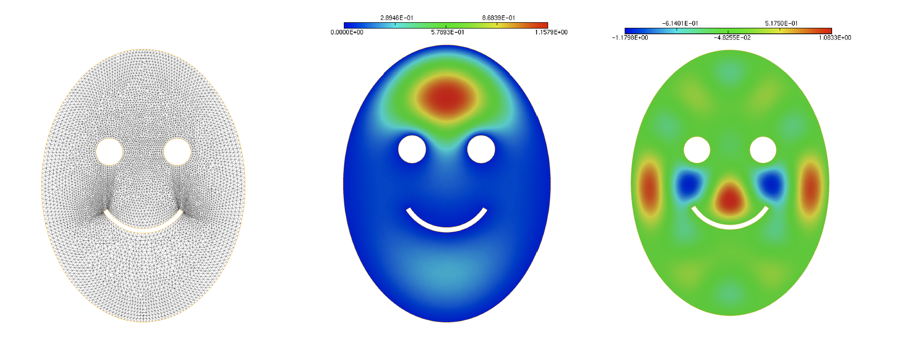

.. _sec.eigen:

Eigenvalue problems
====================

In this section, we consider the treatment of eigenvalue problems with $\texttt{FreeFem}$. 
Beyond its physical relevance and ubiquity in applications, this task is a good opportunity to learn how to handle the Finite Element matrices involved in variational formulations.

.. #################@
.. #################@

.. _sec.FEmats: 

Handling Finite Element matrices
----------------------------------

.. #################@
.. #################@

Since :numref:`sec.lap`, we have been solving variational problems with $\texttt{FreeFem}$ via the keyword :code:`problem`. This practice conveniently conceals the operations involved in the numerical resolution, notably the assembly and inversion of the stiffness matrix.
This section describes an alternative way to solve a variational problem with $\texttt{FreeFem}$ which is more intrusive, but also more flexible; the source code corresponding to this presentation can be downloaded :download:`here <./codes/laplace_with_matrix.edp>`.

To set ideas, let us consider again the Laplace equation in an L-shaped domain $\Omega$, introduced in :numref:`sec.lap`: we look for the solution $u \in H^1_0(\Omega)$ to the following boundary-value problem: 

$$\left\{
\begin{array}{cl}
-\Delta u = f & \text{in } \Omega, \\
u = 0 & \text{on } \partial \Omega,
\end{array}
\right. 
\quad \text{ where } f = 1.$$

As we have seen, the variational formulation for this problem reads: 

.. #################@

.. math::
   :label: eq.varfmathandle

   \text{Search for } u \in H^1_0(\Omega) \text{ s.t. } \forall v \in H^1_0(\Omega), \quad \int_\Omega \nabla u\cdot \nabla v \:\d \x = \int_\Omega fv\:\d \x,

.. #################@

which becomes, after Finite Element discretization: 

.. #################@

.. math::
   :label: eq.varfmathandlemat

   \text{Search for the coefficient vector } \bU_h \in \mathbb{R}^{N_{V_h}} \:\: \text{ s.t. } \:\: K_h \bU_h = \bF_h,

.. #################@

where $K_h$ is the $N_{V_h} \times N_{V_h}$ stiffness matrix, and $\bF_h \in\mathbb{R}^{N_{V_h}}$ is the force vector. 

The main components of such a variational problem -- i.e. its bilinear form and its right-hand side -- may be entered in $\texttt{FreeFem}$ thanks to the keyword :code:`varf`, as in the following listing.

.. #################@

.. code-block::

  /* Finite Element spaces and functions */
  fespace Vh(Th,P1);
  Vh uh;

  /* Variational formulation of the Laplace equation */
  varf varlap(u,v) = int2d(Th)(dx(u)*dx(v)+dy(u)*dy(v))
                   + int2d(Th)(f()*v)   // Watch out for the sign!
                   + on(1,u=0);

.. #################@

Note that the sign between the bilinear and linear parts differs between this syntax and that attached to the keyword :code:`problem`;
this is because the present encoding does not allow to solve directly the variational problem. The stiffness matrix $K_h$ and the force vector $\bF_h$ of the Finite Element discretization :math:numref:`eq.varfmathandlemat` are constructed as follows.

.. #################@

.. code-block::

  /* Assembly of the stiffness matrix */
  matrix A;
  A = varlap(Vh,Vh,solver=UMFPACK);

  /* Assembly of the right-hand side */
  Vh rhs;
  rhs[] = varlap(0,Vh); // rhs[] is the array with size
                      //the number of dofs of the Finite Element
                     // space, whose entries are the coefficients of rhs.

.. #################@

Here, we recall from :numref:`rm.ucoef` that the array containing the coefficients of a Finite Element function $u$ is obtained by the command $\texttt{u[]}$.

Finally, the Finite Element system :math:numref:`eq.varfmathandlemat` is inverted by the following natural command:

.. #################@

.. code-block::

  /* Resolution of the Finite Element system */
  uh[] = A^-1 *rhs[];
  
.. #################@

.. #################@
.. #################@

An eigenvalue problem
---------------------

.. #################@
.. #################@

Let $\Omega$ be a bounded domain in $\mathbb{R}^2$; we consider the following eigenvalue problem:

.. #################@

.. math::
   :label: eq.evlap

    \text{Search for } \lambda \in \mathbb{R} \text{ and } u \in H^1_0(\Omega), \: u\neq 0,\:\: \text{ s.t. } \left\{
   \begin{array}{cl}
   -\Delta u = \lambda u & \text{in } \Omega, \\
   u=0 & \text{on } \partial\Omega.
   \end{array}
   \right.

.. #################@

Obviously, for any real value $\lambda$, $u = 0$ is solution to this problem. The sought eigenvalues are precisely those values $\lambda$ for which a non trivial eigenfunction exists. It can actually be proved that these eigenvalues form a sequence of positive real numbers going to infinity:

.. #################@

.. math::
  
  0\leq \lambda_1 \leq \lambda_2 \leq ... \: \to \: \infty;

.. #################@

The peculiar property of eigenvalues is at the core of the modeling of multiple physical phenomena. For instance, 

  - When $\Omega$ represents an elastic membrane, the values $\lambda_n$ are its self-vibration frequencies; 

  - When $\Omega$ is a thermal cavity, one may prove that the solution to the unsteady heat equation :math:numref:`eq.LaplaceUnsteady` decays exponentially fast in time, at the rate $e^{-\lambda_1 t}$; the asymptotic profile of the temperature is then given by the first eigenvector $u_1$.

In this tutorial, we shall not say much about the difficult, but fascinating spectral theory, dealing with the eigenelements of boundary-value problems, and we shall only formally describe their numerical calculation. We refer for instance to :cite:`allaire2007numerical` for a glimpse of the rigorous framework. 
  
The resolution of :math:numref:`eq.evlap` relies on a variational formulation, similar to that of a classical boundary-value problem, and we briefly rephrase the argument. Since the sought function $u$ satisfies homogeneous Dirichlet boundary conditions, it is natural to work with the functional space $V = H^1_0(\Omega)$, defined in :numref:`sec.H10`. Multiplying the main equation of :math:numref:`eq.evlap` by an arbitrary test function $v \in H^1_0(\Omega)$ and using :ref:`Green's formula <th.Green>`, we are led to the following problem: 

.. #################@

.. math::
  
  \text{Search for } \lambda \in \R \text{ and } u \in V \text{ with } u \neq 0 \:\: \text{ s.t. } \:\: \forall v \in H^1_0(\Omega), \:\: a(u,v) = \lambda m(u,v).
  
.. #################@

This formulation brings into play the same continuous and coercive bilinear form $a : V \times V \to \R$ as that involved in the variational problem for the Laplace equation, see :numref:`sec.LM`, and an additional continuous, bilinear form $m: V \times V \to \R$:
$$a(u,v) = \int_\Omega \nabla u \cdot \nabla v \:\d \x , \:\: \text{ and } \:\: m(u,v) = \int_\Omega uv \:\d \x.$$

Proceeding along the lines of :numref:`sec.FE`, we now introduce a finite-dimensional subspace $V_h$ of $H^1_0(\Omega)$, we are led to the following Finite Element problem: 

.. #################@

.. math::
  :label: eq.disceigenvf

  \text{Search for } \lambda_h \in \R \text{ and } u_h \in V_h \text{ with } u_h \neq 0 \:\: \text{ s.t. } \:\: \forall v_h \in V_h, \:\: a(u_h,v_h)= \lambda_h m(u_h,v_h).

.. #################@

Let us now select a basis $\left\{ \varphi_j\right\}_{j=1,...,N_h}$ of functions for $V_h$; we denote by $\bU_h = \left( u_j \right)_{j=1,...,N_h} \in \R^{N_h}$ the vector of the components of the sought eigenfunction $u_h$ in this basis:

$$u_h = \sum\limits_{j=1}^{N_h}{u_j\varphi_j}.$$
  
Injecting this expression into the Finite Element problem :math:numref:`eq.disceigenvf` and taking test functions $v_h = \varphi _i$, $i=1,...,N_h$, we arrive at the following $N_h \times N_h$ linear system:

$$K_h \bU_h = \lambda_h B_h \bU_h,$$

where the matrix $K_h$ is the usual stiffness matrix for the Laplace equation, and $B_h$ is the so-called mass matrix:

.. #################@

.. math::
  (K_h)_{ij} = \int_\Omega{\nabla \varphi_j \cdot \nabla \varphi_i \:dx}, \text{ and } (B_h){ij} = \int_\Omega{\varphi_j \varphi_i \:dx}.

.. #################@
  
We therefore end up with a generalized matrix eigenvalue problem, which can be conveniently solved thanks to the :code:`EigenValue` command in  $\texttt{FreeFem}$. 

The archetypal resolution of such an eigenvalue problem with $\texttt{FreeFem}$ is exemplified in the following listing, where we use the syntax elements introduced in :numref:`sec.FEmats` to define the stiffness and mass matrices of the problem. The complete code can be downloaded :download:`here <./codes/laplace_ev.edp>`.

.. #######

.. code-block::
   
  /* Variational formulations for the stiffness and mass matrices;
     the homogeneous Dirichlet b.c. has to be put only on the stiffness matrix */
  varf stiffness(u,v) = int2d(Th)(dx(u)*dx(v)+dy(u)*dy(v)) + on(0,u=0.0);

  varf mass(u,v) = int2d(Th)(u*v);

  /* Getting matrices */
  matrix A = stiffness(Vh,Vh,solver=CG);
  matrix B = mass(Vh,Vh,solver=CG);

  /* Setting parameters */
  int nev = 20; // Number of computed eigenvalues
  real[int] ev(nev); // Table of the computed eigenvalues
  Vh[int] eV(nev); // Table for the eigenvectors
  real sigma = 0.0; // Value around which the eigenvalues are computed.

  /* Solving matrix eigenvalue problem */
  int k = EigenValue(A,B,sym=true,sigma=sigma,value=ev,vector=eV,tol=1e-10,maxit=0,ncv=0);

.. #######

The result of this procedure is depicted on :numref:`fig.exev`.

.. #######

.. _fig.exev:

   (Left) Physical domain $\Omega$ of the eigenvalue problem; (middle) Eigenfunction $u_1$ associated to the first eigenvalue $\lambda_1 \approx 7.61$; (right) Eigenfunction $u_{20}$ associated to the $20^{\text{th}}$ eigenvalue $\lambda_{20} \approx 39.05$.
   
.. #######

