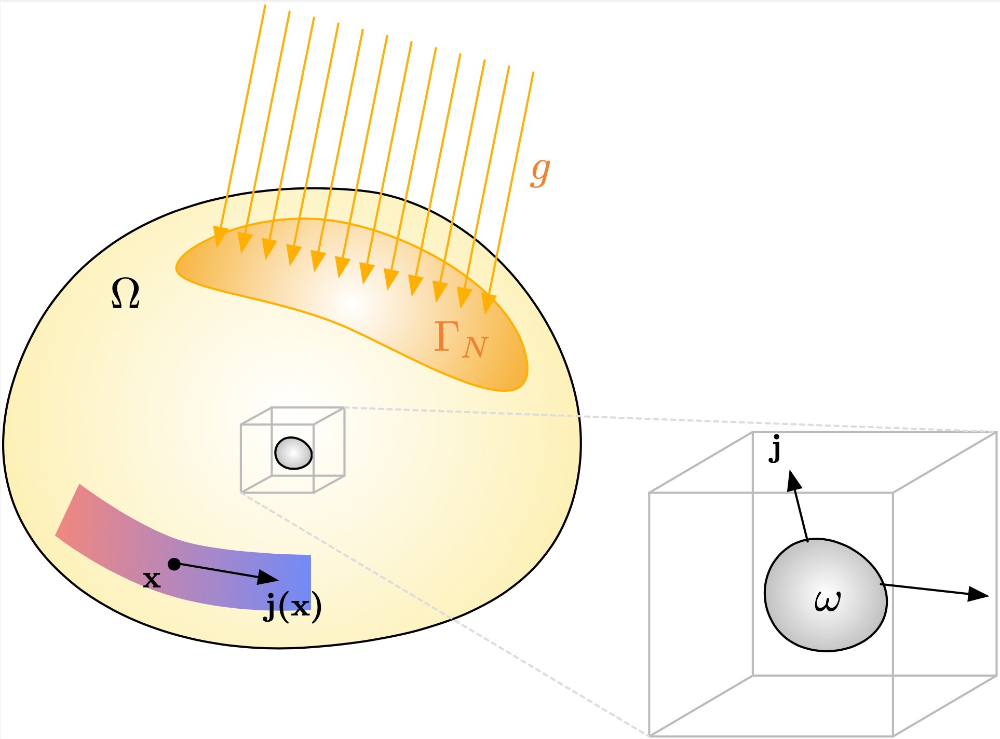
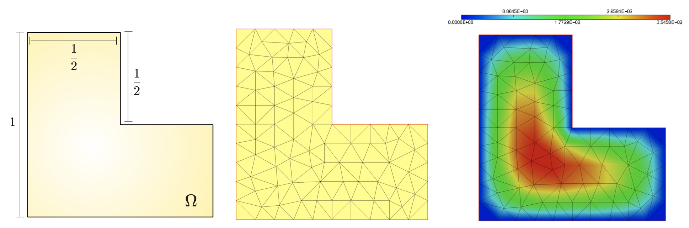
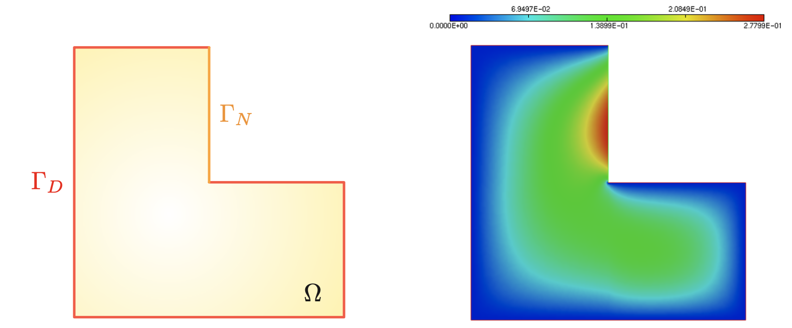
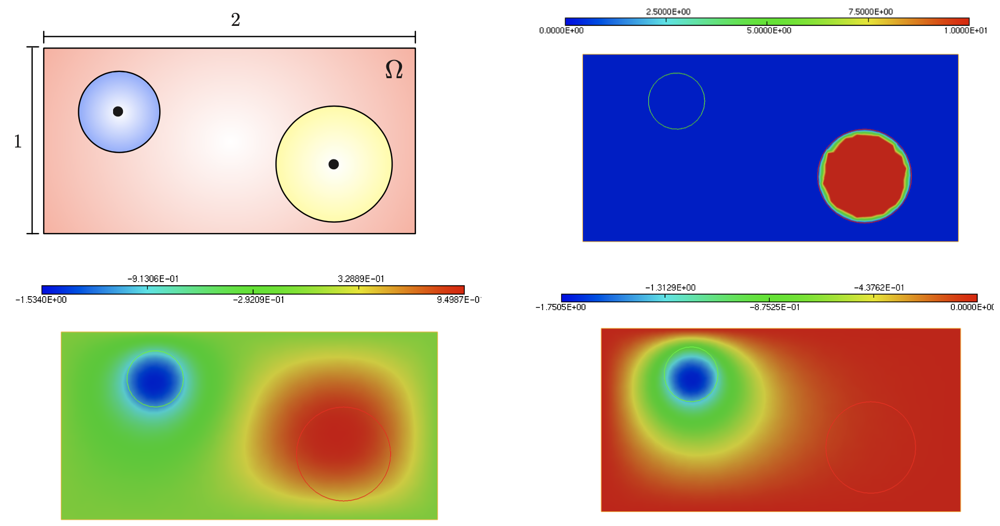

.. _sec.lap:

The Laplace equation in all its forms
======================================

.. ###################################################@
.. ###################################################@

This section is devoted to the numerical solution of the Laplace equation and of several variants. This task serves as an excuse to introduce the numerical environment $\texttt{FreeFem}$, which is the pivotal numerical tool used in this series of tutorials. 
Briefly, $\texttt{FreeFem}$ is an open-source environment, which conveniently allows to solve boundary value problems within a few lines of commands. This is achieved through the direct input of their variational formulations, via a simple pseudo-language which is close to the mathematical writing.

$\texttt{FreeFem}$ can be downloaded from the `dedicated website <https://freefem.org/>`_. This section introduces the main commands, and slightly more advanced features of $\texttt{FreeFem}$ will be described in the course of the next tutorials.  
The reader is referred to the complete `online documentation <https://doc.freefem.org>`_ of $\texttt{FreeFem}$, and the rich collection of examples worked in there for questions and further issues. 

.. #################@
.. #################@

.. _sec.LaplaceMod:

Motivation: modeling of thermal phenomena with the Laplace equation
--------------------------------------------------------------------

.. #################@
.. #################@

Before starting our tour properly speaking, we feel obliged to say a few words about the physics behind the Laplace equation; the reader eager to discover implementation aspects may skip this section.

The Laplace equation serves as (often simplified) mathematical model for a wide variety of physical phenomena: it describes notably the flow of current in an electrostatic conductor, the vertical displacement of an elastic membrane, or the behavior of the temperature within a domain, as we present in this section.

The situation is depicted on :numref:`fig.physLap`: $\Omega$ be a bounded and Lipschitz domain in $\R^d$, where $d=2$ or $3$;
a heat source with density $f: \Omega \to \R$ is acting inside $\Omega$, accounting for instance for the generation of heat via the disintegration of radioactive particles. 

.. #################@

.. _fig.physLap:

   A thermal cavity $\Omega$, and the heat flux vector $\bj$ within.

.. #################@

The physical phenomenon at play is described by:
  
  - The temperature field $u:\Omega \to \R$.
  
  - The heat flux $\bj : \Omega \to \R^d$: by definition, the thermal energy crossing a surface $S \subset \R^d$ with unit normal vector $\n$ equals 
  
    $$\int_S \bj \cdot \n \:\d s.$$

The first important ingredient in the modeling of thermal effects is Fourier's law, which relates the heat flux $\bj$ to the temperature $u$:

$$\bj(\x) = - \gamma(\x)\nabla u(\x). $$

According to intuition, heat is flowing from regions with high temperature to those with low temperature. The coefficient $\gamma$ is called thermal conductivity, and it depends on the physical properties of the constituent material of $\Omega$: high conductivity media, such as metals, are the site of intense heat flow when compared to low conductivity materials, such as air or wool.

The second key ingredient in the modeling is to relate the heat flux $\bj$ to the production of heat inside $\Omega$ by the source $f$. To achieve this, let us consider a small, arbitrary subdomain $\omega \Subset \Omega$. The heat within $\omega$ is changing via two mechanisms:

  - Heat is entering (or escaping) through the boundary $\partial \omega$ under the effect of the temperature difference with the outer medium. The amount of heat flowing in this way equals
    $$-\int_{\partial \omega} \bj \cdot \n \:\d s.$$
   
    Note that the minus sign ensures that heat is gained by $\omega$ when $\bj \cdot \n < 0$, i.e. when $\bj$ is pointing inside $\omega$. 
  
  - The amount of heat produced by the volumic source equals $\int_\omega f \:\d \x$.

We now assume that the system is at equilibrium: no change can occur in the heat contained in $\omega$ and both effects must compensate. This writes:

$$-\int_{\partial \omega} \bj \cdot \n \:\d s + \int_\Omega f \:\d \x = 0 .$$

Using :ref:`Green's' formula <sec.Green>`, we arrive at: 

$$-\int_{\omega} \dv(\bj) \:\d \x + \int_\Omega f \:\d \x = 0 .$$

Since this holds for an arbitrary subdomain $\omega$, we arrive at:

$$\dv(\bj) = f, \text{ that is } -\dv(\gamma \nabla u) = f.$$

This equation characterizes the behavior of the temperature inside the domain $\Omega$. It must be complemented with information about the behavior at the boundary of $\Omega$. Usually, $\partial \Omega$ is decomposed into two disjoint open regions, as:
$$\partial \Omega = \overline{\Gamma_D} \cup \overline{\Gamma_N}, \quad \Gamma_D \cap \Gamma_N = \emptyset.$$
Here, 

  - The temperature $u$ is kept at a fixed value $u_0$ on $\Gamma_D$; 
  
  - A heat flux $g: \Gamma_N \to \R$ is injected via the region $\Gamma_N$.

The first condition reads:

$$u = u_0 \text{ on } \Gamma_D. $$

As for the second condition, equilibrium between the injected heat flux $g$ and the heat induced by the temperature within the medium reads:

$$-\bj \cdot \n + g=0, \text{ that is } \gamma \frac{\partial u}{\partial n} = -g. $$

Eventually, gathering all these informations yields the usual form of the Laplace equation:

.. math::
  :label: eq.conduc
  
  \left\{ \begin{array}{cl}
  - \dv(\gamma \nabla u) = f & \text{in } \Omega, \\
  u = u_0 & \text{on } \Gamma_D,\\
  \gamma \frac{\partial u}{\partial n} = -g & \text{on } \Gamma_N.\\
  \end{array}\right.

.. #################@
.. #################@

.. _sec.LaplaceStart:

Getting started with $\texttt{FreeFem}$: resolution of the Laplace equation
----------------------------------------------------------------------------

.. #################@
.. #################@

For simplicity, we first consider a simplified version of the conductivity equation :math:numref:`eq.conduc`. Let $\Omega$ be the $2d$ L-shaped domain represented on :numref:`fig.LShapeLap` (left); we search for the function $u : \Omega \to \R$ characterized by:

.. math::
  :label: eq.Laplace

  \left\{ \begin{array}{cl}
  - \Delta u = f & \text{in } \Omega, \\
  u = 0 & \text{on } \partial \Omega,
  \end{array}
  \right.
  
where the right-hand side equals $f=1$. The variational problem attached to this equation has been introduced in :numref:`sec.LM`:

.. math::
  :label: eq.LaplaceVF
  
  \text{Search for } u \in H^1_0(\Omega)  \text{ s.t. } \forall v \in H^1_0(\Omega), \quad \int_\Omega \nabla u \cdot \nabla v \:\d \x = \int_\Omega fv \:\d \x,

where $H^1_0(\Omega)$ is the Sobolev space of functions having one weak derivative in $L^2(\Omega)$, and vanishing on $\partial \Omega$ (see :numref:`sec.Sobolev`).

.. #################@

.. _fig.LShapeLap:

   (Left) The L-shaped domain $\Omega$; (middle) A triangular mesh of $\Omega$; (right) Values of the solution $u$ to the Laplace equation :math:numref:`eq.Laplace`.

.. #################@

Let us now jump to the numerical resolution of this problem; the $\texttt{FreeFem}$ source code can be downloaded :download:`here <./codes/laplace_start.edp>`, and we describe its contents.

As we have seen in the previous :numref:`sec.FE`, the resolution of :math:numref:`eq.Laplace` hinges on a mesh ${\mathcal T}_h$ of $\Omega$.
In $\texttt{FreeFem}$, this task is usually realized from the input of a collection of parametrized curves (oriented counterclockwise) defining the boundary $\partial \Omega$ via the keyword $\texttt{border}$. The mesh ${\mathcal T}_h$ of the enclosed domain $\Omega$ is then constructed thanks to the operator $\texttt{buildmesh}$, which allows to specify the desired number of nodes on each part of the boundary. These operations are detailed in the listing below.

.. ############
.. code-block::

  /* Declaration of the boundary curves of the domain */
  border left(t=0,1.0){ x=0.0 ; y=1.0-t; label=1;};
  border bot(t=0,1.0){ x=t ; y=0.0; label=1;};
  border right(t=0,0.5){ x=1.0 ; y=t; label=1;};
  border ang1(t=0,0.5){ x=1.0-t ; y=0.5; label=1;};
  border ang2(t=0,0.5){ x=0.5 ; y=0.5+t; label=1;};
  border top(t=0,0.5){ x=0.5-t ; y=1.0; label=1;};

  /* Build mesh, display and save as a .mesh file */
  mesh Th = buildmesh(left(10)+bot(10)+right(5)+ang1(5)+ang2(5)+top(5));
  plot(Th,wait=1);
  savemesh(Th,"Lshape.mesh");

.. ############

Once this is done, the Finite Element space $V_h$ for the numerical solution $u_h$ and test functions $v_h$ is defined thanks to the keyword $\texttt{fespace}$, as exemplified below.

.. ############
.. code-block::

  /* Definition of finite element spaces and functions */
  fespace Vh(Th,P1); // or P2
  Vh u,v; // u,v are declared as elements in Vh
  
.. ############

Then, the right-hand side $f=1$ is defined as a real-valued function; the $\texttt{FreeFem++}$ syntax for this operation follows.

.. ############
.. code-block::

  /* Source term; the undisplayed arguments are the spatial coordinates */
  func real f() {
    return(1.0);
  }
  
.. ############

Finally, the variational formulation :math:numref:`eq.LaplaceVF` is entered:

.. ############
.. code-block::
  
  /* Stationary heat equation (solver = Conjugate Gradient) */
  problem laplace(u,v,solver=CG) = int2d(Th)(dx(u)*dx(v)+dy(u)*dy(v))
                                 - int2d(Th)(f()*v)
                                 + on(1,u=0.0);  // Homogeneous Dirichlet B.C.

  /* Resolution of the problem */
  laplace;

  /* Display and save the result */
  savemesh(Th,"Lshape.mesh");
  savesol("Lshape.sol",Th,u);

.. ############

A comment is in order about the way homogeneous boundary conditions are supplied in $\texttt{FreeFem}$.
Contrary to the theoretical framework detailed in :numref:`sec.bvptovarf`, these are not comprised in the definition of the Finite Element space $V_h$.
Rather, the operator $\texttt{on}$ is used to impose Dirichlet boundary conditions on the part of $\partial \Omega$ identified with the label $1$ (in the present
case, this represents the whole boundary $\partial\Omega$).
We shall see in :numref:`sec.dirtgv` how this operation is implemented.

.. ##############
.. prf:remark::

   The above listings exemplify two different means visualize the result of a numerical simulation such as that described just above, i.e. the values of the solution $\texttt{u}$ at the vertices of the mesh $\texttt{Th}$: 
   
   (1) Use the $\texttt{plot}$ command in $\texttt{FreeFem}$;
   
   (2) Save the mesh $\texttt{Th}$ and the solution $\texttt{u}$ via to the $\texttt{savemesh}$ and $\texttt{savesol}$ commands, and use the software $\texttt{medit}$. 
   
   More details about visualization are provided in :numref:`sec.visu`, including in-depth explanations of $\texttt{medit}$.

.. ##############

.. ##########
.. admonition:: Exercise
   :class: admonition-exo

   By adapting the above listings,

   (1) Solve the equation :math:numref:`eq.Laplace` by using $\mathbb{P}_0$, or $\mathbb{P}_2$ finite elements.

   (2) Change the mesh size in the discretization of $\Omega$.

   (3) Trade the right-hand side function $f=1$ for a different, analytical one; for instance you may try:
  
       $$f(x_1,x_2) = x_2, \text{ or } f(x_1,x_2) = x_1^2\cos(x_2).$$
      
   (4) Solve the equation :math:numref:`eq.Laplace` on different domains $\Omega$ from the proposed L-shaped one (e.g. a disk, a rectangle, etc.).

.. ##########

.. #################@
.. #################@

Changing boundary conditions and considering inhomogeneous coefficients
------------------------------------------------------------------------

.. #################@
.. #################@

In this section, the physical domain of interest $\Omega$ is again the L-shaped domain $\Omega$ depicted in :numref:`fig.LShapeLapMixed` (left). We now consider a version of the Laplace equation :math:numref:`eq.Laplace` featuring an inhomogeneous conductivity coefficient $\gamma : \Omega \to \R$ and mixed boundary conditions: as illustrated in :numref:`fig.LShapeLapMixed` (left), the boundary $\partial \Omega$ is now divided into two parts $\Gamma_D$, $\Gamma_N$, supporting respectively homogeneous Dirichlet, and inhomogeneous Neumann boundary conditions:

.. math::
  :label: eq.LaplaceMixed

  \left\{\begin{array}{cl}
  -\dv(\gamma(\x) \nabla u )  = f & \text{in } \Omega, \\
  u = 0 & \text{on } \Gamma_D, \\
  \gamma \frac{\partial u}{\partial n} = g & \text{on } \Gamma_N,
  \end{array}\right.
  \text{ with the conductivity } \gamma(\x) := \left\{
  \begin{array}{cl}
  1 & \text{if } x_2 \geq \frac{1}{2}, \\
  0.2 & \text{if } x_1 >= \frac{1}{2}, \\
  0.5 & \text{otherwise},
  \end{array}
  \right.

and where the source and boundary flux equal respectively $f = 1$ and $g=1$.

.. ##########
.. admonition:: Exercise
   :class: admonition-exo

   (1) Write down the variational formulation associated to :math:numref:`eq.LaplaceMixed`.

   (2) Implement the numerical resolution of this problem in $\texttt{FreeFem}$.

       *(Hint: To achieve this, you may get inspired by the syntax in the listing below to encode a boundary integral over a region of $\partial \Omega$ in $\texttt{FreeFem}$.)*
  
   (3) Consider again the above questions after replacing the Neumann boundary condition with the following Robin boundary condition:
      
       $$\gamma \frac{\partial u}{\partial n} + \alpha u = 0, \text{ where } \alpha >0 \text{ is a fixed real number}.$$

.. ############
.. code-block::

  /* Laplace equation with mixed b.c. (solver = Conjugate Gradient) */
  problem laplace(u,v,solver=CG) = int2d(Th)(gamma()*(dx(u)*dx(v)+dy(u)*dy(v)))
                                  - int2d(Th)(f()*v)
                                  - int1d(Th,2)(g()*v) // Integral of $g v$ over the region of the boundary of $Th$ labelled by 2
                                  + on(1,u=0.0);

.. ############

The solution $u$ to this mixed boundary-value problem is depicted on :numref:`fig.LShapeLapMixed` (right).

.. #################@

.. _fig.LShapeLapMixed:

   (Left) Setting of the mixed boundary value problem of :math:numref:`eq.LaplaceMixed`; (right) Plot of the solution $u$.

.. #################@

.. #################@
.. #################@

.. _sec.LaplaceUnsteady:

The unsteady Laplace equation
-----------------------------

.. #################@
.. #################@

In this section, we turn to a time-dependent version of the Laplace equation :math:numref:`eq.Laplace`, posed over the 2d physical domain $\Omega=[0,2]\times [0,1]$ and the time interval $[0,T]$: 

.. math::
  :label: eq.LaplaceUnsteady

  \left\{
  \begin{array}{cl}
  \frac{\partial u}{\partial t}- \Delta u = f & \text{for } t \in (0,T), \:\: \x \in \Omega, \\
  u(t,\x) = 0 & \text{for } t\in (0,T), \:\: \x \in \partial \Omega,\\
  u(0,\x) = u_0(\x) & \text{for } \x \in \Omega.
  \end{array}
  \right.

Here,

  - The initial data $u_0$ is supported in two disjoint disks, where it takes two distinct values, see :numref:`fig.LaplaceUnsteady` (top,right).
  - the source (or sink) $f$ equals $-1$,

We do not discuss the rather technical formalism for such time evolution problems, and we describe its solution in a formal manner.

This problem has to be discretized in both time and space. Essentially, for the time discretization, we use a Finite Difference time-stepping scheme, and for the spatial discretization, we use the Finite Element method. 

Let us proceed step by step, and first derive a suitable variational formulation for :math:numref:`eq.LaplaceUnsteady`: we multiply both sides of the main equation by a test function $v$ which only depends on the spatial variable $\x$. This yields, for each time $t \in (0,T)$:

$$\int_\Omega \frac{\partial u}{\partial t}(t,\x) v(\x) \:\d \x - \int_\Omega \Delta u(t,\x) v(\x) \:\d\x = \int_\Omega f(\x) v(\x)\:\d\x.$$

Now, using that $v$ is independent of time, we can take the time derivative out of the first integral in the above left-hand side; doing so and integration by parts with :ref:`Green's' formula <sec.Green>` in the second integral, we obtain:

$$\frac{\d}{\d t}\left(\int_\Omega u(t,\x) v(\x) \:\d \x \right) + \int_\Omega \nabla u(t,\x) \cdot \nabla v(t,\x) \:\d\x = \int_\Omega f(\x) v(t,\x)\:\d\x.$$

Let us now set:

$$V= H^1_0(\Omega), \text{ and for all } u,v \in V, \quad m(u,v) = \int_\Omega uv \:\d \x, \:\:\: a(u,v) = \int_\Omega \nabla u \cdot \nabla v \:\d \x, \text{ and } \ell(v) = \int_\Omega fv\:\d\x. $$

As usual, the choice of the functional space $V = H^1_0(\Omega)$ is dictated by the homogeneous Dirichlet boundary condition in :math:numref:`eq.LaplaceUnsteady`. With these notations, we arrive at the continuous in time and space variational formulation for :math:numref:`eq.LaplaceUnsteady`:

$$\text{Search for } u(t,\cdot) \in V, \text{ s.t. forall } v \in V, \quad \frac{\d}{\d t} m(u(t,\cdot),v) + a(u,v) = \ell(v). $$

We now perform time discretization: introducing a time step $\Delta t$, we let $t^n = n \Delta t$, $n=0,\ldots$; we also denote by $u^n(\x) = u(t^n,\x)$ the space-dependent function $u$ at the particular time $t^n$. Using an implicit discretization of the time derivative in the above formulation, we are led to search for the collection $\left\{u^n \right\}_{n=0,\ldots,N}$ of functions in $V$ defined by:

$$\left\{
\begin{array}{l}
u^0 \text{ is the initial datum } u_0, \\ 
\text{For all } n=0,\ldots,N-1, \:\: u^{n+1} \in V \text{ is characterized by: } \:\: \forall \: v \in V, \quad \frac{m(u^{n+1},v) - m(u^n,v)}{\Delta t} + a(u^{n+1},v) = \ell(v). 
\end{array}
\right.$$

After rearranging these expressions, the solution of :math:numref:`eq.LaplaceUnsteady` is realized as follows:

  - $u^0$ is the initial datum $u_0$;
  - For $n=0,...,N-1$, calculate $u^{n+1}$ from $u^n$ by solving the variational problem:
  
    .. math::
       :label: eq.varfLaplaceUnsteady
  
       \text{Search for } u^{n+1} \in V, \text{ s.t. for all } v \in V, \quad m(u^{n+1},v) + \Delta t \: a(u^{n+1},v) = m(u^n,v) + \Delta t \:\ell(v).

The implementation of this scheme in $\texttt{FreeFem}$ is barely more complicated than the resolution of the steady Laplace equation tackled in :numref:`sec.LaplaceStart`. The only additional ingredient is the use of a $\texttt{for}$ loop over the time index $n=0,\ldots,N$, along the lines of the following listing:

.. ############
.. code-block::

  /* Semi-discrete in time variational formulation of the heat equation */
  problem sdheat(u,v,solver=CG) = int2d(Th)(u*v)
                                + int2d(Th) (dt*(dx(u)*dx(v)+dy(u)*dy(v)))
                                - int2d(Th)(uo*v)
                                - int2d(Th,refsink)(f()*v)
                                + on(0,u=0);

  /* Main loop: at the beginning of each iteration, uo is the solution at step n, 
    then the solution u at step (n+1) is calculated */
  for (int it=0; it<maxit; it++) {
    sdheat;
    uo = u;
  }

.. ##############

.. ##############
.. prf:remark::

   It is instructive to write the Finite Element discretization of the variational problem :math:numref:`eq.varfLaplaceUnsteady`. Like in :numref:`sec.FE`, let $V_h$ be the chosen Finite Element space for the discretization of $V$, so that the Finite Element problem reads: 
   
   $$\text{Search for } u_h^{n+1} \in V_h, \text{ s.t. for all } v_h \in V_h, \quad m(u_h^{n+1},v_h) + \Delta t \: a(u_h^{n+1},v_h) = m(u_h^n,v_h) + \Delta t \:\ell(v_h).$$

   Let now $\left\{\phi_i \right\}_{i=1,\ldots,N_{V_h}}$ be a basis of $V_h$, and for each $n=0,\ldots,N$, let us denote by $\bU_h^n \in \R^{N_{V_h}}$ the vector gathering the coordinates of $u_h^n$ in this basis. We arrive at the following linear system with size $N_{V_h}$:
   
   $$(M_h  + \Delta t K_h) \bU_h^{n+1} = M \bU_h^{n} + \Delta t \bF_h.$$
   
   Here, 
   
     - $K_h$ is the $N_{V_h} \times N_{V_h}$ stiffness matrix associated to the Laplace operator: 
       
       $$(K_h)_{ij} = \int_\Omega \nabla \phi_i \cdot \nabla \phi_j \:\d x, \quad i,j=1,\ldots,N_{V_h}. $$
       
     - $\bF_h \in \R^{N_{V_h}}$ is the load vector defined by:
     
       $$(F_h)_{i} = \int_\Omega f \phi_i \:\d x, \quad i=1,\ldots,N_{V_h}. $$

     - $M_h$ is the $N_{V_h} \times N_{V_h}$ mass matrix: 
       
       $$(M_h)_{ij} = \int_\Omega  \phi_i  \phi_j \:\d x, \quad i,j=1,\ldots,N_{V_h}. $$

.. ##############

Click :download:`here <./codes/laplace_unsteady.edp>` for the source code of this example; a few snapshots of the evolution process are depicted on :numref:`fig.LaplaceUnsteady`.

.. #################@

.. _fig.LaplaceUnsteady:

   (Top, left) Setting of the unsteady laplace equation; (top,right) Initial distribution of temperature $u_0$; (bottom, left) Temperature $u$ at time $t=0.1$; (bottom, right) Final distribution of $u$.

.. #################@
