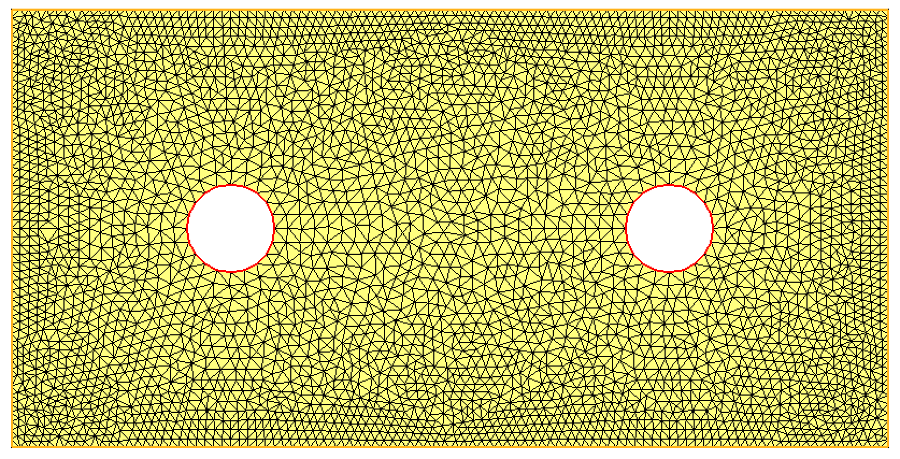
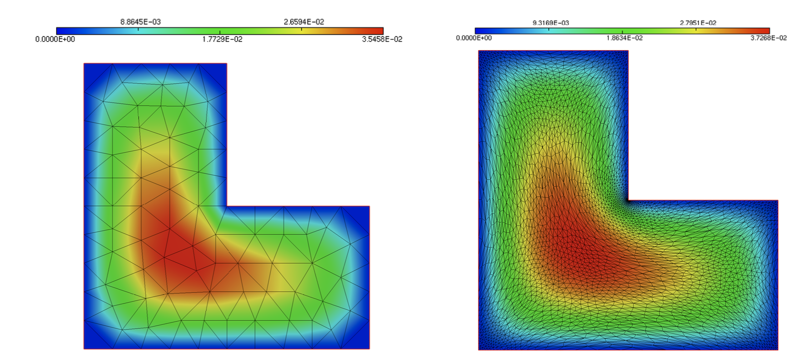
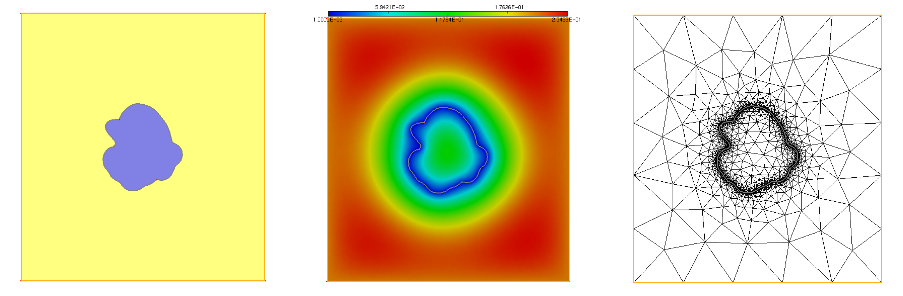
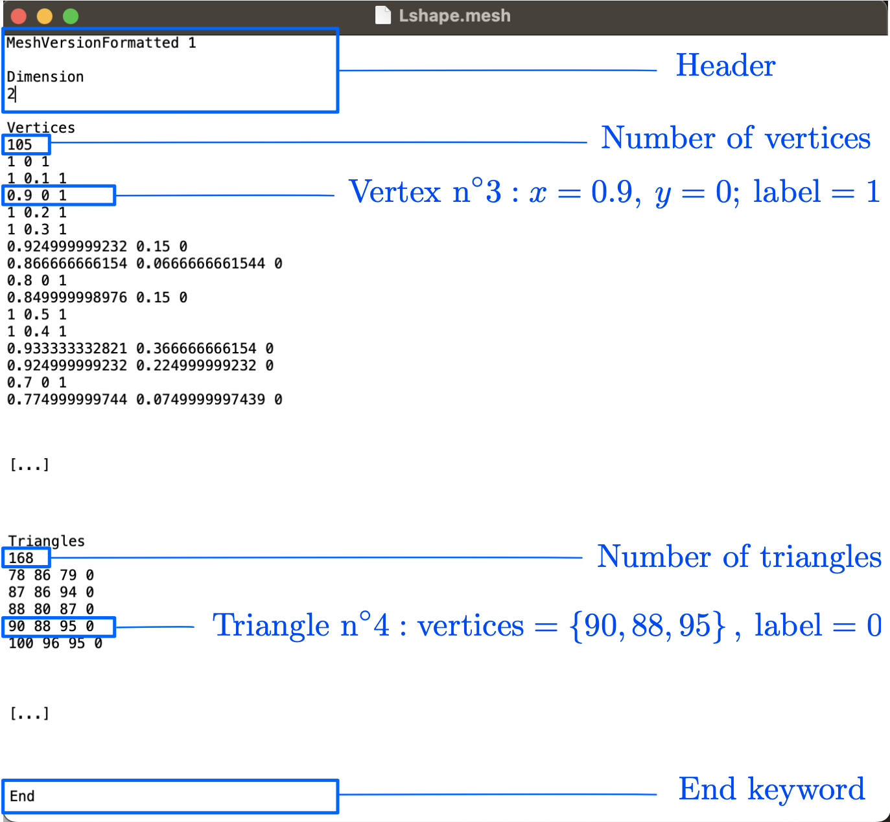
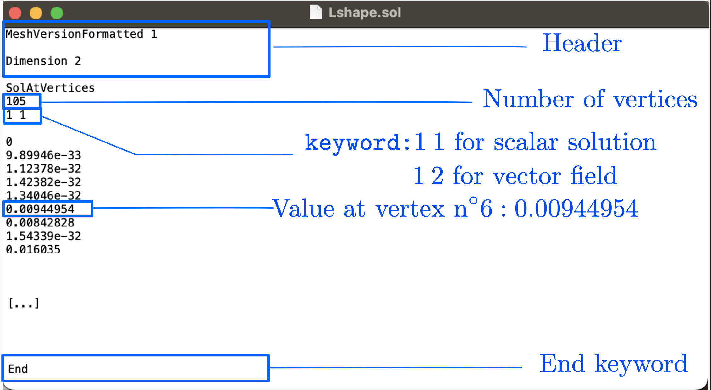

.. _sec.mesh:

A second encounter with meshes
==============================

This section elaborates further about the topic of meshes, that we have first encountered in :numref:`sec.FE`. In the first :numref:`sec.meshFFF`, we provide a few $\texttt{FreeFem}$ syntax commands associated to their construction and handling. We then turn to the topic of mesh adaptation in :numref:`sec.AMR`, before giving a few details about the structure of typical mesh files treated by $\texttt{FreeFem}$ in :numref:`sec.meshsolfiles`.

.. #################@
.. #################@

.. _sec.meshFFF:

Handling meshes with $\texttt{FreeFem}$
----------------------------------------

.. #################@
.. #################@

The $\texttt{FreeFem}$ environment offers multiple options to create, handle and modify meshes. The present section presents a few of the most useful features; the associated source code can be downloaded :download:`here <./codes/handling_meshes.edp>`.

.. #################@

Construction of a mesh
""""""""""""""""""""""

.. #################@

A convenient way to create a mesh of a 2d domain $\Omega$ in $\texttt{FreeFem}$ starts from the input of a parametrization of its boundary $\partial \Omega$, as a collection of 2d curves oriented counterclockwise, i.e. in such a way that the interior of $\Omega$ is at the left-hand side of the curves. For example, the following listing defines the independent components of the boundary of a domain. 

.. ############
.. code-block::

   /* Definition of the boundary curves of the domain */
   border left(t=0.0,1.0){ x=0.0 ; y=1.0-t; label=0;};
   border bot(t=0.0,2.0){ x=t ; y=0.0; label=0;};
   border right(t=0.0,1.0){ x=2.0 ; y=t; label=0;};
   border top(t=0.0,2.0){ x=2.0-t ; y=1.0; label=0;};
   border hole1(t=0.0,1.0){ x=0.5+0.1*cos(2*pi*t); y=0.5+0.1*sin(2*pi*t); label=1;};
   border hole2(t=0.0,1.0){ x=1.5+0.1*cos(2*pi*t); y=0.5+0.1*sin(2*pi*t); label=1;};

.. ############

Then, a mesh of $\Omega$ is constructed thanks to the command $\texttt{buildmesh}$, where the number of vertices discretizing each piece can be specified. This results with the mesh displayed on :numref:`fig.meshborder`.

.. ############
.. code-block::

   /* Build mesh, display and save as a .mesh file */
   /* A negative numbers of vertices indicates reverse orientation */
   mesh Th = buildmesh(left(50)+bot(100)+right(50)+top(100)+hole1(-20)+hole2(-20));

.. ############

.. #################@

.. _fig.meshborder:

   Creation of a 2d mesh from the input of its border with $\texttt{FreeFem}$.

.. #################@

.. #################@

Access to the elements of a mesh
"""""""""""""""""""""""""""""""""

.. #################@

In simple situations, the built-in operations in $\texttt{FreeFem}$ conveniently alleviate the need to handle the triangles and vertices of a mesh $\texttt{Th}$. However, more advanced features sometimes raise the need to have access to these data, which can be achieved along the following lines.

The mesh $\texttt{Th}$ contains $\texttt{Th.nt}$ triangles, which are numbered from $k=0$ to $k=\texttt{Th.nt}-1$.

  - For $i=0,1,2$, $\texttt{Th[k][i]}$ is the number of the $i^{\text{th}}$ vertex of element $k$.
  
  - $\texttt{Th[k].label}$ is the label of element $k$, i.e. the number of the assigned material region.

The mesh contains $\texttt{Th.nv}$ vertices, which are numbered from $l=0$ to $l=\texttt{Th.nv}-1$.
  
  - $\texttt{Th(l).x}$ and $\texttt{Th(l).y}$ are the $x$ and $y$ coordinates of the $l^{\text{th}}$ vertex of the mesh.
  
  - $\texttt{Th(l).label}$ is the label of the $l^{\text{th}}$ vertex of the mesh.

.. #################@
.. #################@

.. _sec.AMR:

Adaptive mesh refinement
-------------------------

.. #################@
.. #################@

This section skims over the popular topic of mesh adaptivity. Its basic assessment is that most physical phenomena are not equally interesting everywhere in the computational domain $\Omega$. For the sake of concentrating the computational effort where it is needed, one would like the elements of the mesh $\texttt{Th}$ to be small enough where fine effects occur, and coarse enough on the other regions of $\Omega$. 

.. #######

Principle, size maps
""""""""""""""""""""""

.. #########

The most intuitive way to perform mesh refinement in practice relies on a size map, i.e. a mapping: $h: \Omega \to \R_+$, such that:

$$\text{For all point } \x \in \Omega, \quad h(\x) = \text{ desired length of edges near } \x.$$

In a basic $\texttt{Freefem}$ implementation, such a size map can be defined as a $\P_1$ Finite Element function on a mesh $\texttt{Th}$ of $\Omega$.

In $\texttt{Freefem}$, adaptive mesh refinement is usually applied in two different situations.

-- A function $u$ is given at the vertices of the mesh $\texttt{Th}$, and one would like to adapt this mesh to capture the regions where $u$ has large variations. This task is accomplished thanks to the following command:

.. ############
.. code-block::

  /* Adaptation of a mesh Th with respect to the variations of $u$;
      err is a parameter quantifying the fineness of the adaptation */
     real eps = 0.05; 
     Th       = adaptmesh(Th,u,err=eps); // The previous mesh is overwritten
 
.. ############

In this case, the size map used by $\texttt{FreeFem}$ to adapt the mesh is hidden from the user.
Here, the argument $\texttt{err}$ is the desired $\P_1$ interpolation error of the function $u$ on $\texttt{Th}$: as a rule of thumbs, the smaller the value, the finer the mesh in the regions where $u$ has sharp variations.
    
-- It is possible to directly supply the desired size map to $\texttt{FreeFem}$, via the following command:
  
.. ############
.. code-block::
  
  fespace Vh(Th,P1);
  Vh m;
  
  [...]

  /* Adaptation of a mesh Th with respect to the size map $m$ */
  mesh Thn = adaptmesh(Th,IsMetric=1,m,nbvx=100000);

.. ############

Here, 

  - The argument :code:`IsMetric=1` indicates that the supplied function $m$ is the size map. 
  
  - The argument :code:`nbvx=100000` indicates the maximum number of vertices allowed in the resulting mesh.

.. #######

Example 1: Adaptation to a solution with a refinement loop
"""""""""""""""""""""""""""""""""""""""""""""""""""""""""""

.. #########

In order to illustrate the idea of adapting a mesh to the resolution of a Finite Element problem, let us consider again the standard Laplace equation introduced in :numref:`sec.lap`.

The results of the standard resolution that we have conducted in there, which are reprinted on :numref:`fig.LaplaceAMR` (left), are actually a little disappointing. Indeed, the solution $u$ is calculated on a coarse mesh of $\Omega$, while the theory predicts that $u$ is not very regular near the reentrant corner of $\Omega$.
Therefore, a coarse mesh is unable to account for the fine features of $u$ in this region.
One remedy to this problem would be to use a very fine mesh of $\Omega$ (i.e. a mesh with many triangles),
but this is unefficient, as the size of the corresponding linear system would increase dramatically (and thereby the required CPU cost).
 
This raises the idea of adapting the computational mesh, so that it is selectively refined where needed (i.e. at the regions where the numerical solution $u_h$ shows large variations), and coarse where it is not. Doing so typically relies on a loop:

  - At first, a coarse computational mesh $\texttt{Th}$ of $\Omega$ is used, which results in an inaccurate, but cheap numerical solution $u$. 
  
  - the mesh $\texttt{Th}$ is then refined near the regions of $\Omega$ where $u$ has large variations, which yields a new version of $\texttt{Th}$ which is better adapted to the solution of :numref:`sec.lap`. This boundary value problem is thus solved on this new mesh. 
  
  - This procedure is iterated a few times, so that the mesh $\texttt{Th}$ is increasingly better adapted to $u$ (while retaining a moderate size), and the numerical approximation of the latter is increasingly accurate.
  
This procedure is summarized in the following $\texttt{FreeFem}$ listing.

.. ############
.. code-block::

  /* Multiple resolutions of the Laplace equation,
                 intertwined with mesh adaptation steps */
  for (int it=0; it<maxit; it++) {
    laplace;
    Th = adaptmesh(Th,u,err=eps);
    plot(Th,u,fill=1);
    eps *= 0.5;
  }

.. ############

.. ##########
.. admonition:: Exercise
  :class: admonition-exo

  Implement the procedure in the listing below to achieve this goal.

.. ##########

The result is presented on :numref:`fig.LaplaceAMR` (right), and the associated code is contained in :download:`this file <./codes/laplace_with_mesh_refinement.edp>`.

.. #################@

.. _fig.LaplaceAMR:

   Temperature field $u$ obtained in the resolution of :math:numref:`eq.Laplace` using  $\mathbb{P}_1$ elements (left) On a coarse mesh, (right) On an iteratively adapted mesh.

.. #################@

.. #######

Example 2: Adaptation with respect to a user-defined metric
""""""""""""""""""""""""""""""""""""""""""""""""""""""""""""

.. #########

Let us consider the situation depicted on :numref:`fig.adaptuser` (left); the corresponding mesh can be downloaded :download:`here <./codes/mario.mesh>`. The domain $\Omega$ is made of two subdomains $\omega$ and $\Omega \setminus \overline{\omega}$, with respective labels $7$ and $0$, separated by the interface $\partial \omega$ with label $20$. One would like to adapt the mesh $\texttt{Th}$ of $\Omega$ so that it feature a small size $\texttt{hmin}=0.001$ near $\partial \omega$, and a larger size $\texttt{hmax}=0.2$ near $\partial \Omega$. 

.. #################@

.. _fig.adaptuser:

   (Left) The considered domain $\Omega$ contains is made of two subdomains $\omega$ and $\Omega \setminus \overline\omega$ (depicted respectively in purple and yellow), separated by the interface $\partial \omega$; (center) One size map $m: \Omega \to \R$ imposing a small size $\texttt{hmin}$ on $\partial \omega$ and a large size $\texttt{hmax}$ on $\partial \Omega$; (right) Adapted mesh of $\Omega$ to this size map.

.. #################@

.. ##########

.. admonition:: Exercise
  :class: admonition-exo

  (1) Create a size map $m : \Omega \to \R$ that shows a smooth transition between the values $\texttt{hmin}=0.001$ on $\partial \omega$ and $\texttt{hmax}=0.2$ on $\partial \Omega$. 
  
    *(Hint: You may solve a Laplace-like equation associated with suitable boundary conditions, conductivity coefficients inside and outside $\omega$, and right-hand side to achieve this goal.)*
  
  (2) Adapt the mesh of $\Omega$ to $m$ thanks to the $\texttt{FreeFem}$ command $\texttt{adaptmesh}$.

.. ##########

The source code associated to a possible solution to this exercise can be downloaded :download:`here <./codes/adaptation_user_metric.edp>`.
The numerical result is depicted on :numref:`fig.adaptuser` (middle,right). 

.. #################@
.. #################@

.. _sec.meshsolfiles:

Description of the $\texttt{.mesh}$ and $\texttt{.sol}$ formats
---------------------------------------------------------------

.. #################@
.. #################@

We have come across files under the formats $\texttt{.mesh}$ and $\texttt{.sol}$ on several occasions in the previous developments; this sections provides a little more details about their structure. 

As the name suggests, a $\texttt{.mesh}$ file is used to store a mesh, so that it can be visualized, as described in :numref:`sec.visu`, or reused for later computations. As we have already seen in :numref:`sec.LaplaceStart`, in $\texttt{Freefem}$, a mesh is written thanks to the $\texttt{savemesh}$ command. Such a file can be loaded by providing its path to the $\texttt{readmesh}$ function.

.. ############
.. code-block::

  /* Path of the mesh */
  string MESH = "./lluke.mesh";
  
  /* Read .mesh file */
  mesh Th = read(Th,MESH);

.. ############

The $\texttt{.mesh}$ format is relatively self-explanatory: it basically consists in the lists of vertices and triangles of the mesh, as depicted on :numref:`fig.meshfile`.

.. #################@

.. _fig.meshfile:

   Organization of a typical $\texttt{.mesh}$ file.

.. #################@

.. ##########
.. prf:remark::

    Multiple other formats are used in practice to store meshes, such as $\texttt{.stl}$ (which are ubiquitous for 3d printing models) and $\texttt{.wrl}$, to name a few. Meshes under the $\texttt{.mesh}$ format can be converted from and to most existing formats thanks to the open-source software `$\texttt{GMSH}$ <https://gmsh.info/>`_.

.. ##########

Let us finally describe the organization of $\texttt{.sol}$ files, that we have already used in :numref:`sec.visu` to store $\P_1$ Finite Element functions defined at the vertices of a mesh $\texttt{Th}$. Such a file simply consists in the list of the values of the function at the vertices of $\texttt{Th}$, as exemplified in :numref:`fig.solfile`.

.. #################@

.. _fig.solfile:

   Organization of a typical $\texttt{.sol}$ file.

.. #################@

As we have seen in :numref:`sec.LaplaceStart`, $\P_1$ Finite Element functions can be saved as $\texttt{.sol}$ files in $\texttt{FreeFem}$ thanks to the function $\texttt{savesol}$. On the contrary, no built-in command allows to read such functions; however, this task can be achieved thanks to the following listing, which is implemented in :download:`this file <./codes/readmshsol.edp>`; click :download:`here <./codes/lluke.mesh>` to download the mesh file and :download:`here <./codes/readmshsol.edp>` for the solution file.

.. ############
.. code-block::

  string SOL = "./lluke.sol";

  [...]
  
  /* Read a .sol file containing a scalar-valued solution */
  ifstream fin(SOL);
  string s;
  int nv;
  
  /* Read header */
  for(int i=0; i<5; i++) {
    fin >> s;
  }
  
  /* Read number of vertices */
  fin >> nv;
    
  /* Read header (bis) */
  for(int i=0; i<2; i++) {
    fin >> s;
  }
      
  /* Read values of the solution */
  for(int i=0; i<nv; i++) {
    fin >> phi[][i];
  }

  /* Display the result */
  plot(Th,phi,fill=1,wait=1);

.. ############

.. ##########

.. _rm.ucoef:

.. prf:remark::

  In this listing, the array of the coefficients of a function $u$ in the basis of the Finite Element space (see :math:numref:`eq.decompFEbasis`) is given by the syntax $\texttt{u[]}$.

.. ##########
