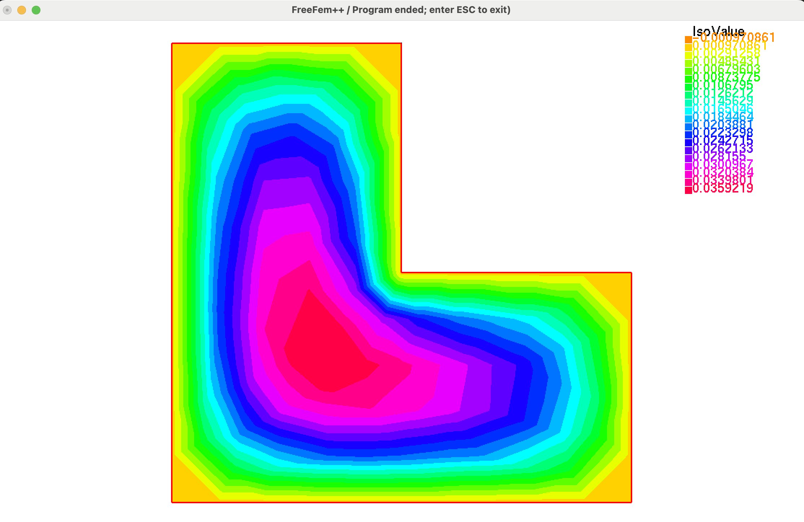
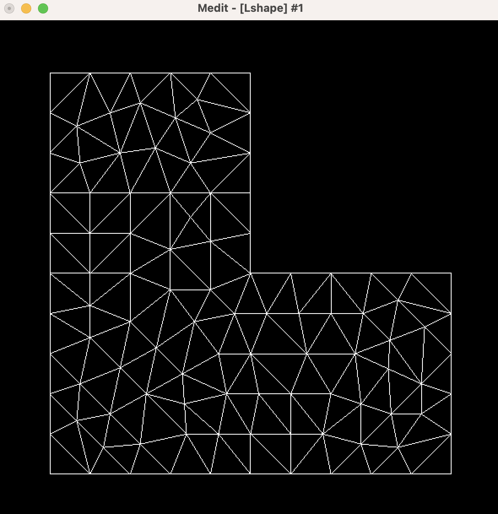
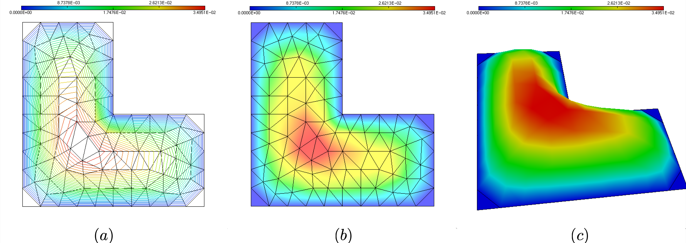
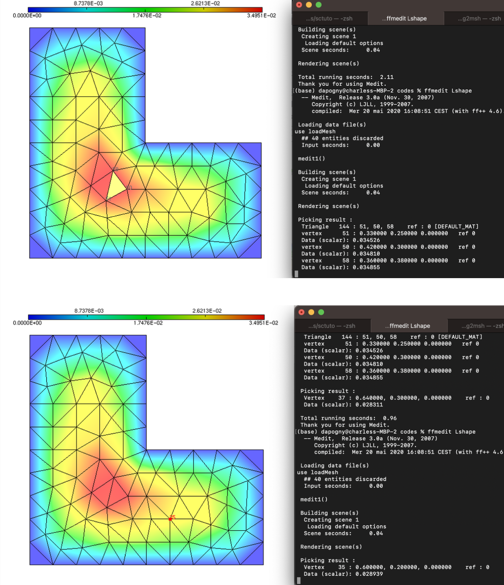
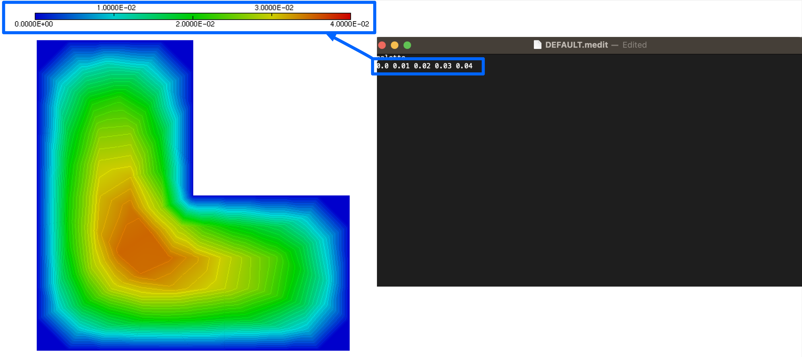
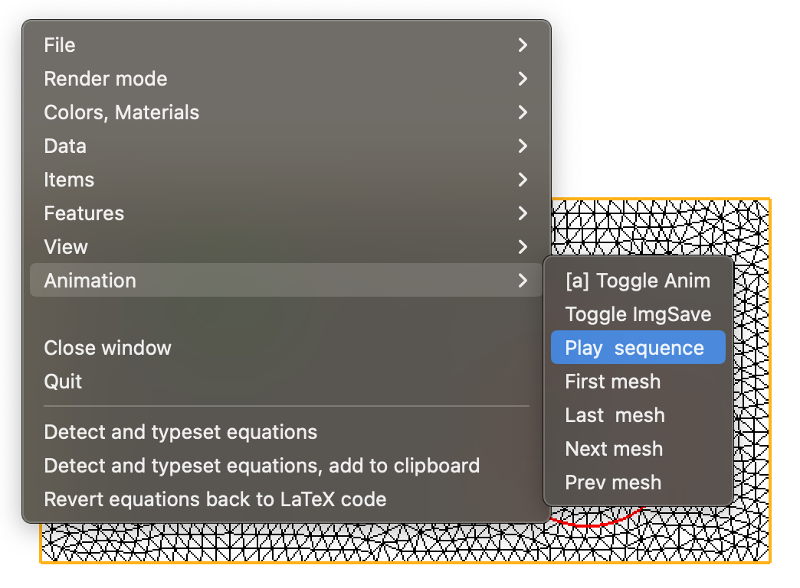

.. _sec.visu:

Visualization of meshes and solutions
======================================

The typical outcome of a numerical calculation consists in a mesh of the computational domain and a solution defined on the latter; such is the case of the solution of a boundary value problem by the Finite Element Method, as we have seen in :numref:`sec.lap`. This raises the question of how to visualize these objects. In this section, we present two ways of achieving this goal; the first one, described in :numref:`sec.plotFF`, hinges on the simple built-in command $\texttt{plot}$ of the $\texttt{FreeFem}$ language; the second and more efficient one, presented in :numref:`sec.plotmedit`, leverages the simple and efficient tool $\texttt{medit}$.

.. #################@
.. #################@

.. _sec.plotFF:

The $\texttt{plot}$ command in $\texttt{FreeFem}$
-------------------------------------------------

.. #################@
.. #################@

To set ideas, let us come back to the situation considered in :numref:`sec.LaplaceStart`, where we have calculated the solution $u$ to the Laplace equation :math:numref:`eq.Laplace` on a mesh $\calT_h$ of an L-shaped domain $\Omega$. The associated source code can be downloaded :download:`here <./codes/laplace_start.edp>`.
The visualization of $\calT_h$ and $u$ can be realized according to the following $\texttt{FreeFem}$ function:

.. ############
.. code-block::

  /* Display and save the result */
  plot(Th,u,wait=1,[options]);

.. ############

Here, $\texttt{[options]}$ stands for one or several optional arguments. The complete features of the $\texttt{plot}$ function are described in the `$\texttt{FreeFem}$ documentation <https://doc.freefem.org/documentation/visualization.html#visualization>`_, and we solely highlight a few useful ones:

  - $\texttt{fill=1}$ fills the elements of the mesh with a color related to the values of the solution.

  - $\texttt{value=1}$ displays the color scale.
  
  - $\texttt{bb=[[0.0, 0.1],[0.9, 1.0]]}$ makes a zoom on the subset $(0.0,0.1) \times (0.9,1.0) \subset \Omega$.
  
This instruction opens a new window with the desired features, as illustrated on :numref:`fig.illusplot`.

.. #################@

.. _fig.illusplot:

   Outcome of the $\texttt{plot}$ command in $\texttt{FreeFem}$.

.. #################@
  
.. #################@
.. #################@

.. _sec.plotmedit:

A simple and efficient visualization tool: $\texttt{medit}$
-----------------------------------------------------------

.. #################@
.. #################@

The open-source software `$\texttt{medit}$ <https://github.com/ISCDtoolbox/Medit>`_ is a simple and efficient tool for displaying a mesh $\calT_h$ and a $\mathbb{P}_1$ function $u$, supplied by its values at the vertices of $\calT_h$. It can be used either directly within the $\texttt{FreeFem}$ environment, or as a stand-alone program. We describe in this section a few important features of $\texttt{medit}$, referring to the `online documentation <https://www.ljll.fr/frey/logiciels/Docmedit.dir/>`_ for a more advanced use. 

Still in the context of the calculation of the solution $u$ to the Laplace equation :math:numref:`eq.Laplace` on a mesh $\calT_h$ considered in :numref:`sec.LaplaceStart`, $\texttt{medit}$ can be used to visualize $\calT_h$ and $u$ through the following $\texttt{FreeFem}$ syntax:

.. ############
.. code-block::
  
  /* Load medit library */
  load "medit"
  
  [...]
  
  /* Display mesh T_h and solution u */
  medit("u", Th, u);
  
.. ############

An alternative, more flexible means to use $\texttt{medit}$ is to call it outside of $\texttt{FreeFem}$, via command lines;
most installations of $\texttt{FreeFem}$ indeed come along with a fully-fledged installation of $\texttt{medit}$. The latter can be called by using the following command line in the console:

.. ############
.. code-block:: console
  
  ffmedit domain.mesh
  
.. ############

Here, it is understood the the current directory contains a mesh file $\texttt{domain.mesh}$ for the domain; if one additionally wishes to displaya solution attached to its vertices, the values of the latter must be contained in another file $\texttt{domain.sol}$, i.e. sharing the same name as the mesh, with the different extension $\texttt{.sol}$. In most situations, it is not necessary to understand the structures of $\texttt{.mesh}$ and $\texttt{.sol}$ files, since they can be read and saved by $\texttt{FreeFem}$ functions; the curious or expert reader can find more information related to this structure in :numref:`sec.meshsolfiles`.

Let us illustrate visualization with $\texttt{medit}$ with the mesh $\calT_h$ and the solution $u$ to the Laplace equation, tackled in :numref:`sec.LaplaceStart`. At first, in the $\texttt{FreeFem}$ script, the mesh $\calT_h$ and the $\P_1$ finite element function $u$ are saved as $\texttt{.mesh}$ and $\texttt{.sol}$ files, thanks to the following lines:

.. ############
.. code-block::

  /* medit must be loaded to use savesol */
  load "medit"
  
  [...]

  /* Display and save the result */
  savemesh(Th,"Lshape.mesh");
  savesol("Lshape.sol",Th,u);
  
.. ############

We then call $\texttt{medit}$ via the following console command:

.. ############
.. code-block:: console
  
  ffmedit Lshape.mesh
  
.. ############

A window opens, as depicted in :numref:`fig.medit1`.

.. #################@

.. _fig.medit1:

   Calling $\texttt{medit}$ with the console.

.. #################@

Several keyboard shorthands then allow to act on the graphical rendering:

  - $\texttt{b}$ switches the background color from black to white, and conversely;
  - $\texttt{o}$ displays the isolines of the solution file;
  - $\texttt{p}$ displays the color scale, see :numref:`fig.medit2` (a);
  - $\texttt{m}$ displays the values of the solution with a color filling rendering, as in :numref:`fig.medit2` (b);
  - $\texttt{k}$ reveals the 3d graph of the solution; using the left click allows to change the view, see :numref:`fig.medit2` (c).

.. #################@

.. _fig.medit2:

   A few basic commands in $\texttt{medit}$: (a) Displaying the isolines of the solution and the color palette; (b) Using a color fill rendering; (c) Visualizing the graph of the solution.

.. #################@

$\texttt{Medit}$ also enjoys convenient functionalities to access the values of the solution $u$ at specific entities in the mesh:

- Clicking on a triangle with $\texttt{shift}$ reveals the number of the triangle, of its three vertices, and the values of the solution at those, see :numref:`fig.medit3` (top).

- Clicking on a vertex with $\texttt{command} + \texttt{shift}$ shows the value of the solution at this vertex, see :numref:`fig.medit3` (bottom).

.. #################@

.. _fig.medit3:

   (Top) Clicking on a triangle to display the numbers of its vertices and the values of the attached solutions; (bottom) Clicking on a vertex to display its number and the value of the attached solution.

.. #################@

A few additional features of $\texttt{medit}$ rely on the use of a parameter file. The latter must be called $\texttt{DEFAULT.medit}$; it is written by using any text editor, and it should be placed in the repository where $\texttt{medit}$ is called -- which may differ from the repository where the visualized files are located. Its syntax is very simple, and an example of such file can be downloaded :download:`here <./codes/DEFAULT.medit>`. This file is primarily used to customize the color scale for the displayed values of the solution: to achieve this, the keyword $\texttt{palette}$ is used, and 5 reference values are supplied for the interpolation of the color scale, see :numref:`fig.palettemedit`.

.. #################@

.. _fig.palettemedit:

   The 5 supplied values under the keyword $\texttt{palette}$ in the $\texttt{DEFAULT.medit}$ file are those between which the color scale in the solution plot is interpolated.

.. #################@

.. #################@

.. prf:remark::

  Additional features of $\texttt{medit}$ will be described in subsequent parts of this book: 

    - :numref:`sec.visu3d` deals with the vizualization of meshes and solutions in 3d; 

    - :numref:`sec.visuElas` is devoted to the vizualization of vector fields. 
    

.. #################@
    
.. #################@
.. #################@

.. _sec.animmedit:

Creating animated $\texttt{.gif}$ files using $\texttt{medit}$
---------------------------------------------------------------

.. #################@
.. #################@

The software $\texttt{medit}$ makes it possible to create beautiful animated gifs with the outputs of numerical simulations. We illustrate this feature with the example of :numref:`sec.LaplaceUnsteady`, dealing with the solution of the unsteady Laplace equation :math:numref:`eq.LaplaceUnsteady`.

Let us recall that the solution of :math:numref:`eq.LaplaceUnsteady` was addressed by decomposing the total time interval $(0,T)$ into several subintervals $(t^n,t^{n+1})$, $n=0,\ldots,N_1$; the values $u^n(\x)=u(t^n,\x)$ of the solution $u(t,\x)$ at the intermediate times $t^n$ are computed and stored, via a sequence of $\texttt{COMMON_NAME}.i.mesh$ files for the mesh of the computational domain $\Omega$ and $\texttt{COMMON_NAME}.i.sol$ files for the values of $u^i$, $i=1,\ldots,N$: 

.. ############
.. code-block::

  /* Load medit library */
  load "medit" 

  [...]

  /* Main loop */
  for (int it=0; it<99; it++) {
  
    [...]
  
    /* Save solution */
    savemesh("heat."+(it+1)+".mesh");
    savesol("heat."+(it+1)+".sol",Th,u);
  }
  
.. ############

The execution of this code produces a sequence of $100$ mesh files $\texttt{heat.1.mesh}$, ..., $\texttt{heat.100.mesh}$ (which are, in the present case all identical) and $100$ associated solutions $\texttt{heat.1.sol}$, ..., $\texttt{heat.100.sol}$. These can be all read all visualized with $\texttt{medit}$ as a sequence, via the following console command:

.. ############
.. code-block:: console
  
  medit heat -a 1 100
  
.. ############

After setting the rendering preferences (such as the background color, etc.), one may select the option $\texttt{Toggle ImgSave}$ from the right-click menu, followed by $\texttt{Play sequence}$; the sequence of meshes and solutions is played and each instance is saved as an image.

.. #################@

.. _fig.meditanim:

   Creating an animation with $\texttt{medit}$ from a series of meshes and solutions.

.. #################@

The process output a series of $\texttt{.ppm}$ image files: $\texttt{heat.1.ppm}$, ..., $\texttt{heat.100.ppm}$. The latter can now be converted into a single $\texttt{.gif}$ file. To this end, one may use, for instance the open-source software suite `$\texttt{ImageMagick}$ <https://imagemagick.org/index.php>`_; once the latter is installed, the following command achieves the desired purpose:

.. ############
.. code-block:: console
  
  convert -loop 1 -delay 20 heat.?.ppm heat.??.ppm heat.???.ppm output.gif
  
.. ############

Here, the option $\texttt{-loop}\: 1$ indicates that the animation stops at the last image; if one wishes instead to repeat the animation indefinitely, this must be replaced with the option $\texttt{-loop} \: 0$). The option $\texttt{delay}$ sets the delay between frames.
The final result is depicted on :numref:`fig.meditheat`.

.. #################@

.. _fig.meditheat:

.. figure:: ../figures/meditheat.gif
   :scale: 50 %

   Animation of the solution to the unsteady Laplace example in :numref:`sec.LaplaceUnsteady`.

.. #################@

